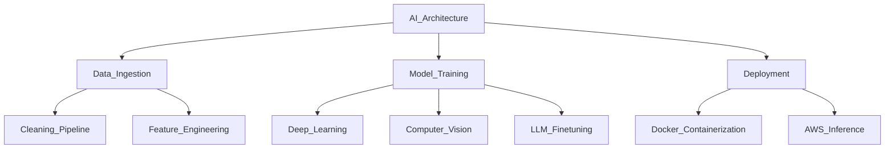

# ⚡ SYSTEM_INIT: NITISH_R_G

<!--
[HIDDEN TERMINAL]
Welcome, curious recruiter or developer.
If you're reading this, you appreciate the details.
Execute command: `hire_nitish()` to initiate a successful collaboration.
-->

<div align="center">
  <a href="https://mac-os-portfolio-nine-beryl.vercel.app/">
    
  </a>
</div>

## 💻 `SYSTEM_STATUS`

```python
class Developer:
    def __init__(self):
        self.name = "Nitish R.G"
        self.role = "Data Science and AI Practitioner"
        self.education = {
            "BS_Data_Science": "IIT Madras",
            "BE_Computer_Science": "SIET"
        }
        self.focus = [
            'Advanced LLMs',
            'Computer Vision',
            'Full-Stack ML Integration',
            'Scalable AI Architectures'
        ]

    def get_mission(self):
        return 'Turning complex data into actionable intelligence 🚀'
```

## 📈 `FOUNDER_DASHBOARD`

<table width="100%">
  <tr>
    <td width="50%" valign="top">
      <h3>🌟 Operations & Mission</h3>
      <p>Driving innovation and building scalable systems. Focused on rapid prototyping, MVP development, and scaling AI architectures.</p>
      <h3>🤝 Open to Collaboration</h3>
      <p>Actively looking to connect with YC founders, open-source maintainers, and innovators building the future of AI.</p>
      <h3>Ask Me About</h3>
      <p>Neural Networks, LLM Finetuning, Open Source, Hackathons, and why Vim &gt; Emacs.</p>
    </td>
    <td width="50%" valign="top">
      <h3>🏢 Experience & Education</h3>
      <ul>
        <li><b>AI Intern</b> @ <a href="https://infyspringboard.onwingspan.com/">Infosys Springboard</a></li>
        <li><b>Developer</b> @ <a href="https://www.amd.com/">AMD AI Developer Program</a></li>
        <li><b>Alumni</b> @ <a href="https://www.mckinsey.com/">McKinsey Forward</a></li>
        <li><b>BS in Data Science</b> @ IIT Madras</li>
        <li><b>BE in Computer Science Engineering</b> @ SIET</li>
      </ul>
      <h3>Currently Learning</h3>
      <p>Advanced RAG patterns, MLOps orchestration, and WebGPU for accelerated models.</p>
    </td>
  </tr>
</table>

## ⚔️ `PROJECT_WAR_ROOM`

<table width="100%">
  <tr>
    <td width="50%" valign="top" align="center">
      <h3><a href="https://github.com/NITISH-R-G/PedagogyX">📚 PedagogyX</a></h3>
      <p><i>Advanced EdTech platform leveraging LLMs for personalized learning paths and automated assessment generation.</i></p>
      <p><b>Impact:</b> Streamlined educator workflows and improved student engagement through adaptive ML pathways.</p>
      
      
      
    </td>
    <td width="50%" valign="top" align="center">
      <h3><a href="https://github.com/NITISH-R-G/PalmPlay">✋ PalmPlay</a></h3>
      <p><i>Computer Vision based real-time gesture recognition system for hands-free application control.</i></p>
      <p><b>Impact:</b> Enabled accessibility and intuitive UX for touchless interactions across multiple OS platforms.</p>
      
      
      
    </td>
  </tr>
  <tr>
    <td width="50%" valign="top" align="center">
      <h3><a href="https://github.com/NITISH-R-G/Intelli-Credit-V2">💳 Intelli-Credit</a></h3>
      <p><i>ML-driven credit scoring and risk assessment engine designed for scalable financial analysis.</i></p>
      <p><b>Impact:</b> Enhanced risk prediction accuracy and automated lending decisions with explainable AI models.</p>
      
      
      
    </td>
    <td width="50%" valign="top" align="center">
      <h3><a href="https://github.com/NITISH-R-G/CODESTREAK">🔥 CODESTREAK</a></h3>
      <p><i>Developer productivity dashboard and analytics tool for tracking coding habits and consistency.</i></p>
      <p><b>Impact:</b> Gamified coding routines for developers, boosting daily engagement and repo commits.</p>
      
      
      
    </td>
  </tr>
</table>

## 🧠 `NEURAL_ARCHITECTURE` (Tech Stack)

<table width="100%">
  <tr>
    <td width="33%" valign="top" align="center">
      <h3>Languages</h3>
      <a href="https://skillicons.dev">
        
      </a>
    </td>
    <td width="33%" valign="top" align="center">
      <h3>AI / ML</h3>
      <a href="https://skillicons.dev">
        
      </a>
    </td>
    <td width="34%" valign="top" align="center">
      <h3>Cloud & Ops</h3>
      <a href="https://skillicons.dev">
        
      </a>
    </td>
  </tr>
</table>



## 🏆 `ACHIEVEMENTS_LOG`

* **Hackathons:** Winner of multiple national-level AI/ML hackathons, driving impactful MVPs within 24-48 hours.
* **Leadership:** Mentored junior developers in Open Source and Data Science initiatives.
* **Certifications:** Certified in Deep Learning and Cloud Data Pipelines.
* **Internships:** Top performer at Infosys Springboard, delivering production-grade ML solutions.

## 📡 `NETWORK_GRAPH` & Resources

<table width="100%">
  <tr>
    <td width="50%" align="center">
      <h3>🖥️ Interactive Portfolio</h3>
      <p><i>Experience my work through a visually stunning Mac OS-themed UI.</i></p>
      <a href="https://mac-os-portfolio-nine-beryl.vercel.app/">
        
      </a>
    </td>
    <td width="50%" align="center">
      <h3>📄 Comprehensive Resume</h3>
      <p><i>Dive deep into my technical background and experience.</i></p>
      <a href="https://drive.google.com/file/d/1lm1TLC00ThShlEi80uRtkz4rppco1w8O/view?usp=sharing">
        
      </a>
    </td>
  </tr>
</table>

<div align="center">
  <p>
    <a href="https://twitter.com/NITISH_R_G">
      
    </a>
    <a href="https://linkedin.com/in/nitish-r-g-15-10-2007-rgn/">
      
    </a>
    <a href="mailto:nitishrg.8220psgps2020@gmail.com">
      
    </a>
  </p>
</div>

## 📊 `TELEMETRY_DATA`

<div align="center">
  
  
  <br />
  
</div>

<div align="center">
  <a href="https://github.com/ryo-ma/github-profile-trophy">
    
  </a>
</div>

<div align="center">
  
</div>

<div align="center">
  <!-- profile-green-animate -->
  
</div>

<br />

<div align="center">
  <!--START_SECTION:activity-->
  <!--END_SECTION:activity-->
</div>

<br />

<div align="center">
  <!-- BLOG-POST-LIST:START -->
  <!-- BLOG-POST-LIST:END -->
</div>

<br />

<div align="center">
  <!--START_SECTION:waka-->
  <!--END_SECTION:waka-->
</div>

---

<div align="center">
  <p><i>"There are 10 types of people in this world: those who understand binary, and those who don't."</i></p>
  
</div>
