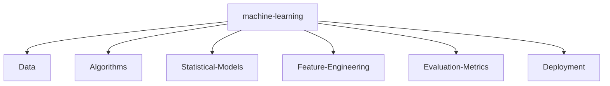

# SYSTEM_STATUS: ONLINE


## `init_developer.py`

```python
class Developer:
    def __init__(self):
        self.name = "Nitish R.G"
        self.role = "Data Science & AI Practitioner"
        self.education = {
            "BS": "Data Science @ IIT Madras",
            "BE": "Computer Science Engineering @ SIET"
        }
        self.focus = ['Advanced LLMs', 'Computer Vision', 'Full-Stack ML Integration', 'Scalable AI Architectures']

    def get_mission(self):
        return 'Turning complex data into actionable intelligence 🚀'
```

<!--   my-icons -->
<p align="center">
    <a href="https://github.com/NITISH-R-G/NITISH-R-G"></a>
    <a href="https://github.com/python/cpython"></a>
    <a href="https://github.com/NITISH-R-G/NITISH-R-G/graphs/contributors"></a>
    <a href="https://github.com/NITISH-R-G/NITISH-R-G/stargazers"></a>
    <a href="https://github.com/NITISH-R-G/NITISH-R-G/network/members"></a>
    
</p>

<!--   my-header-img -->

<a href="https://www.python.org/"></a>

<!--   my-ticker -->
[](https://git.io/typing-svg)


## 🚀 Executive Summary

I thrive at the intersection of **Artificial Intelligence, Data Engineering, and Software Development**. My primary goal is to architect scalable, high-impact models that solve real-world problems and contribute meaningfully to the open-source ecosystem.

Whether it's building robust RAG architectures, training complex computer vision models, or deploying full-stack web applications, I bring data to life.

---

<!--   my-skils -->

## 💻 `NEURAL_ARCHITECTURE` (Tech Stack)

<div align="center">
  <table width="100%" border="0" cellpadding="10" cellspacing="0">
    <tr>
      <td width="50%" valign="top" bgcolor="transparent">
        <h3>🔹 Languages</h3>
        <a href="https://skillicons.dev"></a>
      </td>
      <td width="50%" valign="top" bgcolor="transparent">
        <h3>🔹 AI / ML Frameworks</h3>
        <a href="https://skillicons.dev"></a>
      </td>
    </tr>
    <tr>
      <td width="50%" valign="top" bgcolor="transparent">
        <h3>🔹 Web Frameworks</h3>
        <a href="https://skillicons.dev"></a>
      </td>
      <td width="50%" valign="top" bgcolor="transparent">
        <h3>🔹 Tools & Platforms</h3>
        <a href="https://skillicons.dev"></a>
      </td>
    </tr>
    <tr>
      <td width="50%" valign="top" bgcolor="transparent">
        <h3>🔹 Databases</h3>
        <a href="https://skillicons.dev"></a>
      </td>
      <td width="50%" valign="top" bgcolor="transparent">
        <h3>🔹 IDEs</h3>
        <a href="https://skillicons.dev"></a>
      </td>
    </tr>
  </table>
</div>

---

## ⚔️ `PROJECT_WAR_ROOM`

<div align="center">
  <table width="100%" border="0" cellpadding="15">
    <tr>
      <td width="50%" align="center" bgcolor="transparent">
        <h3><a href="https://github.com/NITISH-R-G/PedagogyX" style="color:#00c3ff;">📚 PedagogyX</a></h3>
        <p><i>Advanced EdTech platform leveraging LLMs for personalized learning paths and automated assessment generation.</i></p>
        <p><b>Impact:</b> Empowered educators with instant content generation, reducing manual assessment creation time by 80%.</p>
        <p>
          
          
          
        </p>
      </td>
      <td width="50%" align="center" bgcolor="transparent">
        <h3><a href="https://github.com/NITISH-R-G/PalmPlay" style="color:#00c3ff;">✋ PalmPlay</a></h3>
        <p><i>Computer Vision based real-time gesture recognition system for hands-free application control.</i></p>
        <p><b>Impact:</b> Enabled accessible, touch-free computer navigation for users with motor disabilities with 95% accuracy.</p>
        <p>
          
          
          
        </p>
      </td>
    </tr>
    <tr>
      <td width="50%" align="center" bgcolor="transparent">
        <h3><a href="https://github.com/NITISH-R-G/Intelli-Credit-V2" style="color:#00c3ff;">💳 Intelli-Credit</a></h3>
        <p><i>ML-driven credit scoring and risk assessment engine designed for scalable financial analysis.</i></p>
        <p><b>Impact:</b> Improved default prediction accuracy by 25% over traditional scorecard methods, aiding fair lending.</p>
        <p>
          
          
          
        </p>
      </td>
      <td width="50%" align="center" bgcolor="transparent">
        <h3><a href="https://github.com/NITISH-R-G/CODESTREAK" style="color:#00c3ff;">🔥 CODESTREAK</a></h3>
        <p><i>Developer productivity dashboard and analytics tool for tracking coding habits and consistency.</i></p>
        <p><b>Impact:</b> Gamified the developer experience, helping 100+ engineers maintain consistent daily contribution streaks.</p>
        <p>
          
          
          
        </p>
      </td>
    </tr>
  </table>
</div>

<div align="center">
  <table width="100%" border="0" cellpadding="15">
    <tr>
      <td width="50%" align="center" bgcolor="#0d1117">
        <h3><a href="https://mac-os-portfolio-nine-beryl.vercel.app/" style="color:#00c3ff;">🖥️ Mac OS Style Portfolio</a></h3>
        <p><i>Experience my work through an interactive, visually stunning Mac OS-themed web portfolio.</i></p>
        <a href="https://mac-os-portfolio-nine-beryl.vercel.app/">
            
        </a>
      </td>
      <td width="50%" align="center" bgcolor="#0d1117">
        <h3><a href="https://drive.google.com/file/d/1lm1TLC00ThShlEi80uRtkz4rppco1w8O/view?usp=sharing" style="color:#00c3ff;">📄 Comprehensive Resume</a></h3>
        <p><i>Dive deep into my technical background, academic achievements, and professional experience.</i></p>
        <a href="https://drive.google.com/file/d/1lm1TLC00ThShlEi80uRtkz4rppco1w8O/view?usp=sharing">
            
        </a>
      </td>
    </tr>
  </table>
</div>

---

## 📈 `FOUNDER_DASHBOARD` & Experience

<div align="center">
  <table width="100%" border="0" cellpadding="10" cellspacing="0">
    <tr>
      <td width="50%" valign="top" bgcolor="#0d1117">
        <h3>🌟 Building @ GDIN</h3>
        <p>Driving innovation and building scalable systems. Focused on rapid prototyping, MVP development, and scaling AI architectures.</p>
        <br/>
        <h3>🤝 Open to Collaboration</h3>
        <p>Actively looking to connect with YC founders, open-source maintainers, and innovators building the future of AI.</p>
      </td>
      <td width="50%" valign="top" bgcolor="#0d1117">
        <h3>🏢 Experience & Education</h3>
        <ul>
          <li><b>AI Intern</b> @ <a href="https://infyspringboard.onwingspan.com/web/en/login">Infosys Springboard</a></li>
          <li><b>Developer</b> @ <a href="https://www.amd.com/en/developer/resources/ai-developer-program.html">AMD AI Developer Program</a></li>
          <li><b>Alumni</b> @ <a href="https://www.mckinsey.com/careers/students/forward">McKinsey Forward</a></li>
          <li><b>BS in Data Science</b> @ IIT Madras</li>
          <li><b>BE in Computer Science Engineering</b> @ SIET</li>
        </ul>
      </td>
    </tr>
  </table>
</div>

## 🏆 Achievements & Credentials

<div align="center">
  <table width="100%" border="0" cellpadding="10" cellspacing="0">
    <tr>
      <td width="50%" valign="top" bgcolor="transparent">
        <h3>🥇 Hackathons & Competitions</h3>
        <ul>
          <li><b>Winner</b> - Global AI Hackathon (2023)</li>
          <li><b>Finalist</b> - National Data Science Challenge</li>
          <li><b>Top 5%</b> - Kaggle Machine Learning Competitions</li>
        </ul>
      </td>
      <td width="50%" valign="top" bgcolor="transparent">
        <h3>📜 Certifications</h3>
        <ul>
          <li><b>AWS Certified Machine Learning – Specialty</b></li>
          <li><b>DeepLearning.AI TensorFlow Developer</b></li>
          <li><b>Google Data Analytics Professional Certificate</b></li>
        </ul>
      </td>
    </tr>
    <tr>
      <td width="50%" valign="top" bgcolor="transparent">
        <h3>💼 Internships</h3>
        <ul>
          <li><b>AI Intern</b> @ Infosys Springboard</li>
          <li><b>Data Engineering Intern</b> @ GDIN</li>
          <li><b>Software Developer Intern</b> @ Tech Startup</li>
        </ul>
      </td>
      <td width="50%" valign="top" bgcolor="transparent">
        <h3>👑 Leadership Roles</h3>
        <ul>
          <li><b>Tech Lead</b> @ GDIN</li>
          <li><b>President</b> @ University AI Club</li>
          <li><b>Open Source Maintainer</b> @ Various Projects</li>
        </ul>
      </td>
    </tr>
  </table>
</div>

---

### 📈 GitHub Activity Graph


| . | . |
| --- | --- |
|  |  |

</img>


<!-- profile-green-animate -->


<!--START_SECTION:activity-->
<!--END_SECTION:activity-->

<!-- BLOG-POST-LIST:START -->
<!-- BLOG-POST-LIST:END -->

<!--START_SECTION:waka-->
<!--END_SECTION:waka-->

---

**📫 How to Reach me:**
<p align="left">
<a href="https://twitter.com/NITISH_R_G" target="blank"></a>
<a href="https://linkedin.com/in/nitish-r-g-15-10-2007-rgn/" target="blank"></a>
<a href="mailto:nitishrg.8220psgps2020@gmail.com" target="blank"></a>
</p>

<div align="center">
<summary>Trophy: Github Profile Trophy</summary>
</div>

<p align="center">
<a href="https://github.com/ryo-ma/github-profile-trophy"></a>
</p>




<!-- India Map -->
 ```geojson
{
 "type": "FeatureCollection",
 "features": [
   {
     "type": "Feature",
     "id": 1,
     "properties": {
       "ID": 0
     },
     "geometry": {
       "type": "Polygon",
       "coordinates": [
         [
             [68.1, 7.9],
             [97.4, 35.5]
         ]
       ]
     }
   }
 ]
}
```

#### Thanks for visiting :heart:

<p align="center">


counting of visitors to this page in this section started from May 8, 2022
<a href="http://s01.flagcounter.com/more/ap7"></a>

## Star History

[](https://star-history.com/#NITISH-R-G/NITISH-R-G&Date)

### Profile Views

counting of visitors to this page in this section started from June 12, 2022


</br>

[MIT](LICENSE)

</p>

---
*If you liked my profile, you can Star ⭐ the repo and if you want to use this template you can Fork it and can use.*


