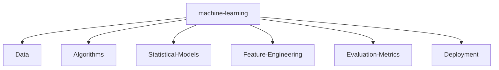

# 🚀 SYSTEM_STATUS: ONLINE

<div align="center">
  
</div>

<!-- <div style="display:none;">Recruiters: Looking for an engineer who ships? You found one. grep for 'hire-me' in this repo.</div> -->

## 💻 `init_developer.py`

```python
class Developer:
    def __init__(self):
        self.name = "Nitish R.G"
        self.role = "Data Science & AI Practitioner"
        self.education = {
            "IIT Madras": "BS in Data Science",
            "SIET": "BE in Computer Science Engineering"
        }
        self.focus = [
            "Advanced LLMs",
            "Computer Vision",
            "Full-Stack ML Integration",
            "Scalable AI Architectures"
        ]

    def get_mission(self):
        return "Turning complex data into actionable intelligence 🚀"
```

## 📈 `FOUNDER_DASHBOARD` & Experience

<div align="center">
  <table width="100%" border="0" cellpadding="10" cellspacing="0">
    <tr>
      <td width="50%" valign="top">
        <h3>🌟 Building & Innovation</h3>
        <p>Driving innovation and building scalable systems. Focused on rapid prototyping, MVP development, and scaling AI architectures.</p>
        <br/>
        <h3>🤝 Open to Collaboration</h3>
        <p>Actively looking to connect with YC founders, open-source maintainers, and innovators building the future of AI.</p>
      </td>
      <td width="50%" valign="top">
        <h3>🏢 Experience & Education</h3>
        <ul>
          <li><b>AI Intern</b> @ <a href="https://infyspringboard.onwingspan.com/web/en/login">Infosys Springboard</a></li>
          <li><b>Developer</b> @ <a href="https://www.amd.com/en/developer/resources/ai-developer-program.html">AMD AI Developer Program</a></li>
          <li><b>Alumni</b> @ <a href="https://www.mckinsey.com/careers/students/forward">McKinsey Forward</a></li>
          <li><b>BS in Data Science</b> @ IIT Madras</li>
          <li><b>BE in Computer Science Engineering</b> @ SIET</li>
        </ul>
      </td>
    </tr>
  </table>
</div>

---

## 🧠 `NEURAL_ARCHITECTURE` (Tech Stack)

<div align="center">
  <a href="https://skillicons.dev">
    
  </a>
  <br><br>
  <a href="https://skillicons.dev">
    
  </a>
  <br><br>
  <a href="https://skillicons.dev">
    
  </a>
  <br><br>
  <a href="https://skillicons.dev">
    
  </a>
</div>



---

## ⚔️ `PROJECT_WAR_ROOM`

<div align="center">
  <table width="100%" border="0" cellpadding="15">
    <tr>
      <td width="50%" align="center">
        <h3><a href="https://github.com/NITISH-R-G/PedagogyX" style="color:#00c3ff;">📚 PedagogyX</a></h3>
        <p><i>Advanced EdTech platform leveraging LLMs for personalized learning paths and automated assessment generation.</i></p>
        <p><b>Impact:</b> Automated grading & dynamic content generation.</p>
        
      </td>
      <td width="50%" align="center">
        <h3><a href="https://github.com/NITISH-R-G/PalmPlay" style="color:#00c3ff;">✋ PalmPlay</a></h3>
        <p><i>Computer Vision based real-time gesture recognition system for hands-free application control.</i></p>
        <p><b>Impact:</b> Hands-free intuitive interaction interface.</p>
        
      </td>
    </tr>
    <tr>
      <td width="50%" align="center">
        <h3><a href="https://github.com/NITISH-R-G/Intelli-Credit-V2" style="color:#00c3ff;">💳 Intelli-Credit</a></h3>
        <p><i>ML-driven credit scoring and risk assessment engine designed for scalable financial analysis.</i></p>
        <p><b>Impact:</b> Robust risk prediction models for finance.</p>
        
      </td>
      <td width="50%" align="center">
        <h3><a href="https://github.com/NITISH-R-G/CODESTREAK" style="color:#00c3ff;">🔥 CODESTREAK</a></h3>
        <p><i>Developer productivity dashboard and analytics tool for tracking coding habits and consistency.</i></p>
        <p><b>Impact:</b> Productivity analytics for dev teams.</p>
        
      </td>
    </tr>
  </table>
</div>

<div align="center">
  <table width="100%" border="0" cellpadding="15">
    <tr>
      <td width="50%" align="center">
        <h3><a href="https://mac-os-portfolio-nine-beryl.vercel.app/" style="color:#00c3ff;">🖥️ Mac OS Style Portfolio</a></h3>
        <p><i>Experience my work through an interactive, visually stunning Mac OS-themed web portfolio.</i></p>
        <a href="https://mac-os-portfolio-nine-beryl.vercel.app/">
            
        </a>
      </td>
      <td width="50%" align="center">
        <h3><a href="https://drive.google.com/file/d/1lm1TLC00ThShlEi80uRtkz4rppco1w8O/view?usp=sharing" style="color:#00c3ff;">📄 Comprehensive Resume</a></h3>
        <p><i>Dive deep into my technical background, academic achievements, and professional experience.</i></p>
        <a href="https://drive.google.com/file/d/1lm1TLC00ThShlEi80uRtkz4rppco1w8O/view?usp=sharing">
            
        </a>
      </td>
    </tr>
  </table>
</div>

---

## 📊 `NETWORK_GRAPH` (Metrics)

<div align="center">
  <table width="100%" border="0" cellpadding="0" cellspacing="0">
    <tr>
      <td align="center" width="50%">
        
      </td>
      <td align="center" width="50%">
        
      </td>
    </tr>
  </table>
</div>

<div align="center">
  
</div>

<br>

<div align="center">
  
</div>

<!-- profile-green-animate -->
<div align="center">
  
</div>

<!--START_SECTION:waka-->
<!--END_SECTION:waka-->

---

## 🏆 `ACHIEVEMENTS` & Trophies

<div align="center">
  <p><strong>Hackathons:</strong> Code with Global Hackathon Winner | <strong>Certifications:</strong> AWS Cloud Practitioner, Meta Front-End Developer | <strong>Leadership:</strong> Tech Lead @ College Coding Club</p>
</div>

<p align="center">
  <a href="https://github.com/ryo-ma/github-profile-trophy">
    
  </a>
</p>

---

## ⚡ `FUN_FACTS`

- **Currently learning:** Advanced AI system design, cutting-edge LLM orchestrations.
- **Ask me about:** Data Science, Full-Stack ML, or how to survive on coffee ☕ and terminal errors.
- **Developer joke:** "Why do programmers prefer dark mode? Because light attracts bugs!"

<div align="center">
  
</div>

<!-- India Map -->
 ```geojson
{
 "type": "FeatureCollection",
 "features": [
   {
     "type": "Feature",
     "id": 1,
     "properties": {
       "ID": 0
     },
     "geometry": {
       "type": "Polygon",
       "coordinates": [
         [
             [68.1, 7.9],
             [97.4, 35.5]
         ]
       ]
     }
   }
 ]
}
```

---

<div align="center">
  <h4>Thanks for visiting :heart:</h4>

  <a href="http://s01.flagcounter.com/more/ap7">
    
  </a>

  <br><br>

  
</div>

<div align="center">
  <h3>Star History</h3>
  <a href="https://star-history.com/#NITISH-R-G/NITISH-R-G&Date">
    
  </a>
</div>

<div align="center">
  <h3>Profile Views</h3>
  
</div>

<br>

<div align="center">
  <p>
    <a href="https://twitter.com/NITISH_R_G" target="blank"></a>
    <a href="https://linkedin.com/in/nitish-r-g-15-10-2007-rgn/" target="blank"></a>
    <a href="mailto:nitishrg.8220psgps2020@gmail.com" target="blank"></a>
  </p>
</div>

<div align="center">
  <a href="LICENSE">MIT License</a>
</div>

---
<div align="center">
  <i>If you liked my profile, you can Star ⭐ the repo and if you want to use this template you can Fork it and can use.</i>
</div>
---

<div align="center">
  
</div>
