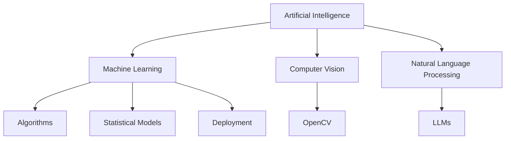

# 🌟 `SYSTEM_INITIALIZATION`

<!-- my-header-img -->


<div align="center">
  <a href="https://github.com/NITISH-R-G/NITISH-R-G"></a>
  <a href="https://github.com/python/cpython"></a>
  
</div>

<!-- my-ticker -->
<div align="center">
  <a href="https://git.io/typing-svg">
    
  </a>
</div>

## 👨‍💻 `init_developer.py`

```python
class Developer:
    def __init__(self):
        self.name = "Nitish R.G"
        self.role = "Data Science & AI Practitioner"
        self.education = {
            "IIT Madras": "BS in Data Science",
            "SIET": "BE in Computer Science Engineering"
        }
        self.focus = [
            'Advanced LLMs',
            'Computer Vision',
            'Full-Stack ML Integration',
            'Data Engineering',
            'Scalable Web Apps'
        ]

    def get_mission(self):
        return 'Turning complex data into actionable intelligence 🚀'

    def collaborate(self):
        return "Actively looking to connect with YC founders, open-source maintainers, and innovators!"
```

## 🚀 `EXECUTIVE_SUMMARY`

I thrive at the intersection of **Artificial Intelligence, Data Engineering, and Software Development**. My primary goal is to architect scalable, high-impact models that solve real-world problems and contribute meaningfully to the open-source ecosystem.

Whether it's building robust RAG architectures, training complex computer vision models, or deploying full-stack web applications, I bring data to life.

---

## ⚔️ `PROJECT_WAR_ROOM`

<div align="center">
  <table width="100%" border="0" cellpadding="15">
    <tr>
      <td width="50%" align="center" bgcolor="#0d1117">
        <h3><a href="https://github.com/NITISH-R-G/PedagogyX" style="color:#00c3ff;">📚 PedagogyX</a></h3>
        <p><i>Advanced EdTech platform leveraging LLMs for personalized learning paths and automated assessment generation.</i></p>
        <p><b>Impact:</b> Revolutionizing personalized learning.</p>
        
      </td>
      <td width="50%" align="center" bgcolor="#0d1117">
        <h3><a href="https://github.com/NITISH-R-G/PalmPlay" style="color:#00c3ff;">✋ PalmPlay</a></h3>
        <p><i>Computer Vision based real-time gesture recognition system for hands-free application control.</i></p>
        <p><b>Impact:</b> Hands-free intuitive control.</p>
        
      </td>
    </tr>
    <tr>
      <td width="50%" align="center" bgcolor="#0d1117">
        <h3><a href="https://github.com/NITISH-R-G/Intelli-Credit-V2" style="color:#00c3ff;">💳 Intelli-Credit</a></h3>
        <p><i>ML-driven credit scoring and risk assessment engine designed for scalable financial analysis.</i></p>
        <p><b>Impact:</b> Data-driven financial risk reduction.</p>
        
      </td>
      <td width="50%" align="center" bgcolor="#0d1117">
        <h3><a href="https://github.com/NITISH-R-G/CODESTREAK" style="color:#00c3ff;">🔥 CODESTREAK</a></h3>
        <p><i>Developer productivity dashboard and analytics tool for tracking coding habits and consistency.</i></p>
        <p><b>Impact:</b> Gamified developer productivity.</p>
        
      </td>
    </tr>
  </table>
</div>

---

## ⚙️ `TECH_STACK`

<div align="center">
  <table width="100%" border="0" cellpadding="10" cellspacing="0">
    <tr>
      <td width="25%" align="center" bgcolor="#0d1117">
        <h3>Languages</h3>
        <br />
        <a href="https://skillicons.dev">
          
        </a>
      </td>
      <td width="25%" align="center" bgcolor="#0d1117">
        <h3>Frameworks</h3>
        <br />
        <a href="https://skillicons.dev">
          
        </a>
      </td>
      <td width="25%" align="center" bgcolor="#0d1117">
        <h3>Tools</h3>
        <br />
        <a href="https://skillicons.dev">
          
        </a>
      </td>
      <td width="25%" align="center" bgcolor="#0d1117">
        <h3>Databases</h3>
        <br />
        <a href="https://skillicons.dev">
          
        </a>
      </td>
    </tr>
  </table>
</div>

### `NEURAL_ARCHITECTURE` (ML Stack)



---

## 📈 `FOUNDER_DASHBOARD` & Experience

<div align="center">
  <table width="100%" border="0" cellpadding="10" cellspacing="0">
    <tr>
      <td width="50%" valign="top" bgcolor="#0d1117">
        <h3>🌟 Building @ GDIN</h3>
        <p>Driving innovation and building scalable systems. Focused on rapid prototyping, MVP development, and scaling AI architectures.</p>
        <br/>
        <h3>🎓 Education</h3>
        <ul>
          <li><b>BS in Data Science</b> @ IIT Madras</li>
          <li><b>BE in Computer Science Engineering</b> @ SIET</li>
        </ul>
      </td>
      <td width="50%" valign="top" bgcolor="#0d1117">
        <h3>💼 Experience & Internships</h3>
        <ul>
          <li><b>AI Intern</b> @ <a href="https://infyspringboard.onwingspan.com/web/en/login">Infosys Springboard</a></li>
        </ul>
        <br/>
        <h3>🏆 Leadership & Programs</h3>
        <ul>
          <li><b>Developer</b> @ <a href="https://www.amd.com/en/developer/resources/ai-developer-program.html">AMD AI Developer Program</a></li>
          <li><b>Alumni</b> @ <a href="https://www.mckinsey.com/careers/students/forward">McKinsey Forward</a></li>
        </ul>
      </td>
    </tr>
  </table>
</div>

### 📜 Certifications & Hackathons

- Active participant in AI and Data Science hackathons.
- Certified across various Machine Learning and Data Engineering disciplines.

---

## 📊 `SYSTEM_METRICS`

<div align="center">
  <table width="100%" border="0" cellpadding="5">
    <tr>
      <td width="50%" align="center" bgcolor="#0d1117">
        
      </td>
      <td width="50%" align="center" bgcolor="#0d1117">
        
      </td>
    </tr>
  </table>
</div>

<div align="center">
  
</div>

<div align="center">
  <a href="https://github.com/ryo-ma/github-profile-trophy">
    
  </a>
</div>

### 🌐 Contribution Matrix

<div align="center">
  
</div>

<div align="center">
  <!-- profile-green-animate -->
  
</div>

---

## 📡 `COMMUNICATIONS_RELAY`

<!-- BLOG-POST-LIST:START -->
<!-- BLOG-POST-LIST:END -->

<!--START_SECTION:activity-->
<!--END_SECTION:activity-->

<!--START_SECTION:waka-->
<!--END_SECTION:waka-->

---

## 🤖 `Ask me about`

`Python` | `Machine Learning` | `Computer Vision` | `APIs` | `Full-stack Integration`

<div align="center">
  <p><b>Currently learning:</b> Advanced LLM architectures, Generative AI applications.</p>
</div>

<!-- Fun Developer Joke hidden for source code readers -->
<!-- Why do programmers prefer dark mode? Because light attracts bugs! -->

---

## 📫 How to Reach Me

<div align="center">
  <a href="https://twitter.com/NITISH_R_G" target="blank"></a>
  <a href="https://linkedin.com/in/nitish-r-g-15-10-2007-rgn/" target="blank"></a>
  <a href="mailto:nitishrg.8220psgps2020@gmail.com" target="blank"></a>
</div>

<div align="center">
  <br />
  
</div>

<div align="center">
  <br />
  <p>If you liked my profile, feel free to Star ⭐ the repo!</p>
</div>
