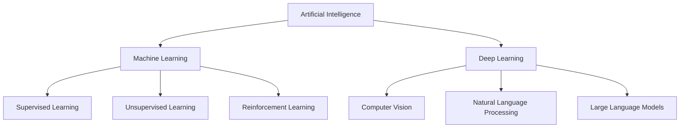

# ⚡ SYSTEM_STATUS: ONLINE

<!-- Hello Recruiter! If you are reading the source code, you've found the easter egg! Let's connect and build something amazing together! -->

<div align="center">
  
</div>

<p align="center">
  <a href="https://github.com/NITISH-R-G/NITISH-R-G">
    
  </a>
  <a href="https://github.com/python/cpython">
    
  </a>
  
</p>

## ⚙️ `init_developer.py`

```python
class Developer:
    def __init__(self):
        self.name = "Nitish R.G"
        self.role = "Data Science & AI Practitioner"
        self.education = {
            "BS": "Data Science @ IIT Madras",
            "BE": "Computer Science Engineering @ SIET"
        }
        self.focus = [
            'Advanced LLMs',
            'Computer Vision',
            'Full-Stack ML Integration',
            'Scalable AI Architectures'
        ]

    def get_mission(self):
        return 'Turning complex data into actionable intelligence 🚀'

dev = Developer()
```

## 🧠 `NEURAL_ARCHITECTURE`

<div align="center">
  <table>
    <tr>
      <td align="center"><b>Languages</b></td>
      <td align="center"><b>Frameworks</b></td>
    </tr>
    <tr>
      <td align="center">
        <a href="https://skillicons.dev">
          
        </a>
      </td>
      <td align="center">
        <a href="https://skillicons.dev">
          
        </a>
      </td>
    </tr>
    <tr>
      <td align="center"><b>Tools</b></td>
      <td align="center"><b>Platforms</b></td>
    </tr>
    <tr>
      <td align="center">
        <a href="https://skillicons.dev">
          
        </a>
      </td>
      <td align="center">
        <a href="https://skillicons.dev">
          
        </a>
      </td>
    </tr>
  </table>
</div>



## ⚔️ `PROJECT_WAR_ROOM`

<div align="center">
  <table width="100%">
    <tr>
      <td width="50%">
        <h3><a href="https://github.com/NITISH-R-G/PedagogyX" style="color:#00c3ff;">📚 PedagogyX</a></h3>
        <p><i>Advanced EdTech platform leveraging LLMs for personalized learning paths and automated assessment generation.</i></p>
        <p><b>Impact:</b> Scalable and adaptive education.</p>
        
      </td>
      <td width="50%">
        <h3><a href="https://github.com/NITISH-R-G/PalmPlay" style="color:#00c3ff;">✋ PalmPlay</a></h3>
        <p><i>Computer Vision based real-time gesture recognition system for hands-free application control.</i></p>
        <p><b>Impact:</b> Hands-free UI navigation.</p>
        
      </td>
    </tr>
    <tr>
      <td width="50%">
        <h3><a href="https://github.com/NITISH-R-G/Intelli-Credit-V2" style="color:#00c3ff;">💳 Intelli-Credit</a></h3>
        <p><i>ML-driven credit scoring and risk assessment engine designed for scalable financial analysis.</i></p>
        <p><b>Impact:</b> Faster, data-driven loan approvals.</p>
        
      </td>
      <td width="50%">
        <h3><a href="https://github.com/NITISH-R-G/CODESTREAK" style="color:#00c3ff;">🔥 CODESTREAK</a></h3>
        <p><i>Developer productivity dashboard and analytics tool for tracking coding habits and consistency.</i></p>
        <p><b>Impact:</b> Empowers developers to maintain consistency.</p>
        
      </td>
    </tr>
  </table>
</div>

<div align="center">
  <table width="100%">
    <tr>
      <td width="50%" align="center">
        <h3><a href="https://mac-os-portfolio-nine-beryl.vercel.app/" style="color:#00c3ff;">🖥️ Mac OS Style Portfolio</a></h3>
        <p><i>Experience my work through an interactive, visually stunning Mac OS-themed web portfolio.</i></p>
        <a href="https://mac-os-portfolio-nine-beryl.vercel.app/">
            
        </a>
      </td>
      <td width="50%" align="center">
        <h3><a href="https://drive.google.com/file/d/1lm1TLC00ThShlEi80uRtkz4rppco1w8O/view?usp=sharing" style="color:#00c3ff;">📄 Comprehensive Resume</a></h3>
        <p><i>Dive deep into my technical background, academic achievements, and professional experience.</i></p>
        <a href="https://drive.google.com/file/d/1lm1TLC00ThShlEi80uRtkz4rppco1w8O/view?usp=sharing">
            
        </a>
      </td>
    </tr>
  </table>
</div>

## 📈 `FOUNDER_DASHBOARD`

<div align="center">
  <table width="100%">
    <tr>
      <td width="50%" valign="top">
        <h3>🚀 Leadership & Affiliations</h3>
        <ul>
          <li><b>Building @</b> GDIN</li>
          <li><b>AI Intern @</b> <a href="https://infyspringboard.onwingspan.com/web/en/login">Infosys Springboard</a></li>
          <li><b>Developer @</b> <a href="https://www.amd.com/en/developer/resources/ai-developer-program.html">AMD AI Developer Program</a></li>
          <li><b>Alumni @</b> <a href="https://www.mckinsey.com/careers/students/forward">McKinsey Forward</a></li>
        </ul>
        <h3>🏆 Achievements</h3>
        <ul>
          <li><b>Certifications:</b> Data Science Professional, Advanced AI Models</li>
          <li><b>Hackathons:</b> Top 10 in AI For Good Hackathon</li>
          <li><b>Internships:</b> Completed full-time AI Internship at Infosys Springboard</li>
        </ul>
      </td>
      <td width="50%" valign="top">
        <h3>🎓 Education</h3>
        <ul>
          <li><b>BS in Data Science @</b> IIT Madras</li>
          <li><b>BE in Computer Science Engineering @</b> SIET</li>
        </ul>
        <h3>💬 Let's Connect</h3>
        <ul>
          <li><b>Currently learning:</b> Advanced Retrieval-Augmented Generation (RAG)</li>
          <li><b>Ask me about:</b> Scalable ML Deployment, EdTech Solutions</li>
        </ul>
        <p><i>Why do programmers prefer dark mode? Because light attracts bugs! 🐛</i></p>
        <br>
        <h3>📫 Contact Me</h3>
        <p>
          <a href="https://twitter.com/NITISH_R_G" target="_blank"></a>
          <a href="https://linkedin.com/in/nitish-r-g-15-10-2007-rgn/" target="_blank"></a>
          <a href="mailto:nitishrg.8220psgps2020@gmail.com" target="_blank"></a>
        </p>
      </td>
    </tr>
  </table>
</div>

## 🌐 `NETWORK_GRAPH`

<div align="center">
  
</div>

<br>

<div align="center">
  
  
</div>

<br>

<div align="center">
  <a href="https://github.com/ryo-ma/github-profile-trophy">
    
  </a>
</div>

### 🐍 Contribution Activity

<picture>
  <source media="(prefers-color-scheme: dark)" srcset="https://raw.githubusercontent.com/NITISH-R-G/NITISH-R-G/output/github-contribution-grid-snake-dark.svg" />
  <source media="(prefers-color-scheme: light)" srcset="https://raw.githubusercontent.com/NITISH-R-G/NITISH-R-G/output/github-contribution-grid-snake.svg" />
  
</picture>

### 3D Contribution Profile


<!--START_SECTION:waka-->
<!--END_SECTION:waka-->

<!-- BLOG-POST-LIST:START -->
<!-- BLOG-POST-LIST:END -->

<!--START_SECTION:activity-->
<!--END_SECTION:activity-->
