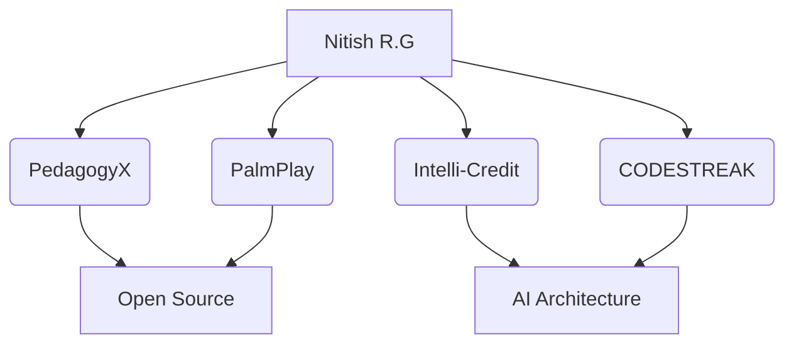

# NITISH_OS v2.0 // SYSTEM TERMINAL

<div align="center">
  
</div>

<br/>

<!-- 🕵️‍♂️ Easter Egg: Ah, you're inspecting the source code! If you're a recruiter or startup founder looking for an AI engineer who builds scalable systems, let's talk: nitishrg.8220psgps2020@gmail.com -->

## 💻 `SYSTEM_STATUS` / `init_developer.py`

```python
import datetime
from typing import Dict, List, Optional, Union

class Developer:
    """
    Core architecture for Nitish R.G's developer persona.
    Specializes in Artificial Intelligence, Data Engineering, and full-stack integration.
    """
    def __init__(self) -> None:
        self.name: str = "Nitish R.G"
        self.role: str = "Data Science & AI Practitioner"
        self.current_workspace: str = "India"

        self.education: Dict[str, str] = {
            "BS": "Data Science @ IIT Madras",
            "BE": "Computer Science Engineering @ SIET"
        }

        self.focus: List[str] = [
            "Advanced LLMs",
            "Computer Vision",
            "Full-Stack ML Integration"
        ]

        self.experience: List[Dict[str, str]] = [
            {"role": "AI Intern", "company": "Infosys Springboard"},
            {"role": "Developer", "program": "AMD AI Developer Program"},
            {"role": "Alumni", "program": "McKinsey Forward"}
        ]

    def get_mission(self) -> str:
        """Returns the current mission."""
        return "Turning complex data into actionable intelligence 🚀"

    def get_daily_status(self) -> str:
        """Returns the current operational status."""
        return f"[{datetime.date.today().isoformat()}] Status: Building scalable AI solutions... 🚀"

if __name__ == "__main__":
    me = Developer()
    print(me.get_daily_status())
    print(me.get_mission())
```

<br/>

## 🚀 `FOUNDER_DASHBOARD`

<div align="center">
  <table width="100%" border="0" cellpadding="15">
    <tr>
      <td width="50%" valign="top" bgcolor="#0d1117">
        <h3>⚡ ACTIVE INITIATIVES</h3>
        <ul>
          <li><b>[ACTIVE]</b> Architecting AI solutions @ GDIN</li>
          <li><b>[ACTIVE]</b> Dual-degree deep learning integration</li>
          <li><b>[SEEKING]</b> YC/Founder collaborations for ML scaling</li>
        </ul>
      </td>
      <td width="50%" valign="top" bgcolor="#0d1117">
        <h3>🔌 CORE TECH STACK</h3>
        <h4>Languages & Frameworks</h4>
        <a href="https://skillicons.dev"></a>
        <h4>Platforms & Tools</h4>
        <a href="https://skillicons.dev"></a>
      </td>
    </tr>
  </table>
</div>

<br/>

## ⚔️ `PROJECT_WAR_ROOM`

<div align="center">
  <table width="100%" border="0" cellpadding="15">
    <tr>
      <td width="50%" valign="top" bgcolor="#0d1117">
        <h3><a href="#" style="color:#00c3ff;">[CORE_INITIATIVE] PedagogyX</a></h3>
        <p><i>Next-generation scalable educational platform leveraging advanced LLMs and RAG architecture for personalized learning paths.</i></p>
      </td>
      <td width="50%" valign="top" bgcolor="#0d1117">
        <h3><a href="#" style="color:#00c3ff;">[BETA_SYSTEM] PalmPlay</a></h3>
        <p><i>Innovative AI-driven interactive system blending computer vision with real-time feedback mechanisms.</i></p>
      </td>
    </tr>
    <tr>
      <td width="50%" valign="top" bgcolor="#0d1117">
        <h3><a href="#" style="color:#00c3ff;">[FINTECH_MODEL] Intelli-Credit</a></h3>
        <p><i>Enterprise-grade predictive ML pipeline analyzing complex data for actionable credit intelligence.</i></p>
      </td>
      <td width="50%" valign="top" bgcolor="#0d1117">
        <h3><a href="#" style="color:#00c3ff;">[DEV_TOOLING] CODESTREAK</a></h3>
        <p><i>Hacker-focused open-source tooling aimed at optimizing developer workflows and sustaining contribution streaks.</i></p>
      </td>
    </tr>
    <tr>
      <td width="50%" valign="top" bgcolor="#0d1117">
        <h3><a href="https://mac-os-portfolio-nine-beryl.vercel.app/" style="color:#00c3ff;">[SYSTEM_PORTAL] Mac OS Portfolio</a></h3>
        <p><i>Interactive terminal-grade presentation of my work, designed as a web OS.</i></p>
      </td>
      <td width="50%" valign="top" bgcolor="#0d1117">
        <h3><a href="https://drive.google.com/file/d/1lm1TLC00ThShlEi80uRtkz4rppco1w8O/view?usp=sharing" style="color:#00c3ff;">[DATA_DUMP] Resume</a></h3>
        <p><i>Deep dive into technical background, academic achievements, and professional timeline.</i></p>
      </td>
    </tr>
  </table>
</div>

<br/>

## 🌍 `NETWORK_GRAPH`



<br/>

## 📊 `OPEN_SOURCE_IMPACT`

<div align="center">
  
</div>

<div align="center">
  <table width="100%" border="0" cellpadding="10" cellspacing="0">
    <tr>
      <td align="center" width="50%" bgcolor="#0d1117">
        <picture>
          <source media="(prefers-color-scheme: dark)" srcset="https://raw.githubusercontent.com/NITISH-R-G/NITISH-R-G/main/github-metrics.svg">
          <source media="(prefers-color-scheme: light)" srcset="https://raw.githubusercontent.com/NITISH-R-G/NITISH-R-G/main/github-metrics.svg">
          
        </picture>
      </td>
      <td align="center" width="50%" bgcolor="#0d1117">
        
        <br/><br/>
        
      </td>
    </tr>
  </table>
</div>

### 🐍 Contribution Matrix Mapping

<div align="center">
  <picture>
    <source media="(prefers-color-scheme: dark)" srcset="https://raw.githubusercontent.com/NITISH-R-G/NITISH-R-G/output/github-contribution-grid-snake-dark.svg">
    <source media="(prefers-color-scheme: light)" srcset="https://raw.githubusercontent.com/NITISH-R-G/NITISH-R-G/output/github-contribution-grid-snake.svg">
    
  </picture>
</div>

### 🧊 3D Contribution Landscape

<div align="center">
  <picture>
    <source media="(prefers-color-scheme: dark)" srcset="https://raw.githubusercontent.com/NITISH-R-G/NITISH-R-G/main/profile-3d-contrib/profile-night-rainbow.svg">
    <source media="(prefers-color-scheme: light)" srcset="https://raw.githubusercontent.com/NITISH-R-G/NITISH-R-G/main/profile-3d-contrib/profile-night-view.svg">
    
  </picture>
</div>

<br/>

## ⚙️ `BUILD_LOG`

### ⏱️ IDE Telemetry (WakaTime)

<div align="center">
<!--START_SECTION:waka-->
<!--END_SECTION:waka-->
</div>

### 📝 Development Logs (Blog Posts)

<!-- BLOG-POST-LIST:START -->
<!-- BLOG-POST-LIST:END -->

<br/>

## 🏆 `HACKATHON_ARCHIVE`

<div align="center">
  <table width="100%" border="0" cellpadding="15">
    <tr>
      <td bgcolor="#0d1117">
        <h3>[ENCRYPTED] Archive Access</h3>
        <p><i>Veteran of multiple high-stakes hackathons. Specialized in rapid prototyping and delivering functional, AI-driven MVPs under pressure.</i></p>
      </td>
    </tr>
  </table>
</div>

<br/>

## 📡 `FUTURE_ROADMAP`

<div align="center">
  <table width="100%" border="0" cellpadding="15">
    <tr>
      <td width="33%" valign="top" bgcolor="#0d1117">
        <h3>[PHASE 1] Scalable AI</h3>
        <p>Deploy enterprise-grade LLM solutions.</p>
      </td>
      <td width="33%" valign="top" bgcolor="#0d1117">
        <h3>[PHASE 2] Founder Connect</h3>
        <p>Collaborate with YC founders & core builders.</p>
      </td>
      <td width="33%" valign="top" bgcolor="#0d1117">
        <h3>[PHASE 3] OSS Dominance</h3>
        <p>Maintain heavy open-source contributions.</p>
      </td>
    </tr>
  </table>
</div>

<br/>

## 🔄 `SYSTEM_ACTIVITY_FEED`

<!--START_SECTION:activity-->
<!--END_SECTION:activity-->

<br/>

<div align="center">
  <a href="https://github.com/NITISH-R-G"></a>
  <a href="https://linkedin.com/in/nitish-r-g-15-10-2007-rgn/"></a>
  <a href="https://twitter.com/NITISH_R_G"></a>
  <a href="mailto:nitishrg.8220psgps2020@gmail.com"></a>
</div>

<br/>

<div align="center">
  
</div>
