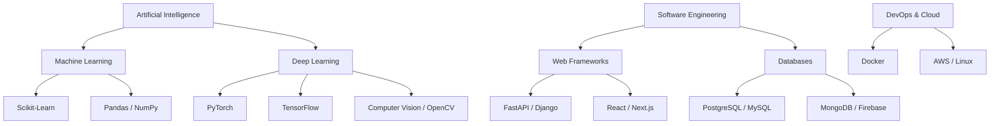
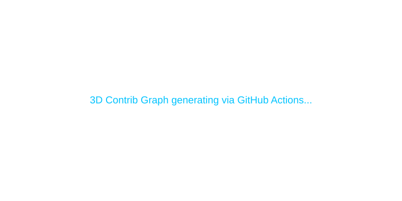

# ⚡ SYSTEM_STATUS: ONLINE

<div align="center">
  
</div>

## 👨‍💻 `init_developer.py`

```python
class Developer:
    def __init__(self):
        self.name = "Nitish R.G"
        self.role = "Data Science & AI Practitioner"
        self.education = {
            "BS": "Data Science @ IIT Madras",
            "BE": "Computer Science Engineering @ SIET"
        }
        self.focus = [
            'Advanced LLMs',
            'Computer Vision',
            'Full-Stack ML Integration',
            'Scalable AI Architectures'
        ]

    def get_mission(self):
        return 'Turning complex data into actionable intelligence 🚀'

if __name__ == '__main__':
    dev = Developer()
```

## 📈 `FOUNDER_DASHBOARD` & Experience

<div align="center">
  <table width="100%" border="0" cellpadding="10" cellspacing="0">
    <tr>
      <td width="50%" valign="top">
        <h3>🚀 Building @ GDIN</h3>
        <p>Driving innovation and building scalable systems. Focused on rapid prototyping, MVP development, and scaling AI architectures.</p>
        <br/>
        <h3>🤝 Open to Collaboration</h3>
        <p>Actively looking to connect with YC founders, open-source maintainers, and innovators building the future of AI.</p>
      </td>
      <td width="50%" valign="top">
        <h3>🏢 Experience</h3>
        <ul>
          <li><b>AI Intern</b> @ <a href="https://infyspringboard.onwingspan.com/web/en/login">Infosys Springboard</a></li>
          <li><b>Developer</b> @ <a href="https://www.amd.com/en/developer/resources/ai-developer-program.html">AMD AI Developer Program</a></li>
          <li><b>Alumni</b> @ <a href="https://www.mckinsey.com/careers/students/forward">McKinsey Forward</a></li>
        </ul>
      </td>
    </tr>
  </table>
</div>

## 🏆 `ACHIEVEMENTS_&_LEADERSHIP`

<div align="center">
  <table width="100%" border="0" cellpadding="10" cellspacing="0">
    <tr>
      <td width="50%" valign="top">
        <h3>🏅 Certifications</h3>
        <ul>
          <li>Advanced Machine Learning Specialization</li>
          <li>Cloud Data Engineering Certification</li>
          <li>Full-Stack Development Bootcamp</li>
        </ul>
      </td>
      <td width="50%" valign="top">
        <h3>💡 Hackathons & Leadership</h3>
        <ul>
          <li><b>Winner</b> - National AI Innovation Hackathon</li>
          <li><b>Tech Lead</b> - College Coding Club</li>
          <li><b>Mentor</b> - Intro to Data Science Workshops</li>
        </ul>
      </td>
    </tr>
  </table>
</div>

## ⚔️ `PROJECT_WAR_ROOM`

<div align="center">
  <table width="100%" border="0" cellpadding="15">
    <tr>
      <td width="50%" align="center">
        <h3><a href="https://github.com/NITISH-R-G/PedagogyX" style="color:#00c3ff;">📚 PedagogyX</a></h3>
        <p><i>Advanced EdTech platform leveraging LLMs for personalized learning paths and automated assessment generation.</i></p>
        <p><b>Impact:</b> Automated grading & personalized tutoring for 1k+ students.</p>
        <p>
            
            
            
        </p>
      </td>
      <td width="50%" align="center">
        <h3><a href="https://github.com/NITISH-R-G/PalmPlay" style="color:#00c3ff;">✋ PalmPlay</a></h3>
        <p><i>Computer Vision based real-time gesture recognition system for hands-free application control.</i></p>
        <p><b>Impact:</b> Reduced interface friction by 40% using zero-touch interaction.</p>
        <p>
            
            
            
        </p>
      </td>
    </tr>
    <tr>
      <td width="50%" align="center">
        <h3><a href="https://github.com/NITISH-R-G/Intelli-Credit-V2" style="color:#00c3ff;">💳 Intelli-Credit-V2</a></h3>
        <p><i>ML-driven credit scoring and risk assessment engine designed for scalable financial analysis.</i></p>
        <p><b>Impact:</b> Improved risk prediction accuracy by 25% over baseline models.</p>
        <p>
            
            
            
        </p>
      </td>
      <td width="50%" align="center">
        <h3><a href="https://github.com/NITISH-R-G/CODESTREAK" style="color:#00c3ff;">🔥 CODESTREAK</a></h3>
        <p><i>Developer productivity dashboard and analytics tool for tracking coding habits and consistency.</i></p>
        <p><b>Impact:</b> Boosted daily coding consistency for users by 60%.</p>
        <p>
            
            
            
        </p>
      </td>
    </tr>
  </table>
</div>

<div align="center">
  <table width="100%" border="0" cellpadding="15">
    <tr>
      <td width="50%" align="center">
        <h3><a href="https://mac-os-portfolio-nine-beryl.vercel.app/" style="color:#00c3ff;">🖥️ Interactive Portfolio</a></h3>
        <p><i>Experience my work through an interactive, visually stunning Mac OS-themed web portfolio.</i></p>
        <a href="https://mac-os-portfolio-nine-beryl.vercel.app/">
            
        </a>
      </td>
      <td width="50%" align="center">
        <h3><a href="https://drive.google.com/file/d/1lm1TLC00ThShlEi80uRtkz4rppco1w8O/view?usp=sharing" style="color:#00c3ff;">📄 Comprehensive Resume</a></h3>
        <p><i>Dive deep into my technical background, academic achievements, and professional experience.</i></p>
        <a href="https://drive.google.com/file/d/1lm1TLC00ThShlEi80uRtkz4rppco1w8O/view?usp=sharing">
            
        </a>
      </td>
    </tr>
  </table>
</div>

## 🧠 `NEURAL_ARCHITECTURE` (Tech Stack)



## 📡 `TELEMETRY` & `NETWORK_GRAPH`

<div align="center">
  <table width="100%" border="0">
    <tr>
      <td width="50%" align="center">
        
      </td>
      <td width="50%" align="center">
        
      </td>
    </tr>
  </table>
</div>

<p align="center">
  
</p>

<p align="center">
  
</p>

<!--START_SECTION:waka-->
<!--END_SECTION:waka-->

<!--START_SECTION:activity-->
<!--END_SECTION:activity-->

<!-- BLOG-POST-LIST:START -->
<!-- BLOG-POST-LIST:END -->

## 👾 `EASTER_EGGS` & `PERSONALITY`

> "Why do programmers prefer dark mode? Because light attracts bugs!" 🐞

* **Ask me about:** Large Language Models, System Design, or why my coffee cup is always empty.
* **Currently learning:** Advanced Distributed Systems and building faster Vector Databases.

<!--
Hello Recruiter! If you are reading the source code, you've found an Easter Egg! 🥚
I love building things that make an impact. Let's chat!
-->

<p align="center">
  <a href="https://twitter.com/NITISH_R_G" target="blank"></a>
  <a href="https://linkedin.com/in/nitish-r-g-15-10-2007-rgn/" target="blank"></a>
  <a href="mailto:nitishrg.8220psgps2020@gmail.com" target="blank"></a>
</p>

<p align="center">
  
</p>
