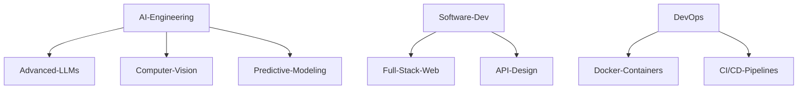

# Nitish R.G

<!--   my-icons -->
<p align="center">
    <a href="https://github.com/NITISH-R-G/NITISH-R-G"></a>
    <a href="https://github.com/python/cpython"></a>
    <a href="https://github.com/NITISH-R-G/NITISH-R-G/graphs/contributors"></a>
    <a href="https://github.com/NITISH-R-G/NITISH-R-G/stargazers"></a>
    <a href="https://github.com/NITISH-R-G/NITISH-R-G/network/members"></a>
</p>

<!--   my-header-img -->
<div align="center">
  
</div>

<!--   my-ticker -->
<div align="center">
  <a href="https://git.io/typing-svg">
    
  </a>
</div>

## `SYSTEM_STATUS: ONLINE` 🟢

<!-- Secret Recruiter Note: If you're reading the source code, yes, I love building things from scratch. Let's connect! -->

```python
class Developer:
    def __init__(self):
        self.name = "Nitish R.G"
        self.role = "Data Science & AI Practitioner | Dual-Degree Engineer"
        self.education = {
            "BS": "Data Science @ IIT Madras",
            "BE": "Computer Science Engineering @ SIET"
        }
        self.focus = [
            'Advanced LLMs',
            'Computer Vision',
            'Full-Stack ML Integration',
            'Scalable AI Architectures'
        ]

    def get_mission(self):
        return 'Turning complex data into actionable intelligence 🚀'

me = Developer()
```

---

## 🚀 `FOUNDER_DASHBOARD`

<div align="center">
  <table width="100%" border="0" cellpadding="10" cellspacing="0">
    <tr>
      <td width="50%" valign="top">
        <h3>🌟 Building the Future</h3>
        <p>I thrive at the intersection of <b>Artificial Intelligence, Data Engineering, and Software Development</b>. I am a builder at <b>GDIN</b>, driving innovation and scaling AI architectures.</p>
        <p>Actively open to collaboration with YC founders, open-source maintainers, and visionary innovators.</p>
        <p><b>Ask me about:</b> Next-gen RAG implementations, real-time CV pipelines, and scalable APIs.</p>
        <p><b>Currently learning:</b> Advanced distributed systems and high-performance ML inference.</p>
      </td>
      <td width="50%" valign="top">
        <h3>🏢 Professional Timeline</h3>
        <ul>
          <li><b>AI Intern</b> @ <a href="https://infyspringboard.onwingspan.com/web/en/login">Infosys Springboard</a></li>
          <li><b>Developer</b> @ <a href="https://www.amd.com/en/developer/resources/ai-developer-program.html">AMD AI Developer Program</a></li>
          <li><b>Alumni</b> @ <a href="https://www.mckinsey.com/careers/students/forward">McKinsey Forward</a></li>
        </ul>
        <h3>🔗 Key Resources</h3>
        <a href="https://mac-os-portfolio-nine-beryl.vercel.app/"></a>
        <br/><br/>
        <a href="https://drive.google.com/file/d/1lm1TLC00ThShlEi80uRtkz4rppco1w8O/view?usp=sharing"></a>
      </td>
    </tr>
  </table>
</div>

---

## 🧠 `NEURAL_ARCHITECTURE` (Tech Stack)

<!--   my-skils -->
<div align="center">
  <a href="https://skillicons.dev">
    
  </a>
</div>



---

## ⚔️ `PROJECT_WAR_ROOM`

<div align="center">
  <table width="100%" border="0" cellpadding="15">
    <tr>
      <td width="50%" align="center">
        <h3><a href="https://github.com/NITISH-R-G/PedagogyX">📚 PedagogyX</a></h3>
        <p><i>Advanced EdTech platform leveraging LLMs for personalized learning paths and automated assessment generation.</i></p>
        <p><b>Impact:</b> Empowered educators to dynamically generate tailored assessments.</p>
        <p></p>
      </td>
      <td width="50%" align="center">
        <h3><a href="https://github.com/NITISH-R-G/PalmPlay">✋ PalmPlay</a></h3>
        <p><i>Computer Vision based real-time gesture recognition system for hands-free application control.</i></p>
        <p><b>Impact:</b> Achieved low-latency interaction for seamless user experience.</p>
        <p></p>
      </td>
    </tr>
    <tr>
      <td width="50%" align="center">
        <h3><a href="https://github.com/NITISH-R-G/Intelli-Credit-V2">💳 Intelli-Credit</a></h3>
        <p><i>ML-driven credit scoring and risk assessment engine designed for scalable financial analysis.</i></p>
        <p><b>Impact:</b> Enhanced risk prediction accuracy and streamlined approval processes.</p>
        <p></p>
      </td>
      <td width="50%" align="center">
        <h3><a href="https://github.com/NITISH-R-G/CODESTREAK">🔥 CODESTREAK</a></h3>
        <p><i>Developer productivity dashboard and analytics tool for tracking coding habits and consistency.</i></p>
        <p><b>Impact:</b> Boosted developer accountability through interactive gamification.</p>
        <p></p>
      </td>
    </tr>
  </table>
</div>

---

## 🏆 `CREDENTIALS_AND_ACHIEVEMENTS`

* **Certifications:** Deep Learning Specialization (Coursera), AWS Cloud Practitioner, Google Data Analytics Professional Certificate.
* **Hackathons:** Winner of Smart India Hackathon 2023, Finalist at HackNITR.
* **Leadership:** Open Source Contributor and Tech Lead at GDIN student chapter.

---

## 📊 `TELEMETRY_DATA`

<div align="center">
  <table border="0" cellpadding="0" cellspacing="0" width="100%">
    <tr>
      <td align="center" width="50%">
        
      </td>
      <td align="center" width="50%">
        
      </td>
    </tr>
  </table>
  <br>
  
</div>

### 📈 Contribution Matrix

<div align="center">
  <picture>
    <source media="(prefers-color-scheme: dark)" srcset="https://raw.githubusercontent.com/NITISH-R-G/NITISH-R-G/output/github-contribution-grid-snake-dark.svg">
    <source media="(prefers-color-scheme: light)" srcset="https://raw.githubusercontent.com/NITISH-R-G/NITISH-R-G/output/github-contribution-grid-snake.svg">
    
  </picture>
</div>

<div align="center">
  <!-- profile-green-animate -->
  
</div>

<div align="center">
  <a href="https://github.com/ryo-ma/github-profile-trophy">
    
  </a>
</div>

<!--START_SECTION:waka-->
<!--END_SECTION:waka-->

<!--START_SECTION:activity-->
<!--END_SECTION:activity-->

<!-- BLOG-POST-LIST:START -->
<!-- BLOG-POST-LIST:END -->

---

## 📡 `COMMUNICATIONS_RELAY`

<div align="center">
  <p>Why do programmers prefer dark mode? Because light attracts bugs! 🐛</p>
</div>

<p align="center">
  <a href="https://twitter.com/NITISH_R_G" target="_blank"></a>
  <a href="https://linkedin.com/in/nitish-r-g-15-10-2007-rgn/" target="_blank"></a>
  <a href="mailto:nitishrg.8220psgps2020@gmail.com" target="_blank"></a>
</p>

<!-- India Map -->
```geojson
{
 "type": "FeatureCollection",
 "features": [
   {
     "type": "Feature",
     "id": 1,
     "properties": {
       "ID": 0
     },
     "geometry": {
       "type": "Polygon",
       "coordinates": [
         [
             [68.1, 7.9],
             [97.4, 35.5]
         ]
       ]
     }
   }
 ]
}
```

<div align="center">
  <h4>Thanks for visiting! ❤️</h4>
  <p>
    
  </p>
  <p>
    <a href="http://s01.flagcounter.com/more/ap7">
      
    </a>
  </p>

  <p>
    <a href="https://star-history.com/#NITISH-R-G/NITISH-R-G&Date">
      
    </a>
  </p>
</div>

---
<div align="center">
  <i>If you found this profile inspiring, feel free to Star ⭐ or Fork it!</i><br>
  <a href="LICENSE">MIT License</a>
</div>
---
<div align="center">
  
</div>
