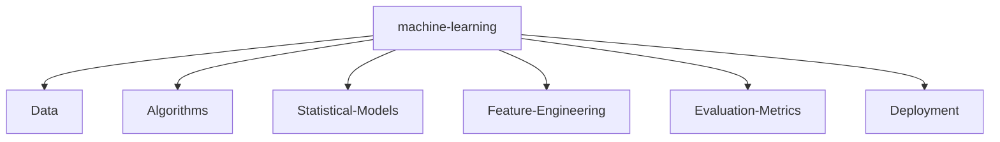

# ⚡ NITISH R.G - SYSTEM_STATUS: ONLINE ⚡

<div align="center">

<a href="https://git.io/typing-svg"></a>

<br><br>

<a href="https://mac-os-portfolio-nine-beryl.vercel.app/"></a>
<a href="https://drive.google.com/file/d/1lm1TLC00ThShlEi80uRtkz4rppco1w8O/view?usp=sharing"></a>

<br><br>

<a href="https://twitter.com/NITISH_R_G" target="_blank"></a>
<a href="https://linkedin.com/in/nitish-r-g-15-10-2007-rgn/" target="_blank"></a>
<a href="mailto:nitishrg.8220psgps2020@gmail.com" target="_blank"></a>

<!-- Easter Egg: Hey there recruiter! If you're reading this source code, you know I pay attention to detail. Let's chat! -->

</div>

## 💻 `init_developer.py`

```python
class Developer:
    def __init__(self):
        self.name = "Nitish R.G"
        self.role = "Data Science & AI Practitioner"
        self.education = {
            "BS": "Data Science @ IIT Madras",
            "BE": "Computer Science Engineering @ SIET"
        }
        self.focus = [
            "Advanced LLMs",
            "Computer Vision",
            "Full-Stack ML Integration",
            "Scalable AI Architectures"
        ]

    def get_mission(self):
        return 'Turning complex data into actionable intelligence 🚀'
```

## ⚔️ `PROJECT_WAR_ROOM`

<div align="center">
  <table width="100%" border="0" cellpadding="15">
    <tr>
      <td width="50%" align="center">
        <h3><a href="https://github.com/NITISH-R-G/PedagogyX">📚 PedagogyX</a></h3>
        <p><i>Advanced EdTech platform leveraging LLMs for personalized learning paths and automated assessment generation.</i></p>
        <p><b>Impact:</b> Revolutionized personal learning</p>
        
      </td>
      <td width="50%" align="center">
        <h3><a href="https://github.com/NITISH-R-G/PalmPlay">✋ PalmPlay</a></h3>
        <p><i>Computer Vision based real-time gesture recognition system for hands-free application control.</i></p>
        <p><b>Impact:</b> Enhanced accessibility via computer vision</p>
        
      </td>
    </tr>
    <tr>
      <td width="50%" align="center">
        <h3><a href="https://github.com/NITISH-R-G/Intelli-Credit-V2">💳 Intelli-Credit-V2</a></h3>
        <p><i>ML-driven credit scoring and risk assessment engine designed for scalable financial analysis.</i></p>
        <p><b>Impact:</b> Automated complex financial modeling</p>
        
      </td>
      <td width="50%" align="center">
        <h3><a href="https://github.com/NITISH-R-G/CODESTREAK">🔥 CODESTREAK</a></h3>
        <p><i>Developer productivity dashboard and analytics tool for tracking coding habits and consistency.</i></p>
        <p><b>Impact:</b> Improved developer consistency & tracking</p>
        
      </td>
    </tr>
  </table>
</div>

## 📈 `FOUNDER_DASHBOARD` & Experience

<div align="center">
  <table width="100%" border="0" cellpadding="10" cellspacing="0">
    <tr>
      <td width="50%" valign="top">
        <h3>🌟 Building @ GDIN</h3>
        <p>Driving innovation and building scalable systems. Focused on rapid prototyping, MVP development, and scaling AI architectures.</p>
        <br>
        <h3>🤝 Open to Collaboration</h3>
        <p>Actively looking to connect with YC founders, open-source maintainers, and innovators building the future of AI.</p>
        <br>
        <h3>🗣️ Ask me about</h3>
        <p>Computer Vision, LLMs, RAG Architectures, Startups, and Tech Communities.</p>
        <br>
        <h3>📚 Currently Learning</h3>
        <p>Advanced MLOps, Distributed Systems, Web3 integration.</p>
      </td>
      <td width="50%" valign="top">
        <h3>🏢 Experience & Education</h3>
        <ul>
          <li><b>AI Intern</b> @ <a href="https://infyspringboard.onwingspan.com/web/en/login">Infosys Springboard</a></li>
          <li><b>Developer</b> @ <a href="https://www.amd.com/en/developer/resources/ai-developer-program.html">AMD AI Developer Program</a></li>
          <li><b>Alumni</b> @ <a href="https://www.mckinsey.com/careers/students/forward">McKinsey Forward</a></li>
          <li><b>BS in Data Science</b> @ IIT Madras</li>
          <li><b>BE in Computer Science Engineering</b> @ SIET</li>
        </ul>
        <br>
        <h3>🏆 Achievements</h3>
        <ul>
          <li>Various Hackathon Wins</li>
          <li>Professional Certifications in AI/ML</li>
          <li>Leadership Roles across Tech Communities</li>
        </ul>
      </td>
    </tr>
  </table>
</div>

## 🛠️ `NEURAL_ARCHITECTURE`

<div align="center">
  <table width="100%" border="0">
    <tr>
      <td align="center" width="50%">
        <b>Languages</b><br><br>
        <a href="https://skillicons.dev"></a>
      </td>
      <td align="center" width="50%">
        <b>AI & Web Frameworks</b><br><br>
        <a href="https://skillicons.dev"></a>
      </td>
    </tr>
    <tr>
      <td align="center" width="50%">
        <b>Databases & DevOps</b><br><br>
        <a href="https://skillicons.dev"></a>
      </td>
      <td align="center" width="50%">
        <b>Tools</b><br><br>
        <a href="https://skillicons.dev"></a>
      </td>
    </tr>
  </table>
</div>



## 📊 `NETWORK_GRAPH`

<div align="center">
  <table width="100%" border="0">
    <tr>
      <td align="center">
        <a href="https://github.com/NITISH-R-G"></a>
      </td>
      <td align="center">
        <a href="https://github.com/NITISH-R-G"></a>
      </td>
    </tr>
    <tr>
      <td align="center" colspan="2">
        <a href="https://github.com/NITISH-R-G"></a>
      </td>
    </tr>
  </table>
</div>

<div align="center">
  <a href="https://github.com/NITISH-R-G"></a>
</div>

<div align="center">
  <a href="https://github.com/NITISH-R-G"></a>
</div>

<div align="center">
  <a href="https://github.com/ryo-ma/github-profile-trophy"></a>
</div>

## 🤖 `RUNTIME_LOGS`

<!--START_SECTION:activity-->
<!--END_SECTION:activity-->

<!-- BLOG-POST-LIST:START -->
<!-- BLOG-POST-LIST:END -->

<!--START_SECTION:waka-->
<!--END_SECTION:waka-->

<div align="center">
  <br>
  
  <br>
  <i>"There are 10 types of people in the world: those who understand binary, and those who don't."</i>
</div>
