# ⚡ SYSTEM_INITIALIZATION ⚡

<div align="center">


<a href="https://git.io/typing-svg"></a>

**Model, API, UI — I build the whole chain, not just the notebook demo.**
Studying Data Science at **IIT Madras**, building at **GDIN**.

[](https://mac-os-portfolio-nine-beryl.vercel.app/)
[](https://drive.google.com/file/d/1lm1TLC00ThShlEi80uRtkz4rppco1w8O/view?usp=sharing)
[](https://linkedin.com/in/nitish-r-g-15-10-2007-rgn/)
[](https://twitter.com/NITISH_R_G)

</div>

---

## 🛠️ init_developer.py

```python
class Developer:
    def __init__(self):
        self.name = "Nitish R.G"
        self.role = "Data Science and AI Practitioner | Dual-Degree Engineer"
        self.education = {
            "BS Data Science": "IIT Madras",
            "BE CSE": "SIET"
        }
        self.affiliations = [
            "GDIN", "Infosys Springboard", "AMD AI", "McKinsey Forward"
        ]
        self.focus = [
            'Advanced LLMs',
            'Computer Vision',
            'Full-Stack ML Integration',
            'Scalable AI Architectures'
        ]

    def get_mission(self):
        return 'Turning complex data into actionable intelligence 🚀'
```

---

## 🚀 FOUNDER_DASHBOARD

### `Tech Stack`

<div align="center">
  <a href="https://skillicons.dev">
    
  </a>
  <br>
  <a href="https://skillicons.dev">
    
  </a>
</div>

### `Neural Architecture Overview`

```mermaid
graph TD;
    A[Data Engineering] -->|Pipelines| B(ML/AI Models);
    B --> C{Backend Systems};
    C -->|APIs| D[Frontend & UI];
    C -->|Analytics| E[Dashboards];
    style A fill:#0d1117,stroke:#00c3ff,stroke-width:2px;
    style B fill:#0d1117,stroke:#00c3ff,stroke-width:2px;
    style C fill:#0d1117,stroke:#00c3ff,stroke-width:2px;
    style D fill:#0d1117,stroke:#00c3ff,stroke-width:2px;
    style E fill:#0d1117,stroke:#00c3ff,stroke-width:2px;
```



---

## ⚔️ PROJECT_WAR_ROOM

<table>
  <tr>
    <td width="50%" valign="top">
      <h3>📚 <a href="https://github.com/NITISH-R-G/PedagogyX">PedagogyX</a></h3>
      <p>LLM-driven EdTech platform — personalized learning paths, automated assessment generation.</p>
      <p><b>Impact:</b> Revolutionizing personalized learning through adaptive AI assessments.</p>
      <p>
        
        
        
      </p>
    </td>
    <td width="50%" valign="top">
      <h3>✋ <a href="https://github.com/NITISH-R-G/PalmPlay">PalmPlay</a></h3>
      <p>Real-time computer-vision gesture recognition for hands-free app control.</p>
      <p><b>Impact:</b> Enhancing accessibility and interactive media control with seamless CV.</p>
      <p>
        
        
      </p>
    </td>
  </tr>
  <tr>
    <td width="50%" valign="top">
      <h3>💳 <a href="https://github.com/NITISH-R-G/Intelli-Credit-V2">Intelli-Credit-V2</a></h3>
      <p>ML credit-scoring and risk engine built for scalable financial analysis.</p>
      <p><b>Impact:</b> Delivering highly accurate credit risk profiling for modern fintech apps.</p>
      <p>
        
        
      </p>
    </td>
    <td width="50%" valign="top">
      <h3>🔥 <a href="https://github.com/NITISH-R-G/CODESTREAK">CODESTREAK</a></h3>
      <p>Developer-productivity dashboard for tracking coding habits and consistency.</p>
      <p><b>Impact:</b> Gamifying coding consistency and elevating developer workflows globally.</p>
      <p>
        
        
      </p>
    </td>
  </tr>
</table>

---

## 📈 NETWORK_GRAPH & STATS

<div align="center">
  
  <br/>
  
  
  <br/>
  
  <br/>
  <a href="https://github.com/ryo-ma/github-profile-trophy">
    
  </a>
</div>

<div align="center">
  
</div>

<div align="center">
  
</div>

---

## 🕒 ACTIVITY_LOG

<!--START_SECTION:activity-->
<!--END_SECTION:activity-->

## 📰 RECENT_LOGS (Blog)

<!-- BLOG-POST-LIST:START -->
<!-- BLOG-POST-LIST:END -->

## ⏱️ WAKATIME_METRICS

<!--START_SECTION:waka-->
<!--END_SECTION:waka-->

---

## 🏆 ACHIEVEMENTS & CREDENTIALS

### Track Record

- **AI Intern** → [Infosys Springboard](https://infyspringboard.onwingspan.com/web/en/login)
- **Developer** → [AMD AI Developer Program](https://www.amd.com/en/developer/resources/ai-developer-program.html)
- **Alumnus** → [McKinsey Forward](https://www.mckinsey.com/careers/students/forward)

### Certifications, Hackathons, Internships, Leadership

- *Actively building and scaling impactful applications at GDIN.*
- *Open to collaborating with visionaries building AI that transcends the demo stage.*

---

## 💬 Ask me about

> 💡 How to architect scalable ML pipelines.
> 💡 Bridging the gap between Jupyter Notebooks and Production systems.
> 💡 Integrating Next.js with FastAPI & PyTorch for seamless GenAI apps.

<div align="center">
  <i>"A bug in the code is just an undocumented feature waiting to be discovered."</i> - Anonymous Developer
</div>

<div align="center">
  <a href="mailto:nitishrg.8220psgps2020@gmail.com">
    
  </a>
</div>

<!-- HIDDEN EASTER EGG: Hello Recruiter/Developer! If you are reading this, you clearly have an eye for detail. Let's chat! -->
