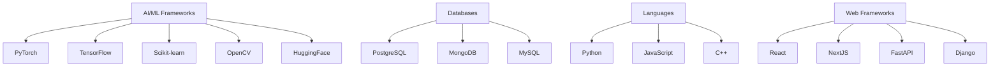

# 🚀 SYSTEM_INITIALIZATION: Developer Profile

<!-- Easter Egg: Hey recruiter/developer looking at the raw markdown! You've got an eye for detail. Feel free to reach out to me! -->

<p align="center">
    <a href="https://github.com/NITISH-R-G/NITISH-R-G"></a>
    <a href="https://github.com/python/cpython"></a>
    
</p>

<p align="center">
    <a href="https://git.io/typing-svg">
        
    </a>
</p>

## 👨‍💻 `init_developer.py`

```python
class Developer:
    def __init__(self):
        self.name = "Nitish R.G"
        self.role = "Data Science & AI Practitioner"
        self.education = {
            "BS": "Data Science @ IIT Madras",
            "BE": "Computer Science Engineering @ SIET"
        }
        self.focus = [
            "Advanced LLMs",
            "Computer Vision",
            "Full-Stack ML Integration",
            "Scalable AI Architectures"
        ]

    def get_mission(self):
        return "Turning complex data into actionable intelligence 🚀"

# Executing instance
nitish = Developer()
```

## ⚔️ `PROJECT_WAR_ROOM`

<div align="center">
  <table width="100%" border="0" cellpadding="15">
    <tr>
      <td width="50%" align="center">
        <h3><a href="https://github.com/NITISH-R-G/PedagogyX" style="color:#00c3ff;">📚 PedagogyX</a></h3>
        <p><i>Advanced EdTech platform leveraging LLMs for personalized learning paths and automated assessment generation.</i></p>
        <p><b>Impact:</b> Streamlines educational content delivery and adaptive testing.</p>
        <p><b>Tech used:</b>   </p>
      </td>
      <td width="50%" align="center">
        <h3><a href="https://github.com/NITISH-R-G/PalmPlay" style="color:#00c3ff;">✋ PalmPlay</a></h3>
        <p><i>Computer Vision based real-time gesture recognition system for hands-free application control.</i></p>
        <p><b>Impact:</b> Enables touchless human-computer interaction for accessible UI manipulation.</p>
        <p><b>Tech used:</b>  </p>
      </td>
    </tr>
    <tr>
      <td width="50%" align="center">
        <h3><a href="https://github.com/NITISH-R-G/Intelli-Credit-V2" style="color:#00c3ff;">💳 Intelli-Credit</a></h3>
        <p><i>ML-driven credit scoring and risk assessment engine designed for scalable financial analysis.</i></p>
        <p><b>Impact:</b> Enhances risk prediction accuracy and automates loan approval processes.</p>
        <p><b>Tech used:</b>  </p>
      </td>
      <td width="50%" align="center">
        <h3><a href="https://github.com/NITISH-R-G/CODESTREAK" style="color:#00c3ff;">🔥 CODESTREAK</a></h3>
        <p><i>Developer productivity dashboard and analytics tool for tracking coding habits and consistency.</i></p>
        <p><b>Impact:</b> Gamifies developer productivity and improves daily coding habits.</p>
        <p><b>Tech used:</b>  </p>
      </td>
    </tr>
  </table>
</div>

## 🌐 `EXTERNAL_LINKS`

<div align="center">
  <table width="100%" border="0" cellpadding="15">
    <tr>
      <td width="50%" align="center">
        <h3><a href="https://mac-os-portfolio-nine-beryl.vercel.app/" style="color:#00c3ff;">🖥️ Mac OS Style Portfolio</a></h3>
        <p><i>Experience my work through an interactive, visually stunning Mac OS-themed web portfolio.</i></p>
        <a href="https://mac-os-portfolio-nine-beryl.vercel.app/">
            
        </a>
      </td>
      <td width="50%" align="center">
        <h3><a href="https://drive.google.com/file/d/1lm1TLC00ThShlEi80uRtkz4rppco1w8O/view?usp=sharing" style="color:#00c3ff;">📄 Comprehensive Resume</a></h3>
        <p><i>Dive deep into my technical background, academic achievements, and professional experience.</i></p>
        <a href="https://drive.google.com/file/d/1lm1TLC00ThShlEi80uRtkz4rppco1w8O/view?usp=sharing">
            
        </a>
      </td>
    </tr>
  </table>
</div>

## 🧠 `NEURAL_ARCHITECTURE` (Tech Stack)



<div align="center">
  <table width="100%">
    <tr>
      <td align="center">
        <b>Currently Learning:</b> Distributed Systems and Advanced MLOps 🚀
      </td>
      <td align="center">
        <b>Ask Me About:</b> RAG architectures, Computer Vision, and Building MVPs!
      </td>
    </tr>
  </table>
</div>

## 🏆 `ACHIEVEMENTS_AND_CREDIBILITY`

* **Internships & Roles:**
  * AI Intern @ **Infosys Springboard**
  * Developer @ **AMD AI Developer Program**
  * Building @ **GDIN**
* **Leadership & Programs:**
  * Alumni @ **McKinsey Forward**
* **Education & Certifications:**
  * BS in Data Science @ **IIT Madras**
  * BE in Computer Science Engineering @ **SIET**
* **Hackathons:** Actively building and rapid-prototyping scalable AI architectures in various hackathons and collaborative developer ecosystems.

## 📈 `SYSTEM_STATUS` (Metrics & Activity)

<div align="center">
  
  
</div>

<div align="center">
  
</div>

<br>

<div align="center">
  
</div>

<br>

<div align="center">
  
</div>

<br>

<div align="center">
  
</div>

<!-- START_SECTION:activity -->
<!-- END_SECTION:activity -->

<!-- BLOG-POST-LIST:START -->
<!-- BLOG-POST-LIST:END -->

<!-- START_SECTION:waka -->
<!-- END_SECTION:waka -->

## 🎭 `DEVELOPER_HUMOR`

> Why do programmers prefer dark mode?
> Because light attracts bugs! 🐛

## 📫 `NETWORK_GRAPH` (Contact)

<p align="center">
<a href="https://twitter.com/NITISH_R_G" target="_blank"></a>
<a href="https://linkedin.com/in/nitish-r-g-15-10-2007-rgn/" target="_blank"></a>
<a href="mailto:nitishrg.8220psgps2020@gmail.com" target="_blank"></a>
</p>
