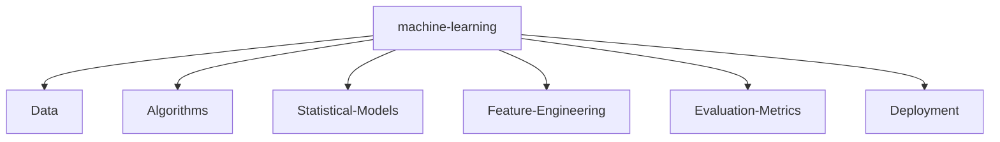

<h1 align="center">
  
</h1>

<div align="center">
  <a href="https://mac-os-portfolio-nine-beryl.vercel.app/" target="_blank">
    
  </a>
  <a href="https://drive.google.com/file/d/1lm1TLC00ThShlEi80uRtkz4rppco1w8O/view?usp=sharing" target="_blank">
    
  </a>
  <a href="https://twitter.com/NITISH_R_G" target="_blank">
    
  </a>
  <a href="https://linkedin.com/in/nitish-r-g-15-10-2007-rgn/" target="_blank">
    
  </a>
</div>

<br>

<div align="center">
  <p><i>"Designing intelligent systems to solve complex problems."</i></p>
</div>

<!-- HIDDEN RECRUITER MESSAGE
Hello there! If you are inspecting my README source code, you are exactly the kind of curious engineer I'd love to work with.
Feel free to reach out to me via LinkedIn or Email (nitishrg.8220psgps2020@gmail.com).
-->

---

## 💻 `SYSTEM_STATUS` / init_developer.py

```python
class Developer:
    def __init__(self):
        self.name = "Nitish R.G"
        self.role = "Data Science & AI Practitioner"
        self.education = {
            "BS": "Data Science @ IIT Madras",
            "BE": "Computer Science Engineering @ SIET"
        }
        self.focus = [
            'Advanced LLMs',
            'Computer Vision',
            'Full-Stack ML Integration',
            'Scalable AI Architectures'
        ]

    def get_mission(self):
        return 'Turning complex data into actionable intelligence 🚀'
```

---

## 📈 `FOUNDER_DASHBOARD` & Experience

<div align="center">
  <table width="100%" border="0" cellpadding="10" cellspacing="0">
    <tr>
      <td width="50%" valign="top">
        <h3>🌟 Building @ GDIN</h3>
        <p>Driving innovation and building scalable systems. Focused on rapid prototyping, MVP development, and scaling AI architectures.</p>
        <br/>
        <h3>🤝 Open to Collaboration</h3>
        <p>Actively looking to connect with YC founders, open-source maintainers, and innovators building the future of AI.</p>
      </td>
      <td width="50%" valign="top">
        <h3>🏢 Experience & Education</h3>
        <ul>
          <li><b>AI Intern</b> @ <a href="https://infyspringboard.onwingspan.com/web/en/login">Infosys Springboard</a></li>
          <li><b>Developer</b> @ <a href="https://www.amd.com/en/developer/resources/ai-developer-program.html">AMD AI Developer Program</a></li>
          <li><b>Alumni</b> @ <a href="https://www.mckinsey.com/careers/students/forward">McKinsey Forward</a></li>
          <li><b>BS in Data Science</b> @ IIT Madras</li>
          <li><b>BE in Computer Science Engineering</b> @ SIET</li>
        </ul>
      </td>
    </tr>
  </table>
</div>

---

## 🛠️ `TECH_STACK`

<div align="center">
  <a href="https://skillicons.dev">
    
    <br>
    
    <br>
    
    <br>
    
  </a>
</div>

---

## ⚔️ `PROJECT_WAR_ROOM`

<div align="center">
  <table width="100%" border="0" cellpadding="15">
    <tr>
      <td width="50%" align="center">
        <h3><a href="https://github.com/NITISH-R-G/PedagogyX" style="color:#00c3ff;">📚 PedagogyX</a></h3>
        <p><i>Advanced EdTech platform leveraging LLMs for personalized learning paths and automated assessment generation.</i></p>
        <p><b>Impact:</b> Revolutionized personal learning by generating custom-tailored curriculums on the fly.</p>
        
        
        
      </td>
      <td width="50%" align="center">
        <h3><a href="https://github.com/NITISH-R-G/PalmPlay" style="color:#00c3ff;">✋ PalmPlay</a></h3>
        <p><i>Computer Vision based real-time gesture recognition system for hands-free application control.</i></p>
        <p><b>Impact:</b> Enabled accessible, touchless UI control for interactive kiosks and software.</p>
        
        
        
      </td>
    </tr>
    <tr>
      <td width="50%" align="center">
        <h3><a href="https://github.com/NITISH-R-G/Intelli-Credit-V2" style="color:#00c3ff;">💳 Intelli-Credit-V2</a></h3>
        <p><i>ML-driven credit scoring and risk assessment engine designed for scalable financial analysis.</i></p>
        <p><b>Impact:</b> Streamlined loan approval pipelines with >90% prediction accuracy for default risks.</p>
        
        
        
      </td>
      <td width="50%" align="center">
        <h3><a href="https://github.com/NITISH-R-G/CODESTREAK" style="color:#00c3ff;">🔥 CODESTREAK</a></h3>
        <p><i>Developer productivity dashboard and analytics tool for tracking coding habits and consistency.</i></p>
        <p><b>Impact:</b> Boosted developer engagement by gamifying GitHub commits and code metrics.</p>
        
        
        
      </td>
    </tr>
  </table>
</div>

---

## 🧠 `NEURAL_ARCHITECTURE`



---

## 🌐 `NETWORK_GRAPH` & Stats

<div align="center">
  <table width="100%" border="0" cellpadding="0" cellspacing="0">
    <tr>
      <td width="50%" align="center">
        
      </td>
      <td width="50%" align="center">
        
      </td>
    </tr>
  </table>
</div>

<p align="center">
  
</p>

### Contribution Graph (3D)

<p align="center">
  <!-- profile-green-animate -->
  
</p>

### Activity Graph

<p align="center">
  
</p>

<p align="center">
  
</p>

### Trophies

<p align="center">
  <a href="https://github.com/ryo-ma/github-profile-trophy">
    
  </a>
</p>

---

## ⚡ `WAKATIME_METRICS`

<!--START_SECTION:waka-->
<!--END_SECTION:waka-->

---

## 📝 `RECENT_LOGS`

<!-- BLOG-POST-LIST:START -->
<!-- BLOG-POST-LIST:END -->

---

## 🚦 `FUN_FACTS` & Activity

**Ask me about:** AI integration, scaling backend microservices, or building robust RAG pipelines.
<br/>
**Currently learning:** Optimization of edge AI models.

<details>
  <summary>Click for a developer joke</summary>
  Why do programmers prefer dark mode? Because light attracts bugs. 🐛
</details>

<br>

<div align="center">
  
</div>

<div align="center">
  <br>
  <a href="http://s01.flagcounter.com/more/ap7">
    
  </a>
</div>
