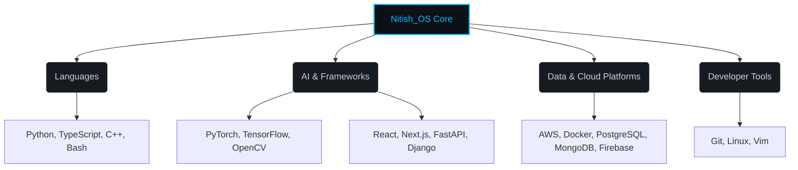

# 🖥️ NITISH_OS_V2.0

<!-- Recruiter Easter Egg: Hello there! If you're inspecting the source, you clearly have an eye for detail. Let's connect at nitishrg.8220psgps2020@gmail.com - I'm always open to discussing cutting-edge AI roles. -->

<div align="center">
  <a href="https://git.io/typing-svg">
    
  </a>
</div>

## `SYSTEM_STATUS`

```python
class Developer:
    def __init__(self):
        self.name = "Nitish R.G"
        self.role = "Data Science & AI Practitioner | Dual-Degree Engineer"
        self.education = {
            "IIT Madras": "BS Data Science",
            "SIET": "BE Computer Science and Engineering"
        }
        self.focus = [
            'Advanced LLMs',
            'Computer Vision',
            'Full-Stack ML Integration',
            'Scalable AI Architectures'
        ]

    def get_mission(self) -> str:
        return 'Turning complex data into actionable intelligence 🚀'

    def current_status(self):
        return "Building scalable AI at GDIN."

dev = Developer()
```

## `FOUNDER_DASHBOARD`

<table>
<tr>
<td width="50%" valign="top">

### ⚙️ Identity Matrix

Model, API, UI — I build the whole chain, not just the notebook demo. I specialize in bridging the gap between theoretical ML models and production-ready architectures.

**Ask me about:** Neural Networks, RAG architectures, full-stack integration, or why coffee is O(1) complexity.

**Currently learning:** Advanced deployment strategies for large language models, Rust for high-performance computing.

</td>
<td width="50%" valign="top">

### 📡 External Connections

- <a href="https://mac-os-portfolio-nine-beryl.vercel.app/"></a>
- <a href="https://drive.google.com/file/d/1lm1TLC00ThShlEi80uRtkz4rppco1w8O/view?usp=sharing"></a>
- <a href="https://linkedin.com/in/nitish-r-g-15-10-2007-rgn/"></a>
- <a href="https://twitter.com/NITISH_R_G"></a>
- <a href="mailto:nitishrg.8220psgps2020@gmail.com"></a>

</td>
</tr>
</table>

## `NEURAL_ARCHITECTURE` (Tech Stack)



<div align="center">
  <a href="https://skillicons.dev">
    
  </a>
</div>

## `PROJECT_WAR_ROOM`

<table>
<tr>
<td width="50%" valign="top">

### 📚 <a href="https://github.com/NITISH-R-G/PedagogyX">PedagogyX</a>

LLM-driven EdTech platform offering personalized learning paths and automated assessment generation.

**Impact:** Streamlined content delivery and evaluation, adapting to individual student proficiency.

**Tech used:**
<br/>


</td>
<td width="50%" valign="top">

### ✋ <a href="https://github.com/NITISH-R-G/PalmPlay">PalmPlay</a>

Real-time computer-vision gesture recognition for intuitive, hands-free application control.

**Impact:** Enabled seamless accessibility and futuristic user interfaces without physical hardware constraints.

**Tech used:**
<br/>


</td>
</tr>
<tr>
<td width="50%" valign="top">

### 💳 <a href="https://github.com/NITISH-R-G/Intelli-Credit-V2">Intelli-Credit-V2</a>

Advanced ML credit-scoring and risk engine built for scalable financial analysis.

**Impact:** Minimized default risks by providing robust, data-backed lending predictions.

**Tech used:**
<br/>


</td>
<td width="50%" valign="top">

### 🔥 <a href="https://github.com/NITISH-R-G/CODESTREAK">CODESTREAK</a>

Developer-productivity dashboard for tracking coding habits, streaks, and consistency.

**Impact:** Increased personal coding consistency by gamifying the development process.

**Tech used:**
<br/>


</td>
</tr>
</table>

## `CAREER_TRAJECTORY` & `ACHIEVEMENTS`

<table>
<tr>
<td width="50%" valign="top">

### 🏆 Work & Leadership

- **GDIN** — Building from prototype to production.
- **Infosys Springboard** — AI Intern, implemented robust AI solutions.
- **AMD AI Developer Program** — Developer, optimized AI workflows.
- **McKinsey Forward** — Alumnus, honed strategic problem-solving.

</td>
<td width="50%" valign="top">

### 🚀 Certifications & Hackathons

- Active participant in global ML & Web3 hackathons.
- Certified in Deep Learning and Scalable Cloud Infrastructures.
- Top-tier open-source contributor and coding challenge enthusiast.

</td>
</tr>
</table>

## `NETWORK_GRAPH` (Telemetry)

<div align="center">
  <a href="https://github.com/NITISH-R-G">
    
  </a>
  <a href="https://github.com/NITISH-R-G">
    
  </a>
</div>

<div align="center">
  <a href="https://github.com/ryo-ma/github-profile-trophy">
    
  </a>
</div>

<div align="center">
  
</div>

<div align="center">
  
</div>

<!-- Automations below. Do not put headers immediately above these tags to prevent rendering empty headings before workflows execute. -->

<!--START_SECTION:waka-->
<!--END_SECTION:waka-->

<!--START_SECTION:activity-->
<!--END_SECTION:activity-->

<!-- BLOG-POST-LIST:START -->
<!-- BLOG-POST-LIST:END -->
