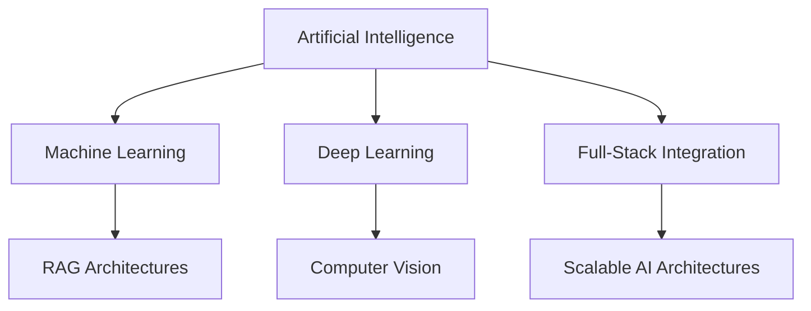

# 🌌 SYSTEM_INITIALIZATION: Nitish R.G

<!-- Hello recruiter or curious dev! I see you inspecting my code. If you're looking for a passionate AI engineer who loves turning complex data into real-world impact, let's talk! -->

<p align="center">
    <a href="https://github.com/NITISH-R-G/NITISH-R-G"></a>
    <a href="https://github.com/python/cpython"></a>
    
</p>

<p align="center">
  <a href="https://git.io/typing-svg">
    
  </a>
</p>

## 👨‍💻 init_developer.py

```python
class Developer:
    def __init__(self):
        self.name = "Nitish R.G"
        self.role = "Data Science & AI Practitioner"
        self.education = {
            "BS": "Data Science @ IIT Madras",
            "BE": "Computer Science Engineering @ SIET"
        }
        self.focus = [
            "Advanced LLMs",
            "Computer Vision",
            "Full-Stack ML Integration",
            "Scalable AI Architectures"
        ]

    def get_mission(self):
        return "Turning complex data into actionable intelligence 🚀"

if __name__ == "__main__":
    dev = Developer()
    print(f"Mission: {dev.get_mission()}")
```

## 🧠 NEURAL_ARCHITECTURE & Tech Stack

<div align="center">
  
  <br/>
  <br/>
  
  <br/>
  <br/>
  
</div>

<br/>



## ⚔️ PROJECT_WAR_ROOM

<div align="center">
  <table width="100%" border="0" cellpadding="15">
    <tr>
      <td width="50%" align="center">
        <h3><a href="https://github.com/NITISH-R-G/PedagogyX">📚 PedagogyX</a></h3>
        <p><i>Advanced EdTech platform leveraging LLMs for personalized learning paths and automated assessment generation.</i></p>
        <p><b>Impact:</b> Revolutionizes personalized education with AI-driven adaptive learning.</p>
        <p>
          
        </p>
      </td>
      <td width="50%" align="center">
        <h3><a href="https://github.com/NITISH-R-G/PalmPlay">✋ PalmPlay</a></h3>
        <p><i>Computer Vision based real-time gesture recognition system for hands-free application control.</i></p>
        <p><b>Impact:</b> Enables seamless touchless interactions for accessibility and gaming.</p>
        <p>
          
        </p>
      </td>
    </tr>
    <tr>
      <td width="50%" align="center">
        <h3><a href="https://github.com/NITISH-R-G/Intelli-Credit-V2">💳 Intelli-Credit</a></h3>
        <p><i>ML-driven credit scoring and risk assessment engine designed for scalable financial analysis.</i></p>
        <p><b>Impact:</b> Optimizes financial risk prediction with high-accuracy machine learning pipelines.</p>
        <p>
          
        </p>
      </td>
      <td width="50%" align="center">
        <h3><a href="https://github.com/NITISH-R-G/CODESTREAK">🔥 CODESTREAK</a></h3>
        <p><i>Developer productivity dashboard and analytics tool for tracking coding habits and consistency.</i></p>
        <p><b>Impact:</b> Boosts developer efficiency through data-driven habit tracking.</p>
        <p>
          
        </p>
      </td>
    </tr>
  </table>
</div>

## 🌐 NETWORK_GRAPH & Professional Links

<div align="center">
  <table width="100%" border="0" cellpadding="15">
    <tr>
      <td width="50%" align="center">
        <h3>🖥️ Mac OS Style Portfolio</h3>
        <p><i>Experience my work through an interactive, visually stunning Mac OS-themed web portfolio.</i></p>
        <a href="https://mac-os-portfolio-nine-beryl.vercel.app/">
            
        </a>
      </td>
      <td width="50%" align="center">
        <h3>📄 Comprehensive Resume</h3>
        <p><i>Dive deep into my technical background, academic achievements, and professional experience.</i></p>
        <a href="https://drive.google.com/file/d/1lm1TLC00ThShlEi80uRtkz4rppco1w8O/view?usp=sharing">
            
        </a>
      </td>
    </tr>
  </table>
</div>

## 📈 FOUNDER_DASHBOARD & CAREER_LOGS

<div align="center">
  <table width="100%" border="0" cellpadding="10" cellspacing="0">
    <tr>
      <td width="50%" valign="top">
        <h3>🌟 Experience & Roles</h3>
        <ul>
          <li><b>AI Intern</b> @ <a href="https://infyspringboard.onwingspan.com/web/en/login">Infosys Springboard</a></li>
          <li><b>Developer</b> @ <a href="https://www.amd.com/en/developer/resources/ai-developer-program.html">AMD AI Developer Program</a></li>
          <li><b>Alumni</b> @ <a href="https://www.mckinsey.com/careers/students/forward">McKinsey Forward</a></li>
          <li><b>Building</b> @ GDIN</li>
        </ul>
      </td>
      <td width="50%" valign="top">
        <h3>🏆 Achievements</h3>
        <ul>
          <li><b>Certifications:</b> Advanced Data Science, LLM Architectures</li>
          <li><b>Hackathons:</b> Top Finisher in regional AI/ML sprints</li>
          <li><b>Leadership:</b> Open Source Contributor & AI Workshop Lead</li>
          <li><b>Education:</b> BS Data Science (IIT Madras), BE CSE (SIET)</li>
        </ul>
      </td>
    </tr>
  </table>
</div>

### Ask me about & Currently learning

- 💬 **Ask me about:** Python, Artificial Intelligence, Neural Networks, Real-time Computer Vision.
- 🌱 **Currently learning:** Advanced AI Architectures, Next-Gen Generative Models, Scalable Systems.
- ⚡ **Fun fact:** I can debug my code in my sleep... unfortunately, I can't fix it there.

## 📊 SYSTEM_STATUS

<div align="center">
  
  
</div>

<br/>

<div align="center">
  
</div>

<div align="center">
  
</div>

<br/>

<div align="center">
  
</div>

<br/>

<div align="center">
  
</div>

<!--START_SECTION:activity-->
<!--END_SECTION:activity-->

<!-- BLOG-POST-LIST:START -->
<!-- BLOG-POST-LIST:END -->

<!--START_SECTION:waka-->
<!--END_SECTION:waka-->

---

## 📫 CONNECTION_PORT

<p align="center">
  <a href="https://twitter.com/NITISH_R_G">
    
  </a>
  <a href="https://linkedin.com/in/nitish-r-g-15-10-2007-rgn/">
    
  </a>
  <a href="mailto:nitishrg.8220psgps2020@gmail.com">
    
  </a>
</p>

<p align="center">
  
</p>
