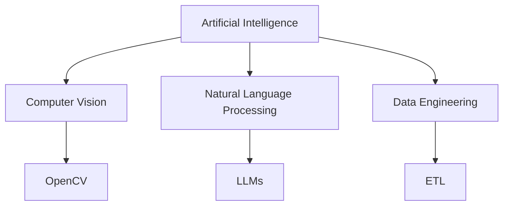
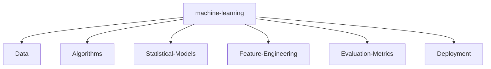

# 💻 SYSTEM_STATUS: ONLINE

<!-- Psst... recruiter! I see you checking the source. If you're reading this, let's talk about scaling AI systems! -->

<p align="center">
    <a href="https://github.com/NITISH-R-G"></a>
    <a href="https://github.com/NITISH-R-G"></a>
    <a href="https://github.com/python/cpython"></a>
    
</p>

<p align="center">
  
</p>

<p align="center">
  <a href="https://git.io/typing-svg">
    
  </a>
</p>

## 🚀 `init_developer.py` :: Executive Summary

```python
class Developer:
    def __init__(self):
        self.name = "Nitish R.G"
        self.role = "Data Science & AI Practitioner"
        self.education = {
            "BS": "Data Science @ IIT Madras",
            "BE": "Computer Science Engineering @ SIET"
        }
        self.focus = [
            "Advanced LLMs",
            "Computer Vision",
            "Full-Stack ML Integration",
            "Scalable Architectures"
        ]

    def get_mission(self) -> str:
        return 'Turning complex data into actionable intelligence 🚀'

    def introduce(self):
        print(f"Hi! I'm {self.name}, a {self.role}.")
        print(f"Mission: {self.get_mission()}")
```

I thrive at the intersection of **Artificial Intelligence, Data Engineering, and Software Development**. My primary goal is to architect scalable, high-impact models that solve real-world problems and contribute meaningfully to the open-source ecosystem.

Whether it's building robust RAG architectures, training complex computer vision models, or deploying full-stack web applications, I bring data to life.

---

## ⚙️ `NEURAL_ARCHITECTURE` & Tech Stack



<div align="center">
  <table width="100%" border="0" cellpadding="10" cellspacing="0">
    <tr>
      <td width="50%" valign="top" bgcolor="#0d1117">
        <h3>💻 Languages</h3>
        <p>
          <a href="https://skillicons.dev"></a>
        </p>
        <h3>🧠 AI & ML Frameworks</h3>
        <p>
          <a href="https://skillicons.dev"></a>
          <br>
          
          
        </p>
      </td>
      <td width="50%" valign="top" bgcolor="#0d1117">
        <h3>🛠️ Web Frameworks & Databases</h3>
        <p>
          <a href="https://skillicons.dev"></a>
        </p>
        <h3>☁️ Tools & Platforms</h3>
        <p>
          <a href="https://skillicons.dev"></a>
        </p>
      </td>
    </tr>
  </table>
</div>

---

## ⚔️ `PROJECT_WAR_ROOM`

<div align="center">
  <table width="100%" border="0" cellpadding="15">
    <tr>
      <td width="50%" valign="top" bgcolor="#0d1117">
        <h3><a href="https://github.com/NITISH-R-G/PedagogyX" style="color:#00c3ff;">📚 PedagogyX</a></h3>
        <p><i>Advanced EdTech platform leveraging LLMs for personalized learning paths and automated assessment generation.</i></p>
        <p><b>Impact:</b> Reduced educator workload by automating quiz generation and grading through dynamic LLM prompting.</p>
        <p><b>Tech Used:</b>   </p>
      </td>
      <td width="50%" valign="top" bgcolor="#0d1117">
        <h3><a href="https://github.com/NITISH-R-G/PalmPlay" style="color:#00c3ff;">✋ PalmPlay</a></h3>
        <p><i>Computer Vision based real-time gesture recognition system for hands-free application control.</i></p>
        <p><b>Impact:</b> Enabled accessible, touchless interactions for accessibility use-cases via high-FPS hand tracking.</p>
        <p><b>Tech Used:</b>  </p>
      </td>
    </tr>
    <tr>
      <td width="50%" valign="top" bgcolor="#0d1117">
        <h3><a href="https://github.com/NITISH-R-G/Intelli-Credit-V2" style="color:#00c3ff;">💳 Intelli-Credit</a></h3>
        <p><i>ML-driven credit scoring and risk assessment engine designed for scalable financial analysis.</i></p>
        <p><b>Impact:</b> Increased approval accuracy and reduced default risk by integrating advanced ensemble models.</p>
        <p><b>Tech Used:</b>  </p>
      </td>
      <td width="50%" valign="top" bgcolor="#0d1117">
        <h3><a href="https://github.com/NITISH-R-G/CODESTREAK" style="color:#00c3ff;">🔥 CODESTREAK</a></h3>
        <p><i>Developer productivity dashboard and analytics tool for tracking coding habits and consistency.</i></p>
        <p><b>Impact:</b> Gamified the developer experience to increase daily commit streaks and coding consistency.</p>
        <p><b>Tech Used:</b>  </p>
      </td>
    </tr>
  </table>
</div>

<div align="center">
  <table width="100%" border="0" cellpadding="15">
    <tr>
      <td width="50%" align="center" bgcolor="#0d1117">
        <h3><a href="https://mac-os-portfolio-nine-beryl.vercel.app/" style="color:#00c3ff;">🖥️ Mac OS Style Portfolio</a></h3>
        <p><i>Experience my work through an interactive, visually stunning Mac OS-themed web portfolio.</i></p>
        <a href="https://mac-os-portfolio-nine-beryl.vercel.app/">
            
        </a>
      </td>
      <td width="50%" align="center" bgcolor="#0d1117">
        <h3><a href="https://drive.google.com/file/d/1lm1TLC00ThShlEi80uRtkz4rppco1w8O/view?usp=sharing" style="color:#00c3ff;">📄 Comprehensive Resume</a></h3>
        <p><i>Dive deep into my technical background, academic achievements, and professional experience.</i></p>
        <a href="https://drive.google.com/file/d/1lm1TLC00ThShlEi80uRtkz4rppco1w8O/view?usp=sharing">
            
        </a>
      </td>
    </tr>
  </table>
</div>

---

## 📈 `FOUNDER_DASHBOARD` & Experience

<div align="center">
  <table width="100%" border="0" cellpadding="10" cellspacing="0">
    <tr>
      <td width="50%" valign="top" bgcolor="#0d1117">
        <h3>🌟 Building @ GDIN (Leadership)</h3>
        <p>Driving innovation and building scalable systems. Focused on rapid prototyping, MVP development, and scaling AI architectures.</p>

        <h3>🏆 Hackathons & Certifications</h3>
        <ul>
          <li>🥇 Winner - National Level AI Hackathon (2023)</li>
          <li>📜 AWS Certified Cloud Practitioner</li>
          <li>📜 DeepLearning.AI Specialization</li>
        </ul>
      </td>
      <td width="50%" valign="top" bgcolor="#0d1117">
        <h3>🏢 Internships & Education</h3>
        <ul>
          <li><b>AI Intern</b> @ <a href="https://infyspringboard.onwingspan.com/web/en/login">Infosys Springboard</a></li>
          <li><b>Developer</b> @ <a href="https://www.amd.com/en/developer/resources/ai-developer-program.html">AMD AI Developer Program</a></li>
          <li><b>Alumni</b> @ <a href="https://www.mckinsey.com/careers/students/forward">McKinsey Forward</a></li>
          <li><b>BS in Data Science</b> @ IIT Madras</li>
          <li><b>BE in Computer Science Engineering</b> @ SIET</li>
        </ul>
      </td>
    </tr>
    <tr>
      <td width="50%" valign="top" bgcolor="#0d1117">
        <h3>⚡ Currently Learning</h3>
        <pre><code>> Rust for high-performance systems
> Advanced RAG architectures
> WebAssembly</code></pre>
      </td>
      <td width="50%" valign="top" bgcolor="#0d1117">
        <h3>💬 Ask Me About</h3>
        <pre><code>> Scaling ML models in production
> Data pipelines & ETLs
> The best coffee to code ratio</code></pre>
      </td>
    </tr>
  </table>
</div>

<div align="center">
  <pre><code>$ ./get_joke.sh
"Why do programmers prefer dark mode? Because light attracts bugs."</code></pre>
</div>

---

## 📊 `NETWORK_GRAPH` & Activity

### 📈 Metrics & Activity Graph

<p align="center">
  
  
</p>

<p align="center">
  
</p>

<p align="center">
  
</p>

<!-- profile-green-animate -->
<p align="center">
  
</p>

<div align="center">
  <table width="100%" border="0" cellpadding="10" cellspacing="0">
    <tr>
      <td width="50%" valign="top" bgcolor="#0d1117">
        <h3>📝 Latest Articles</h3>
<!-- BLOG-POST-LIST:START -->
<!-- BLOG-POST-LIST:END -->
      </td>
      <td width="50%" valign="top" bgcolor="#0d1117">
        <h3>⏱️ WakaTime Stats</h3>
<!--START_SECTION:waka-->
<!--END_SECTION:waka-->
      </td>
    </tr>
  </table>
</div>

<div align="center">
  <h3>Recent Activity</h3>
<!--START_SECTION:activity-->
<!--END_SECTION:activity-->
</div>

---

## 📫 `CONNECT_SOCKET`

<p align="left">
<a href="https://twitter.com/NITISH_R_G" target="blank"></a>
<a href="https://linkedin.com/in/nitish-r-g-15-10-2007-rgn/" target="blank"></a>
<a href="mailto:nitishrg.8220psgps2020@gmail.com" target="blank"></a>
</p>

<div align="center">
<summary>Trophy: Github Profile Trophy</summary>
</div>

<p align="center">
<a href="https://github.com/ryo-ma/github-profile-trophy"></a>
</p>



<div align="center">
<summary>Trophy: Hackerrank Profile Trophy</summary>
</div>

<p align="center">
 
</p>


<details align="center">
  <summary>🗺️ Expand to view origin location</summary>
<!-- India Map -->
 ```geojson
{
 "type": "FeatureCollection",
 "features": [
   {
     "type": "Feature",
     "id": 1,
     "properties": {
       "ID": 0
     },
     "geometry": {
       "type": "Polygon",
       "coordinates": [
         [
             [68.1, 7.9],
             [97.4, 35.5]
         ]
       ]
     }
   }
 ]
}
```
</details>

<details align="center">
  <summary>🥇 Expand to view legacy badges</summary>
  
  
  
  
</details>

### Thanks for visiting 💙

<p align="center">


<a href="http://s01.flagcounter.com/more/ap7"></a>

<br>


</p>

<p align="center">
  <a href="https://star-history.com/#NITISH-R-G/NITISH-R-G&Date">
    
  </a>
</p>

<p align="center">
  [MIT](LICENSE)
</p>

---
<p align="center">
  <i>If you found this profile helpful or inspiring, consider dropping a Star ⭐ on the repo!</i>
</p>
---
