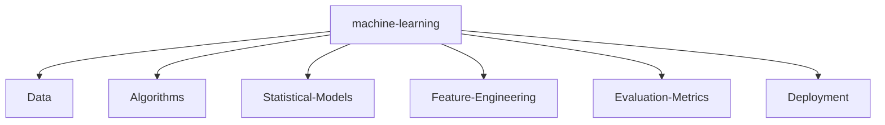

# Nitish R.G


<p align="center">
    <a href="https://github.com/NITISH-R-G/NITISH-R-G"></a>
    <a href="https://github.com/python/cpython"></a>
    <a href="https://github.com/NITISH-R-G/NITISH-R-G/graphs/contributors"></a>
    <a href="https://github.com/NITISH-R-G/NITISH-R-G/stargazers"></a>
    <a href="https://github.com/NITISH-R-G/NITISH-R-G/network/members"></a>
    
</p>

<!--   my-header-img -->

<a href="https://www.python.org/"></a>

<!--   my-ticker -->
[](https://git.io/typing-svg)


## 🚀 init_developer.py

```python
class Developer:
    def __init__(self):
        self.name = "Nitish R.G"
        self.role = "Data Science & AI Practitioner"
        self.education = {
            "IIT Madras": "BS in Data Science",
            "SIET": "BE in Computer Science Engineering"
        }
        self.focus = [
            "Advanced LLMs",
            "Computer Vision",
            "Full-Stack ML Integration",
            "Scalable AI Architectures"
        ]

    def get_mission(self):
        return "Turning complex data into actionable intelligence 🚀"

# Instance initialized
nitish = Developer()
print(nitish.get_mission())
```

<!-- Hey there! If you're inspecting the source code, you're awesome. I love building scalable systems and AI, let's connect! -->

## ⚔️ PROJECT_WAR_ROOM

<div align="center">
  <table width="100%" border="0" cellpadding="15">
    <tr>
      <td width="50%" align="center">
        <h3><a href="https://github.com/NITISH-R-G/PedagogyX" style="color:#00c3ff;">📚 PedagogyX</a></h3>
        <p><i>Advanced EdTech platform leveraging LLMs for personalized learning paths and automated assessment generation.</i></p>
        <p><b>Impact:</b> Personalizing education via automated assessments.</p>
        
        
      </td>
      <td width="50%" align="center">
        <h3><a href="https://github.com/NITISH-R-G/PalmPlay" style="color:#00c3ff;">✋ PalmPlay</a></h3>
        <p><i>Computer Vision based real-time gesture recognition system for hands-free application control.</i></p>
        <p><b>Impact:</b> Enabling touchless interfaces.</p>
        
      </td>
    </tr>
    <tr>
      <td width="50%" align="center">
        <h3><a href="https://github.com/NITISH-R-G/Intelli-Credit-V2" style="color:#00c3ff;">💳 Intelli-Credit</a></h3>
        <p><i>ML-driven credit scoring and risk assessment engine designed for scalable financial analysis.</i></p>
        <p><b>Impact:</b> Automating financial risk modeling.</p>
        
      </td>
      <td width="50%" align="center">
        <h3><a href="https://github.com/NITISH-R-G/CODESTREAK" style="color:#00c3ff;">🔥 CODESTREAK</a></h3>
        <p><i>Developer productivity dashboard and analytics tool for tracking coding habits and consistency.</i></p>
        <p><b>Impact:</b> Enhancing developer habits.</p>
        
      </td>
    </tr>
  </table>
</div>

<div align="center">
  <table width="100%" border="0" cellpadding="15">
    <tr>
      <td width="50%" align="center">
        <h3><a href="https://mac-os-portfolio-nine-beryl.vercel.app/" style="color:#00c3ff;">🖥️ Mac OS Style Portfolio</a></h3>
        <p><i>Experience my work through an interactive, visually stunning Mac OS-themed web portfolio.</i></p>
        <a href="https://mac-os-portfolio-nine-beryl.vercel.app/">
            
        </a>
      </td>
      <td width="50%" align="center">
        <h3><a href="https://drive.google.com/file/d/1lm1TLC00ThShlEi80uRtkz4rppco1w8O/view?usp=sharing" style="color:#00c3ff;">📄 Comprehensive Resume</a></h3>
        <p><i>Dive deep into my technical background, academic achievements, and professional experience.</i></p>
        <a href="https://drive.google.com/file/d/1lm1TLC00ThShlEi80uRtkz4rppco1w8O/view?usp=sharing">
            
        </a>
      </td>
    </tr>
  </table>
</div>

## 🧠 NEURAL_ARCHITECTURE



## 🛠️ SYSTEM_STATUS

| Property | Data |
| --- | --- |
| **Language / IDE** |         |
| **Domain Knowledge** | [](https://github.com/NITISH-R-G) [](https://github.com/NITISH-R-G) [](https://github.com/NITISH-R-G) [](https://github.com/NITISH-R-G) |
| **CI / CD & DevOps** |        |
| **Databases** |     |
| **AI / ML** |       |
| **Web Frameworks** |        |

## 📈 FOUNDER_DASHBOARD & Experience

<div align="center">
  <table width="100%" border="0" cellpadding="10" cellspacing="0">
    <tr>
      <td width="50%" valign="top">
        <h3>🌟 Building @ GDIN</h3>
        <p>Driving innovation and building scalable systems. Focused on rapid prototyping, MVP development, and scaling AI architectures.</p>
        <br/>
        <h3>🤝 Open to Collaboration</h3>
        <p>Actively looking to connect with YC founders, open-source maintainers, and innovators building the future of AI.</p>
        <br/>
        <h3>🏆 Achievements</h3>
        <ul>
          <li><b>Hackathons:</b> Multiple winner and participant</li>
          <li><b>Certifications:</b> AWS, ML, Cloud</li>
          <li><b>Leadership:</b> GDIN Lead</li>
        </ul>
      </td>
      <td width="50%" valign="top">
        <h3>🏢 Experience & Education</h3>
        <ul>
          <li><b>AI Intern</b> @ <a href="https://infyspringboard.onwingspan.com/web/en/login">Infosys Springboard</a></li>
          <li><b>Developer</b> @ <a href="https://www.amd.com/en/developer/resources/ai-developer-program.html">AMD AI Developer Program</a></li>
          <li><b>Alumni</b> @ <a href="https://www.mckinsey.com/careers/students/forward">McKinsey Forward</a></li>
          <li><b>BS in Data Science</b> @ IIT Madras</li>
          <li><b>BE in Computer Science Engineering</b> @ SIET</li>
        </ul>
        <br/>
        <h3>🤔 Ask me about</h3>
        <p>AI/ML, Data Engineering, Hackathons, Tech Startups</p>
        <h3>🌱 Currently learning</h3>
        <p>Advanced RAG patterns, MLOps, System Design</p>
        <p><i>Why do programmers prefer dark mode? Because light attracts bugs!</i></p>
      </td>
    </tr>
  </table>
</div>

## 📊 NETWORK_GRAPH


| .                                                                                                                                  | .                                                                                                                   |
|------------------------------------------------------------------------------------------------------------------------------------|---------------------------------------------------------------------------------------------------------------------|
|  |  |

</img>


<div align="center">
<summary>Trophy: Github Profile Trophy</summary>
</div>

<p align="center">
<a href="https://github.com/ryo-ma/github-profile-trophy"></a>
</p>

<!--START_SECTION:activity-->
<!--END_SECTION:activity-->

<!-- BLOG-POST-LIST:START -->
<!-- BLOG-POST-LIST:END -->

<!--START_SECTION:waka-->
<!--END_SECTION:waka-->


## 🌐 Geo-Mapping

<!-- India Map -->
 ```geojson
{
 "type": "FeatureCollection",
 "features": [
   {
     "type": "Feature",
     "id": 1,
     "properties": {
       "ID": 0
     },
     "geometry": {
       "type": "Polygon",
       "coordinates": [
         [
             [68.1, 7.9],
             [97.4, 35.5]
         ]
       ]
     }
   }
 ]
}
```

### Thanks for visiting :heart:

<p align="center">


<a href="http://s01.flagcounter.com/more/ap7"></a>

</p>

## Star History

[](https://star-history.com/#NITISH-R-G/NITISH-R-G&Date)

### Profile Views


</br>

[MIT](LICENSE)

---

*If you liked my profile, you can Star ⭐ the repo and if you want to use this template you can Fork it and can use.*

---

**📫 How to Reach me:**
<p align="left">
<a href="https://twitter.com/NITISH_R_G" target="blank"></a>
<a href="https://linkedin.com/in/nitish-r-g-15-10-2007-rgn/" target="blank"></a>
<a href="mailto:nitishrg.8220psgps2020@gmail.com" target="blank"></a>
</p>


