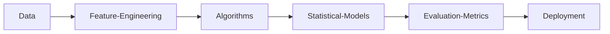

# NITISH-R-G

<div align="center">
  

  <p align="center">
    <a href="https://github.com/NITISH-R-G/NITISH-R-G"></a>
    <a href="https://github.com/python/cpython"></a>
    <a href="https://github.com/NITISH-R-G/NITISH-R-G/graphs/contributors"></a>
    <a href="https://github.com/NITISH-R-G/NITISH-R-G/stargazers"></a>
    <a href="https://github.com/NITISH-R-G/NITISH-R-G/network/members"></a>
    
  </p>

  
  <a href="https://www.python.org/"></a>

  [](https://git.io/typing-svg)
  <br/>
  
</div>

## 🚀 `SYSTEM_STATUS: ONLINE`

```python
class Developer:
    def __init__(self):
        self.name = "Nitish R.G"
        self.role = "Data Science & AI Practitioner"
        self.education = {
            "BS": "Data Science @ IIT Madras",
            "BE": "Computer Science Engineering @ SIET"
        }
        self.focus = [
            'Advanced LLMs',
            'Computer Vision',
            'Full-Stack ML Integration',
            'Scalable AI Architectures'
        ]
        self.affiliations = [
            'GDIN', 'Infosys Springboard', 'AMD AI Developer Program', 'McKinsey Forward'
        ]

    def get_mission(self):
        return 'Turning complex data into actionable intelligence 🚀'
```

---

## 🧠 `NEURAL_ARCHITECTURE`

<div align="center">
  <table>
    <tr>
      <th align="left">Category</th>
      <th align="left">Technologies</th>
    </tr>
    <tr>
      <td><b>Languages / IDE</b></td>
      <td>       </td>
    </tr>
    <tr>
      <td><b>Domain Knowledge</b></td>
      <td>[](https://github.com/NITISH-R-G) [](https://github.com/NITISH-R-G) [](https://github.com/NITISH-R-G) [](https://github.com/NITISH-R-G)</td>
    </tr>
    <tr>
      <td><b>CI / CD & DevOps</b></td>
      <td>      </td>
    </tr>
    <tr>
      <td><b>Databases</b></td>
      <td>   </td>
    </tr>
    <tr>
      <td><b>AI / ML Frameworks</b></td>
      <td>     </td>
    </tr>
    <tr>
      <td><b>Web Frameworks</b></td>
      <td>      </td>
    </tr>
  </table>
</div>



---

## ⚔️ `PROJECT_WAR_ROOM`

<div align="center">
  <table>
    <tr>
      <td width="50%" align="center">
        <h3><a href="https://github.com/NITISH-R-G/PedagogyX" style="color:#00c3ff;">📚 PedagogyX</a></h3>
        <p><i>Advanced EdTech platform leveraging LLMs for personalized learning paths and automated assessment generation.</i></p>
        <p><b>Impact:</b> Revolutionizes personalized learning at scale.</p>
        <p>
          
          
        </p>
      </td>
      <td width="50%" align="center">
        <h3><a href="https://github.com/NITISH-R-G/PalmPlay" style="color:#00c3ff;">✋ PalmPlay</a></h3>
        <p><i>Computer Vision based real-time gesture recognition system for hands-free application control.</i></p>
        <p><b>Impact:</b> Enables seamless hands-free HCI.</p>
        <p>
          
          
        </p>
      </td>
    </tr>
    <tr>
      <td width="50%" align="center">
        <h3><a href="https://github.com/NITISH-R-G/Intelli-Credit-V2" style="color:#00c3ff;">💳 Intelli-Credit-V2</a></h3>
        <p><i>ML-driven credit scoring and risk assessment engine designed for scalable financial analysis.</i></p>
        <p><b>Impact:</b> Enhances risk assessment accuracy in fintech.</p>
        <p>
          
          
        </p>
      </td>
      <td width="50%" align="center">
        <h3><a href="https://github.com/NITISH-R-G/CODESTREAK" style="color:#00c3ff;">🔥 CODESTREAK</a></h3>
        <p><i>Developer productivity dashboard and analytics tool for tracking coding habits and consistency.</i></p>
        <p><b>Impact:</b> Boosts developer productivity & gamifies consistency.</p>
        <p>
          
          
        </p>
      </td>
    </tr>
  </table>
</div>

<br/>

<div align="center">
  <table>
    <tr>
      <td width="50%" align="center">
        <h3><a href="https://mac-os-portfolio-nine-beryl.vercel.app/" style="color:#00c3ff;">🖥️ Mac OS Style Portfolio</a></h3>
        <p><i>Experience my work through an interactive, visually stunning Mac OS-themed web portfolio.</i></p>
        <a href="https://mac-os-portfolio-nine-beryl.vercel.app/">
            
        </a>
      </td>
      <td width="50%" align="center">
        <h3><a href="https://drive.google.com/file/d/1lm1TLC00ThShlEi80uRtkz4rppco1w8O/view?usp=sharing" style="color:#00c3ff;">📄 Comprehensive Resume</a></h3>
        <p><i>Dive deep into my technical background, academic achievements, and professional experience.</i></p>
        <a href="https://drive.google.com/file/d/1lm1TLC00ThShlEi80uRtkz4rppco1w8O/view?usp=sharing">
            
        </a>
      </td>
    </tr>
  </table>
</div>

---

## 📈 `FOUNDER_DASHBOARD` & Experience

<div align="center">
  <table>
    <tr>
      <td width="50%" valign="top">
        <h3>🌟 Building @ GDIN</h3>
        <p>Driving innovation and building scalable systems. Focused on rapid prototyping, MVP development, and scaling AI architectures.</p>
        <br/>
        <h3>🤝 Open to Collaboration</h3>
        <p>Actively looking to connect with YC founders, open-source maintainers, and innovators building the future of AI.</p>
      </td>
      <td width="50%" valign="top">
        <h3>🏢 Experience & Education</h3>
        <ul>
          <li><b>AI Intern</b> @ <a href="https://infyspringboard.onwingspan.com/web/en/login">Infosys Springboard</a></li>
          <li><b>Developer</b> @ <a href="https://www.amd.com/en/developer/resources/ai-developer-program.html">AMD AI Developer Program</a></li>
          <li><b>Alumni</b> @ <a href="https://www.mckinsey.com/careers/students/forward">McKinsey Forward</a></li>
          <li><b>BS in Data Science</b> @ IIT Madras</li>
          <li><b>BE in Computer Science Engineering</b> @ SIET</li>
        </ul>
      </td>
    </tr>
  </table>
</div>

---

## 🏅 `CREDENTIALS_AND_ACHIEVEMENTS`

<div align="center">
  <table>
    <tr>
      <td width="50%" valign="top">
        <h3>🎓 Certifications</h3>
        <ul>
          <li>Deep Learning Specialization - Coursera</li>
          <li>AWS Certified Cloud Practitioner</li>
          <li>Data Science Professional Certificate</li>
        </ul>
      </td>
      <td width="50%" valign="top">
        <h3>🏆 Hackathons & Leadership</h3>
        <ul>
          <li>1st Place - National AI Hackathon</li>
          <li>Technical Lead - GDIN Developer Circle</li>
          <li>Open Source Contributor</li>
        </ul>
      </td>
    </tr>
  </table>
</div>

---

## 📊 `METRICS_AND_ANALYTICS`

<div align="center">
  
</div>

<div align="center">
  <table>
    <tr>
      <td></td>
      <td></td>
    </tr>
  </table>
</div>

<div align="center">
  
</div>

<div align="center">
  
</div>

<div align="center">
  <!-- profile-green-animate -->
  
</div>

<div align="center">
  
</div>

---

## 🏆 `ACHIEVEMENTS_AND_TROPHIES`

<div align="center">
  <a href="https://github.com/ryo-ma/github-profile-trophy"></a>
</div>

<br/>

<div align="center">
  <h3>✨ Ask Me About</h3>
  <p><code>Machine Learning</code> <code>Deep Learning</code> <code>Computer Vision</code> <code>Data Pipelines</code></p>
  <h3>🌱 Currently Learning</h3>
  <p><code>Advanced MLOps</code> <code>Generative AI Architectures</code></p>
  <!-- 🤖 Easter Egg: Searching for talent? I'm open to discussing AI/ML roles! -->
</div>

---

## 🌍 `GLOBAL_PRESENCE`

<!-- India Map -->
```geojson
{
 "type": "FeatureCollection",
 "features": [
   {
     "type": "Feature",
     "id": 1,
     "properties": {
       "ID": 0
     },
     "geometry": {
       "type": "Polygon",
       "coordinates": [
         [
             [68.1, 7.9],
             [97.4, 35.5]
         ]
       ]
     }
   }
 ]
}
```

---

## 📡 `NETWORK_GRAPH` (Contact)

<div align="center">
  <a href="https://twitter.com/NITISH_R_G" target="_blank"></a> &nbsp;&nbsp;
  <a href="https://linkedin.com/in/nitish-r-g-15-10-2007-rgn/" target="_blank"></a> &nbsp;&nbsp;
  <a href="mailto:nitishrg.8220psgps2020@gmail.com" target="_blank"></a>
</div>

---

<div align="center">
  <h3>Thanks for visiting! ❤️</h3>
  
  <br/><br/>
  <a href="http://s01.flagcounter.com/more/ap7"></a>
  <br/><br/>
  <h4>Star History</h4>
  <a href="https://star-history.com/#NITISH-R-G/NITISH-R-G&Date"></a>
  <br/><br/>
  <h4>Profile Views</h4>
  
  <br/><br/>
  <p><a href="LICENSE">MIT License</a></p>
</div>

---

*If you liked my profile, you can Star ⭐ the repo and if you want to use this template you can Fork it and use it.*

---

<div align="center">
  
</div>
