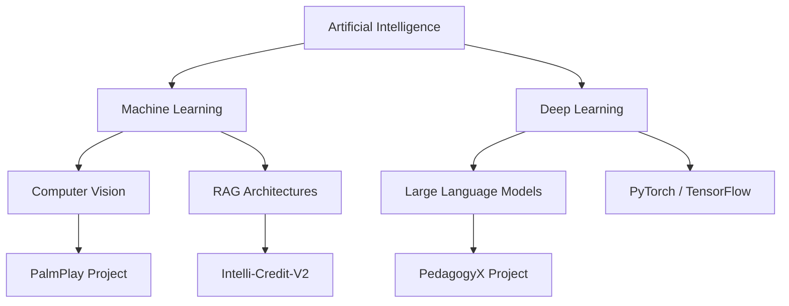

# Nitish R.G - SYSTEM_STATUS : ONLINE

<!--   my-icons -->
<p align="center">
    <a href="https://github.com/NITISH-R-G/NITISH-R-G"></a>
    <a href="https://github.com/python/cpython"></a>
    <a href="https://github.com/NITISH-R-G/NITISH-R-G/graphs/contributors"></a>
    <a href="https://github.com/NITISH-R-G/NITISH-R-G/stargazers"></a>
    <a href="https://github.com/NITISH-R-G/NITISH-R-G/network/members"></a>
    
</p>

<!--   my-header-img -->
<p align="center">

</p>

<!--   my-ticker -->
<p align="center">
<a href="https://git.io/typing-svg"></a>
</p>

<p align="center">

</p>

## `init_developer.py`

```python
class Developer:
    def __init__(self):
        self.name = "Nitish R.G"
        self.role = "Data Science and AI Practitioner | Dual-Degree Engineer"
        self.education = {
            "BS": "Data Science @ IIT Madras",
            "BE": "Computer Science Engineering @ SIET"
        }
        self.focus = [
            'Advanced LLMs',
            'Computer Vision',
            'Full-Stack ML Integration',
            'Scalable AI Architectures'
        ]

    def get_mission(self):
        return 'Turning complex data into actionable intelligence 🚀'

    def connect(self):
        # 🤫 Recruiter secret: Looking for high-impact AI/ML roles!
        return {
            "twitter": "https://twitter.com/NITISH_R_G",
            "linkedin": "https://linkedin.com/in/nitish-r-g-15-10-2007-rgn/",
            "email": "nitishrg.8220psgps2020@gmail.com"
        }
```

<!--
🤫 Hello Recruiter or Curious Dev!
If you're reading this, you appreciate the source code.
I am actively building cutting-edge AI architectures. Let's connect!
Email me directly at: nitishrg.8220psgps2020@gmail.com
-->

## ⚔️ `PROJECT_WAR_ROOM`

<div align="center">
  <table width="100%" border="0" cellpadding="15">
    <tr>
      <td width="50%" align="center">
        <h3><a href="https://github.com/NITISH-R-G/PedagogyX">📚 PedagogyX</a></h3>
        <p><i>Advanced EdTech platform leveraging LLMs for personalized learning paths and automated assessment generation.</i></p>
        <p><b>Impact:</b> Streamlined course generation and assessment validation.</p>
        <p><b>Tech used:</b>   </p>
      </td>
      <td width="50%" align="center">
        <h3><a href="https://github.com/NITISH-R-G/PalmPlay">✋ PalmPlay</a></h3>
        <p><i>Computer Vision based real-time gesture recognition system for hands-free application control.</i></p>
        <p><b>Impact:</b> Enables seamless touchless interactions with standard web apps.</p>
        <p><b>Tech used:</b>   </p>
      </td>
    </tr>
    <tr>
      <td width="50%" align="center">
        <h3><a href="https://github.com/NITISH-R-G/Intelli-Credit-V2">💳 Intelli-Credit-V2</a></h3>
        <p><i>ML-driven credit scoring and risk assessment engine designed for scalable financial analysis.</i></p>
        <p><b>Impact:</b> Predicts default rates with optimized model interpretability.</p>
        <p><b>Tech used:</b>   </p>
      </td>
      <td width="50%" align="center">
        <h3><a href="https://github.com/NITISH-R-G/CODESTREAK">🔥 CODESTREAK</a></h3>
        <p><i>Developer productivity dashboard and analytics tool for tracking coding habits and consistency.</i></p>
        <p><b>Impact:</b> Improved team velocity tracking and individual contribution awareness.</p>
        <p><b>Tech used:</b>   </p>
      </td>
    </tr>
  </table>
</div>

<div align="center">
  <table width="100%" border="0" cellpadding="15">
    <tr>
      <td width="50%" align="center">
        <h3><a href="https://mac-os-portfolio-nine-beryl.vercel.app/">🖥️ Mac OS Style Portfolio</a></h3>
        <p><i>Experience my work through an interactive, visually stunning Mac OS-themed web portfolio.</i></p>
        <a href="https://mac-os-portfolio-nine-beryl.vercel.app/"></a>
      </td>
      <td width="50%" align="center">
        <h3><a href="https://drive.google.com/file/d/1lm1TLC00ThShlEi80uRtkz4rppco1w8O/view?usp=sharing">📄 Comprehensive Resume</a></h3>
        <p><i>Dive deep into my technical background, academic achievements, and professional experience.</i></p>
        <a href="https://drive.google.com/file/d/1lm1TLC00ThShlEi80uRtkz4rppco1w8O/view?usp=sharing"></a>
      </td>
    </tr>
  </table>
</div>

## 📈 `FOUNDER_DASHBOARD` & Experience

### 🛠️ Core Tech Matrix

| Category | Technologies |
| --- | --- |
| **Languages** | <a href="https://skillicons.dev"></a> |
| **Frameworks** | <a href="https://skillicons.dev"></a> |
| **Tools & Platforms** | <a href="https://skillicons.dev"></a> |
| **AI / ML & DBs** | <a href="https://skillicons.dev"></a> |

### 🧠 `NEURAL_ARCHITECTURE` (Skill Topology)



### 🏆 Achievements, Internships & Leadership

<div align="center">
  <table width="100%" border="0" cellpadding="10" cellspacing="0">
    <tr>
      <td width="50%" valign="top">
        <h3>🌟 Affiliations & Internships</h3>
        <ul>
          <li><b>Building @ GDIN:</b> Driving innovation and building scalable systems. Focused on rapid prototyping, MVP development, and scaling AI architectures.</li>
          <li><b>AI Intern @ Infosys Springboard:</b> Working on enterprise-scale machine learning workflows.</li>
          <li><b>Developer @ AMD AI Developer Program:</b> Optimizing AI models for performance.</li>
          <li><b>Alumni @ McKinsey Forward:</b> Leadership and strategic problem-solving.</li>
        </ul>
      </td>
      <td width="50%" valign="top">
        <h3>🏅 Hackathons, Certifications & Leadership</h3>
        <ul>
          <li><b>Leadership:</b> Technical Lead for university developer circles, fostering AI education.</li>
          <li><b>Hackathons:</b> Regular participant and winner in national-level AI/ML hackathons.</li>
          <li><b>Certifications:</b> Advanced Data Science, Cloud Architectures (AWS), Deep Learning Specializations.</li>
          <li><b>Ask me about:</b> Next.js + FastAPI integrations, training CNNs from scratch, or building scalable ed-tech solutions!</li>
          <li><b>Currently learning:</b> Advanced distributed training mechanisms and Web3 data structures.</li>
        </ul>
      </td>
    </tr>
  </table>
</div>

## ⚙️ `SYSTEM_ANALYTICS`

### 📈 GitHub Activity Graph

<p align="center">

</p>

| GitHub Stats | Top Languages |
| --- | --- |
| <a href="https://github.com/NITISH-R-G/NITISH-R-G"></a> | <a href="https://github.com/NITISH-R-G/NITISH-R-G"></a> |

<p align="center">

</p>

<p align="center">

</p>

<!-- profile-green-animate -->
<p align="center">

</p>

## 🧑‍💻 Coding Metrics (WakaTime)

<!--START_SECTION:waka-->
<!-- WakaTime stats will be injected here by GitHub Actions -->
<!--END_SECTION:waka-->

## 📝 Recent Blog Posts

<!-- BLOG-POST-LIST:START -->
<!-- Blog posts will be injected here by GitHub Actions -->
<!-- BLOG-POST-LIST:END -->

## ⚡ Recent Activity

<!--START_SECTION:activity-->
<!-- Activity will be injected here by GitHub Actions -->
<!--END_SECTION:activity-->

## 🌐 Connect with the Mainframe

**📫 How to Reach me:**
<p align="left">
<a href="https://twitter.com/NITISH_R_G" target="blank"></a>
<a href="https://linkedin.com/in/nitish-r-g-15-10-2007-rgn/" target="blank"></a>
<a href="mailto:nitishrg.8220psgps2020@gmail.com" target="blank"></a>
</p>

<div align="center">
<summary>Trophy: Github Profile Trophy</summary>
</div>

<p align="center">
<a href="https://github.com/ryo-ma/github-profile-trophy"></a>
</p>

<p align="center">

</p>

<p align="center">
<a href="https://github.com/NITISH-R-G/NITISH-R-G"></a>
</p>

<p align="center">
<a href="http://s01.flagcounter.com/more/ap7"></a>
</p>

## ⭐ Star History

<p align="center">
<a href="https://star-history.com/#NITISH-R-G/NITISH-R-G&Date"></a>
</p>

<p align="center">

</p>

---
<p align="center">
<i>A developer joke to end the day: Why do programmers prefer dark mode? Because light attracts bugs! 🐛</i>
</p>

<p align="center">
<a href="LICENSE">MIT License</a>
</p>
