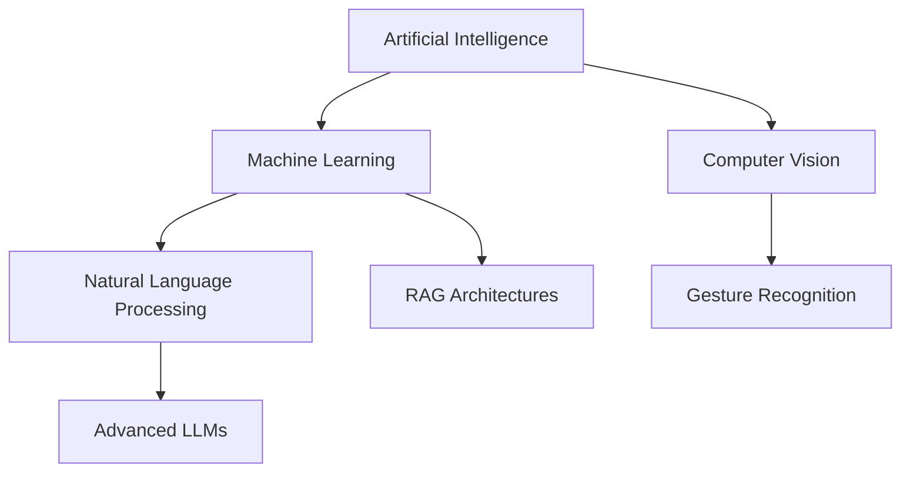

# ⚡ NITISH R.G | SYSTEM_STATUS: ONLINE

<div align="center">
  
</div>

<!-- my-ticker -->
<div align="center">
  <a href="https://git.io/typing-svg">
    
  </a>
</div>

<div align="center">
  <p>
    <a href="https://github.com/NITISH-R-G/NITISH-R-G"></a>
    <a href="https://mac-os-portfolio-nine-beryl.vercel.app/"></a>
    <a href="https://drive.google.com/file/d/1lm1TLC00ThShlEi80uRtkz4rppco1w8O/view?usp=sharing"></a>
  </p>
</div>

<!-- Recruiter Easter Egg -->
<!--
  [SYSTEM LOG]: Unauthorized access detected.
  Scanning intruder...
  Profile matched: Tech Recruiter or Curious Dev.
  Welcome! If you're reading this, we should definitely talk.
  Drop me an email at nitishrg.8220psgps2020@gmail.com
-->

## 👨‍💻 `init_developer.py`

```python
class Developer:
    def __init__(self):
        self.name = "Nitish R.G"
        self.role = "Data Science & AI Practitioner | Dual-Degree Engineer"
        self.education = {
            "IIT Madras": "BS in Data Science",
            "SIET": "BE in Computer Science Engineering"
        }
        self.focus = [
            'Advanced LLMs',
            'Computer Vision',
            'Full-Stack ML Integration',
            'Scalable AI Architectures'
        ]

    def get_mission(self):
        return 'Turning complex data into actionable intelligence 🚀'
```

---

## 🛠️ `TECH_STACK_MATRIX`

<table width="100%" border="0" cellpadding="10">
  <tr>
    <td width="50%" valign="top">
      <h3>💻 Languages</h3>
      <p>
        
        
        
        
        
      </p>
      <h3>🧠 Frameworks & Libraries</h3>
      <p>
        
        
        
        
        
      </p>
    </td>
    <td width="50%" valign="top">
      <h3>☁️ Platforms & DevOps</h3>
      <p>
        
        
        
        
      </p>
      <h3>🗄️ Databases</h3>
      <p>
        
        
        
      </p>
    </td>
  </tr>
</table>

### `NEURAL_ARCHITECTURE`



---

## ⚔️ `PROJECT_WAR_ROOM`

<table width="100%" border="0" cellpadding="15">
  <tr>
    <td width="50%" valign="top">
      <h3>📚 <a href="https://github.com/NITISH-R-G/PedagogyX">PedagogyX</a></h3>
      <p>Advanced EdTech platform leveraging LLMs for personalized learning paths and automated assessment generation.</p>
      <p><b>Impact:</b> Revolutionizing personalized education at scale.</p>
      <p>
        
        
        
      </p>
    </td>
    <td width="50%" valign="top">
      <h3>✋ <a href="https://github.com/NITISH-R-G/PalmPlay">PalmPlay</a></h3>
      <p>Computer Vision based real-time gesture recognition system for hands-free application control.</p>
      <p><b>Impact:</b> Enhanced accessibility and hands-free interaction.</p>
      <p>
        
        
      </p>
    </td>
  </tr>
  <tr>
    <td width="50%" valign="top">
      <h3>💳 <a href="https://github.com/NITISH-R-G/Intelli-Credit-V2">Intelli-Credit-V2</a></h3>
      <p>ML-driven credit scoring and risk assessment engine designed for scalable financial analysis.</p>
      <p><b>Impact:</b> Automated risk mitigation for financial systems.</p>
      <p>
        
        
      </p>
    </td>
    <td width="50%" valign="top">
      <h3>🔥 <a href="https://github.com/NITISH-R-G/CODESTREAK">CODESTREAK</a></h3>
      <p>Developer productivity dashboard and analytics tool for tracking coding habits and consistency.</p>
      <p><b>Impact:</b> Empowering developers to build consistent coding habits.</p>
      <p>
        
        
      </p>
    </td>
  </tr>
</table>

---

## 🏆 `ACHIEVEMENTS_&_EXPERIENCE`

<table width="100%" border="0" cellpadding="10">
  <tr>
    <td width="50%" valign="top">
      <h3>💼 Experience & Leadership</h3>
      <ul>
        <li><b>AI Intern</b> @ <a href="https://infyspringboard.onwingspan.com/web/en/login">Infosys Springboard</a></li>
        <li><b>Developer</b> @ <a href="https://www.amd.com/en/developer/resources/ai-developer-program.html">AMD AI Developer Program</a></li>
        <li><b>Alumni</b> @ <a href="https://www.mckinsey.com/careers/students/forward">McKinsey Forward</a></li>
        <li><b>Building</b> @ GDIN</li>
      </ul>
      <p><i>Ask me about: System Architecture, AI Model Training, and Startup MVPs.</i></p>
    </td>
    <td width="50%" valign="top">
      <h3>🏅 Hackathons & Certifications</h3>
      <ul>
        <li>Active participant in AI/ML Hackathons.</li>
        <li>Certified in Data Science & Machine Learning.</li>
        <li>Continuously learning and exploring Quantum Computing.</li>
      </ul>
      <br>
      <p><i>"Why do Java developers wear glasses? Because they don't C#!"</i> 🤓</p>
    </td>
  </tr>
</table>

---

## 📈 `SYSTEM_TELEMETRY`

<div align="center">
  <a href="https://github.com/NITISH-R-G">
    
  </a>
  <a href="https://github.com/NITISH-R-G">
    
  </a>
</div>

<br>

<div align="center">
  <a href="https://github.com/NITISH-R-G">
    
  </a>
</div>

<br>

<div align="center">
  
</div>

<br>

<div align="center">
  <a href="https://github.com/ryo-ma/github-profile-trophy">
    
  </a>
</div>

<br>

<div align="center">
  
</div>

<br>

<div align="center">
  
</div>

---

## 📡 `COMMUNICATIONS_RELAY`

<div align="center">
  <a href="https://twitter.com/NITISH_R_G">
    
  </a>
  <a href="https://linkedin.com/in/nitish-r-g-15-10-2007-rgn/">
    
  </a>
  <a href="mailto:nitishrg.8220psgps2020@gmail.com">
    
  </a>
</div>

<br>

<div align="center">
  
</div>

<br>

<!-- Automations -->
<!--START_SECTION:waka-->
<!--END_SECTION:waka-->

<!--START_SECTION:activity-->
<!--END_SECTION:activity-->

<!-- BLOG-POST-LIST:START -->
<!-- BLOG-POST-LIST:END -->

<div align="center">
  
</div>
