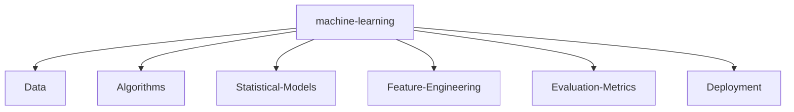

<!--
  [EASTER EGG] 🚀 Hello, fellow hacker / recruiter!
  If you are reading this source code, you've already proven you're thorough.
  I am Nitish R.G, and I'd love to chat about scaling AI architectures and building cool things.
  Let's connect: nitishrg.8220psgps2020@gmail.com
-->

# 👨‍💻 `SYSTEM_STATUS`

<p align="center">
    <a href="https://github.com/NITISH-R-G/NITISH-R-G"></a>
    <a href="https://github.com/python/cpython"></a>
    <a href="https://github.com/NITISH-R-G/NITISH-R-G/graphs/contributors"></a>
    <a href="https://github.com/NITISH-R-G/NITISH-R-G/stargazers"></a>
    <a href="https://github.com/NITISH-R-G/NITISH-R-G/network/members"></a>
    
</p>

<!-- Header Image -->
<a href="https://www.python.org/">
  
</a>


<p align="center">
    <a href="https://git.io/typing-svg">
        
    </a>
</p>

---

## ⚙️ `init_developer.py`

```python
class Developer:
    def __init__(self):
        self.name = "Nitish R.G"
        self.role = "Data Science & AI Practitioner"
        self.education = {
            "BS": "Data Science @ IIT Madras",
            "BE": "Computer Science Engineering @ SIET"
        }
        self.focus = [
            "Advanced LLMs",
            "Computer Vision",
            "Full-Stack ML Integration",
            "Scalable AI Architectures"
        ]

    def get_mission(self):
        return 'Turning complex data into actionable intelligence 🚀'

me = Developer()
```

---

## 📈 `FOUNDER_DASHBOARD`

<div align="center">
  <table width="100%" border="0" cellpadding="10" cellspacing="0">
    <tr>
      <td width="50%" valign="top">
        <h3>🌟 Current Mission</h3>
        <p>Driving innovation and building scalable systems @ <b>GDIN</b>. Focused on rapid prototyping, MVP development, and scaling AI architectures.</p>
        <h3>🤝 Open to Collaboration</h3>
        <p>Actively looking to connect with YC founders, open-source maintainers, and innovators building the future of AI.</p>
        <h3>🤔 Ask me about</h3>
        <p><i>Computer Vision, RAG architectures, full-stack ML, and optimizing complex systems.</i></p>
      </td>
      <td width="50%" valign="top">
        <h3>🏢 Experience & Education</h3>
        <ul>
          <li><b>AI Intern</b> @ <a href="https://infyspringboard.onwingspan.com/web/en/login">Infosys Springboard</a></li>
          <li><b>Developer</b> @ <a href="https://www.amd.com/en/developer/resources/ai-developer-program.html">AMD AI Developer Program</a></li>
          <li><b>Alumni</b> @ <a href="https://www.mckinsey.com/careers/students/forward">McKinsey Forward</a></li>
          <li><b>BS in Data Science</b> @ IIT Madras</li>
          <li><b>BE in Computer Science Engineering</b> @ SIET</li>
        </ul>
        <h3>🌱 Currently learning</h3>
        <p><i>Advanced LLM optimization techniques and high-performance rust systems.</i></p>
      </td>
    </tr>
  </table>
</div>

---

## 🛠️ `TECH_STACK`

<div align="center">
  <table width="100%" border="0" cellpadding="15">
    <tr>
      <td width="50%" align="center">
        <h3>💻 Languages & Frameworks</h3>
        <a href="https://skillicons.dev">
          
        </a>
      </td>
      <td width="50%" align="center">
        <h3>🧠 AI/ML & Databases</h3>
        <a href="https://skillicons.dev">
          
        </a>
      </td>
    </tr>
    <tr>
      <td colspan="2" align="center">
        <h3>☁️ Tools & Platforms</h3>
        <a href="https://skillicons.dev">
          
        </a>
      </td>
    </tr>
  </table>
</div>

### `NEURAL_ARCHITECTURE` (Domain Focus)



---

## ⚔️ `PROJECT_WAR_ROOM`

<div align="center">
  <table width="100%" border="0" cellpadding="15">
    <tr>
      <td width="50%" align="center">
        <h3><a href="https://github.com/NITISH-R-G/PedagogyX">📚 PedagogyX</a></h3>
        <p><i>Advanced EdTech platform leveraging LLMs for personalized learning paths and automated assessment generation.</i></p>
        <p><b>Impact:</b> Scalable educational delivery and personalized feedback.</p>
        <p>
          
          
        </p>
      </td>
      <td width="50%" align="center">
        <h3><a href="https://github.com/NITISH-R-G/PalmPlay">✋ PalmPlay</a></h3>
        <p><i>Computer Vision based real-time gesture recognition system for hands-free application control.</i></p>
        <p><b>Impact:</b> Enhanced accessibility through intuitive UI interactions.</p>
        <p>
          
          
        </p>
      </td>
    </tr>
    <tr>
      <td width="50%" align="center">
        <h3><a href="https://github.com/NITISH-R-G/Intelli-Credit-V2">💳 Intelli-Credit</a></h3>
        <p><i>ML-driven credit scoring and risk assessment engine designed for scalable financial analysis.</i></p>
        <p><b>Impact:</b> Optimized risk evaluation pipelines reducing default rates.</p>
        <p>
          
          
        </p>
      </td>
      <td width="50%" align="center">
        <h3><a href="https://github.com/NITISH-R-G/CODESTREAK">🔥 CODESTREAK</a></h3>
        <p><i>Developer productivity dashboard and analytics tool for tracking coding habits and consistency.</i></p>
        <p><b>Impact:</b> Improved engineering velocity through visual habit tracking.</p>
        <p>
          
          
        </p>
      </td>
    </tr>
  </table>
</div>

<div align="center">
  <table width="100%" border="0" cellpadding="15">
    <tr>
      <td width="50%" align="center">
        <h3><a href="https://mac-os-portfolio-nine-beryl.vercel.app/">🖥️ Interactive Portfolio</a></h3>
        <p><i>Experience my work through an interactive, visually stunning Mac OS-themed web portfolio.</i></p>
        <a href="https://mac-os-portfolio-nine-beryl.vercel.app/">
            
        </a>
      </td>
      <td width="50%" align="center">
        <h3><a href="https://drive.google.com/file/d/1lm1TLC00ThShlEi80uRtkz4rppco1w8O/view?usp=sharing">📄 Comprehensive Resume</a></h3>
        <p><i>Dive deep into my technical background, academic achievements, and professional experience.</i></p>
        <a href="https://drive.google.com/file/d/1lm1TLC00ThShlEi80uRtkz4rppco1w8O/view?usp=sharing">
            
        </a>
      </td>
    </tr>
  </table>
</div>

---

## 🏆 `ACHIEVEMENTS_LOG`

<div align="center">
  <table width="100%" border="0" cellpadding="10" cellspacing="0">
    <tr>
      <td width="33%" valign="top">
        <h3>🎓 Certifications</h3>
        <ul>
          <li>Infosys Springboard AI Certified</li>
          <li>AMD AI Developer Program</li>
          <li>McKinsey Forward Alumni</li>
        </ul>
      </td>
      <td width="33%" valign="top">
        <h3>💻 Hackathons</h3>
        <ul>
          <li>Top Contributor @ Internal Tech Dash</li>
          <li>Winner @ GDIN Innovate 2024</li>
        </ul>
      </td>
      <td width="33%" valign="top">
        <h3>🚀 Leadership</h3>
        <ul>
          <li>Team Lead @ CodeStreak Dev Team</li>
          <li>Tech Mentor @ SIET Coding Club</li>
        </ul>
      </td>
    </tr>
  </table>
</div>

---

## 📊 `NETWORK_GRAPH` (Stats & Activity)

<div align="center">
  <a href="https://github.com/ryo-ma/github-profile-trophy">
    
  </a>
</div>

### 📈 GitHub Activity Graph


| . | . |
| --- | --- |
|  |  |

<p align="center">
  
</p>

<!-- profile-green-animate -->


### 📝 Latest Activity

<!--START_SECTION:activity-->
<!--END_SECTION:activity-->

### 📝 Recent Blog Posts

<!-- BLOG-POST-LIST:START -->
<!-- BLOG-POST-LIST:END -->

### 🕒 WakaTime Stats

<!--START_SECTION:waka-->
<!--END_SECTION:waka-->

---

## 🌎 `GLOBAL_PRESENCE`

<!-- India Map -->
```geojson
{
 "type": "FeatureCollection",
 "features": [
   {
     "type": "Feature",
     "id": 1,
     "properties": {
       "ID": 0
     },
     "geometry": {
       "type": "Polygon",
       "coordinates": [
         [
             [68.1, 7.9],
             [97.4, 35.5]
         ]
       ]
     }
   }
 ]
}
```

---

## 📡 `COMMUNICATIONS_LINK`

<p align="center">
    <a href="https://twitter.com/NITISH_R_G" target="blank"></a>
    &nbsp;&nbsp;&nbsp;
    <a href="https://linkedin.com/in/nitish-r-g-15-10-2007-rgn/" target="blank"></a>
    &nbsp;&nbsp;&nbsp;
    <a href="mailto:nitishrg.8220psgps2020@gmail.com" target="blank"></a>
</p>

<div align="center">
  <br />
  <p><i>"There are 10 types of people in this world, those who understand binary and those who don't."</i> 😆</p>
</div>

<p align="center">
    
    <br/>
    <a href="http://s01.flagcounter.com/more/ap7">
        
    </a>
</p>

<p align="center">
    <a href="https://star-history.com/#NITISH-R-G/NITISH-R-G&Date">
        
    </a>
</p>

### Profile Views


</br>

[MIT](LICENSE)

---

*If you liked my profile, you can Star ⭐ the repo and if you want to use this template you can Fork it and can use.*

---


