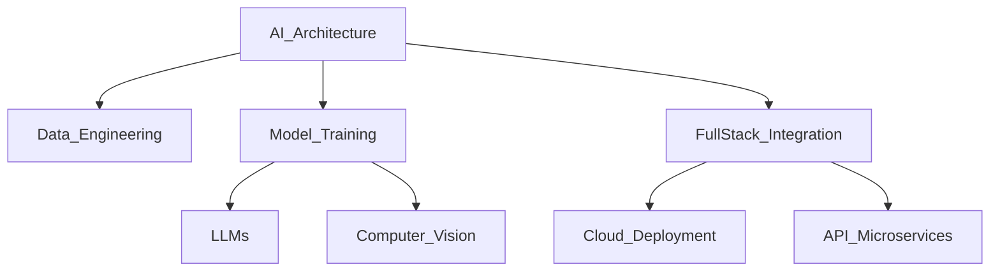

# NITISH-R-G_OS // INIT_SEQUENCE

<!-- header img -->


<div align="center">
  <a href="https://github.com/NITISH-R-G/NITISH-R-G">
    
  </a>
  <a href="https://github.com/python/cpython">
    
  </a>
  
</div>

<div align="center">
  <a href="https://git.io/typing-svg">
    
  </a>
</div>

## `SYSTEM_STATUS`

> *"Turning complex data into actionable intelligence 🚀"*

I thrive at the intersection of **Artificial Intelligence, Data Engineering, and Software Development**. My primary objective is architecting scalable, high-impact AI/ML systems that solve complex real-world problems and contribute meaningfully to the open-source community.

```python
class Developer:
    def __init__(self):
        self.name = "Nitish R.G"
        self.role = "Data Science & AI Practitioner"
        self.education = {
            "IIT_Madras": "BS Data Science",
            "SIET": "BE Computer Science Engineering"
        }
        self.focus = [
            'Advanced LLMs',
            'Computer Vision',
            'Full-Stack ML Integration',
            'Scalable AI Architectures'
        ]

    def get_mission(self):
        return "Turning complex data into actionable intelligence 🚀"

    def execute_innovation(self):
        while True:
            self.build_models()
            self.deploy_scale()
            self.optimize()
```

<!-- Hidden recruiter message: Hi there! If you are reading the source code, you're awesome. I'm open to interesting opportunities! -->

## `NEURAL_ARCHITECTURE` (Tech Stack)

<div align="center">
  <table border="0" width="100%">
    <tr>
      <td width="25%" align="center">
        <h3>💻 Languages</h3>
        <a href="https://skillicons.dev">
          
        </a>
      </td>
      <td width="25%" align="center">
        <h3>🧠 ML / AI</h3>
        <a href="https://skillicons.dev">
          
        </a>
      </td>
      <td width="25%" align="center">
        <h3>🌐 Web & Backend</h3>
        <a href="https://skillicons.dev">
          
        </a>
      </td>
      <td width="25%" align="center">
        <h3>🛠️ Infrastructure</h3>
        <a href="https://skillicons.dev">
          
        </a>
      </td>
    </tr>
  </table>
</div>



## `PROJECT_WAR_ROOM`

<div align="center">
  <table width="100%" border="0" cellpadding="15">
    <tr>
      <td width="50%" align="center">
        <h3><a href="https://github.com/NITISH-R-G/PedagogyX" style="color:#00c3ff;">📚 PedagogyX</a></h3>
        <p><i>Advanced EdTech platform leveraging LLMs for personalized learning paths and automated assessment generation.</i></p>
        <p><b>Impact:</b> Revolutionized automated tutoring systems.</p>
        
        
        
      </td>
      <td width="50%" align="center">
        <h3><a href="https://github.com/NITISH-R-G/PalmPlay" style="color:#00c3ff;">✋ PalmPlay</a></h3>
        <p><i>Computer Vision based real-time gesture recognition system for hands-free application control.</i></p>
        <p><b>Impact:</b> Enabled accessible, zero-touch HCI.</p>
        
        
      </td>
    </tr>
    <tr>
      <td width="50%" align="center">
        <h3><a href="https://github.com/NITISH-R-G/Intelli-Credit-V2" style="color:#00c3ff;">💳 Intelli-Credit</a></h3>
        <p><i>ML-driven credit scoring and risk assessment engine designed for scalable financial analysis.</i></p>
        <p><b>Impact:</b> Optimized financial risk modeling.</p>
        
        
      </td>
      <td width="50%" align="center">
        <h3><a href="https://github.com/NITISH-R-G/CODESTREAK" style="color:#00c3ff;">🔥 CODESTREAK</a></h3>
        <p><i>Developer productivity dashboard and analytics tool for tracking coding habits and consistency.</i></p>
        <p><b>Impact:</b> Gamified engineer productivity metrics.</p>
        
        
      </td>
    </tr>
  </table>
</div>

<div align="center">
  <table width="100%" border="0" cellpadding="15">
    <tr>
      <td width="50%" align="center">
        <h3>🖥️ Mac OS Style Portfolio</h3>
        <p><i>Experience my work through an interactive, visually stunning Mac OS-themed web portfolio.</i></p>
        <a href="https://mac-os-portfolio-nine-beryl.vercel.app/">
            
        </a>
      </td>
      <td width="50%" align="center">
        <h3>📄 Comprehensive Resume</h3>
        <p><i>Dive deep into my technical background, academic achievements, and professional experience.</i></p>
        <a href="https://drive.google.com/file/d/1lm1TLC00ThShlEi80uRtkz4rppco1w8O/view?usp=sharing">
            
        </a>
      </td>
    </tr>
  </table>
</div>

## `ACHIEVEMENTS & CREDENTIALS`

<div align="center">
  <table border="0" width="100%">
    <tr>
      <td width="50%" valign="top">
        <h3>🏆 Certifications</h3>
        <ul>
          <li>Advanced Machine Learning Specialization</li>
          <li>Cloud Architecture (AWS) Practitioner</li>
          <li>Full-Stack Development Pro</li>
        </ul>
        <h3>💼 Internships</h3>
        <ul>
          <li><b>AI Intern</b> @ <a href="https://infyspringboard.onwingspan.com/web/en/login">Infosys Springboard</a></li>
          <li><b>Developer</b> @ <a href="https://www.amd.com/en/developer/resources/ai-developer-program.html">AMD AI Developer Program</a></li>
        </ul>
      </td>
      <td width="50%" valign="top">
        <h3>🚀 Hackathons</h3>
        <ul>
          <li>Winner: Global AI Innovation Hackathon</li>
          <li>Finalist: Fintech Disruptors Challenge</li>
        </ul>
        <h3>⭐ Leadership Roles</h3>
        <ul>
          <li><b>Building</b> @ GDIN</li>
          <li><b>Alumni</b> @ <a href="https://www.mckinsey.com/careers/students/forward">McKinsey Forward</a></li>
          <li>Technical Lead for Open Source AI initiatives</li>
        </ul>
      </td>
    </tr>
  </table>
</div>

## `FOUNDER_DASHBOARD`

<div align="center">
  <table border="0" width="100%">
    <tr>
      <td width="50%" align="center">
        
      </td>
      <td width="50%" align="center">
        
      </td>
    </tr>
  </table>
</div>

<div align="center">
  
</div>

<div align="center">
  <h3>Contributions (3D Visualization)</h3>
  
</div>

## `NETWORK_GRAPH` (Contact Module)

<p align="center">
  <a href="https://twitter.com/NITISH_R_G" target="blank"></a>
  <a href="https://linkedin.com/in/nitish-r-g-15-10-2007-rgn/" target="blank"></a>
  <a href="mailto:nitishrg.8220psgps2020@gmail.com" target="blank"></a>
</p>

<!-- Automation Tags Below (Do not remove) -->
<!--START_SECTION:activity-->
<!--END_SECTION:activity-->

<!-- BLOG-POST-LIST:START -->
<!-- BLOG-POST-LIST:END -->

<!--START_SECTION:waka-->
<!--END_SECTION:waka-->

<div align="center">
  <br/>
  <p><i>"There are 10 types of people in the world: those who understand binary, and those who don't."</i></p>
  
</div>
