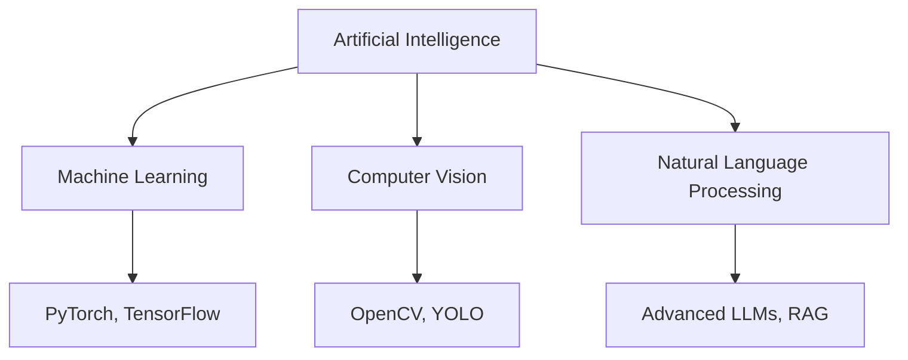

# 

<div align="center">
  <a href="https://github.com/python/cpython"></a>
  <a href="https://github.com/NITISH-R-G/NITISH-R-G"></a>
  
</div>

<br />

<div align="center">
  <a href="https://git.io/typing-svg">
    
  </a>
</div>

<p align="center">
  
</p>

<!-- Recruiter note: Psst! If you're inspecting the source, you'll see I enjoy blending code with creativity. Connect with me! -->

---

## ⚡ `init_developer.py`

```python
class Developer:
    def __init__(self):
        self.name = "Nitish R.G"
        self.role = "Data Science and AI Practitioner"
        self.education = {
            "BS": "IIT Madras (Data Science)",
            "BE": "SIET (Computer Science Engineering)"
        }
        self.focus = [
            "Advanced LLMs",
            "Computer Vision",
            "Full-Stack ML Integration",
            "Scalable AI Architectures"
        ]

    def get_mission(self):
        return 'Turning complex data into actionable intelligence 🚀'
```

---

## 📊 `SYSTEM_STATUS`

<div align="center">
  <table width="100%" border="0" cellpadding="10" cellspacing="0">
    <tr>
      <td width="50%" valign="top">
        <h3>🚀 Current Directives</h3>
        <p>I thrive at the intersection of <b>AI, Data Engineering, and Software Development</b>. Whether it's building robust RAG architectures, training complex CV models, or deploying full-stack apps, I bring data to life.</p>
        <br />
        <p><b>Currently Learning:</b> Agentic Workflows & Multi-Modal Models</p>
        <p><b>Ask me about:</b> Fine-tuning LLMs, scaling AI in production, and optimizing ML pipelines.</p>
      </td>
      <td width="50%" valign="top">
        <h3>🏢 Experience & Affiliations</h3>
        <ul>
          <li><b>Building</b> @ GDIN</li>
          <li><b>AI Intern</b> @ <a href="https://infyspringboard.onwingspan.com/web/en/login">Infosys Springboard</a></li>
          <li><b>Developer</b> @ <a href="https://www.amd.com/en/developer/resources/ai-developer-program.html">AMD AI Developer Program</a></li>
          <li><b>Alumni</b> @ <a href="https://www.mckinsey.com/careers/students/forward">McKinsey Forward</a></li>
        </ul>
      </td>
    </tr>
  </table>
</div>

---

## 🛠️ `NEURAL_ARCHITECTURE` (Tech Stack)

<div align="center">
  <p><b>Languages:</b> <br /> <a href="https://skillicons.dev"></a></p>
  <p><b>Web Frameworks:</b> <br /> <a href="https://skillicons.dev"></a></p>
  <p><b>AI & Data:</b> <br /> <a href="https://skillicons.dev"></a></p>
  <p><b>DevOps & Tools:</b> <br /> <a href="https://skillicons.dev"></a></p>
</div>



---

## ⚔️ `PROJECT_WAR_ROOM`

<div align="center">
  <table width="100%" border="0" cellpadding="15">
    <tr>
      <td width="50%" align="center">
        <h3><a href="https://github.com/NITISH-R-G/PedagogyX">📚 PedagogyX</a></h3>
        <p><i>EdTech platform leveraging LLMs for personalized learning paths.</i></p>
        <p><b>Impact:</b> Automated assessment generation for personalized education.</p>
        <a href="https://github.com/NITISH-R-G/PedagogyX"></a>
      </td>
      <td width="50%" align="center">
        <h3><a href="https://github.com/NITISH-R-G/PalmPlay">✋ PalmPlay</a></h3>
        <p><i>CV-based real-time gesture recognition system.</i></p>
        <p><b>Impact:</b> Enabled hands-free application control with high accuracy.</p>
        <a href="https://github.com/NITISH-R-G/PalmPlay"></a>
      </td>
    </tr>
    <tr>
      <td width="50%" align="center">
        <h3><a href="https://github.com/NITISH-R-G/Intelli-Credit-V2">💳 Intelli-Credit</a></h3>
        <p><i>ML-driven credit scoring and risk assessment engine.</i></p>
        <p><b>Impact:</b> Scalable financial analysis for rapid risk assessment.</p>
        <a href="https://github.com/NITISH-R-G/Intelli-Credit-V2"></a>
      </td>
      <td width="50%" align="center">
        <h3><a href="https://github.com/NITISH-R-G/CODESTREAK">🔥 CODESTREAK</a></h3>
        <p><i>Developer productivity dashboard and analytics tool.</i></p>
        <p><b>Impact:</b> Gamified coding consistency and habit tracking.</p>
        <a href="https://github.com/NITISH-R-G/CODESTREAK"></a>
      </td>
    </tr>
  </table>
</div>

<div align="center">
  <table width="100%" border="0" cellpadding="15">
    <tr>
      <td width="50%" align="center">
        <h3>🖥️ <a href="https://mac-os-portfolio-nine-beryl.vercel.app/">Mac OS Style Portfolio</a></h3>
        <p><i>Experience my work through an interactive, visually stunning Mac OS-themed web portfolio.</i></p>
        <a href="https://mac-os-portfolio-nine-beryl.vercel.app/"></a>
      </td>
      <td width="50%" align="center">
        <h3>📄 <a href="https://drive.google.com/file/d/1lm1TLC00ThShlEi80uRtkz4rppco1w8O/view?usp=sharing">Comprehensive Resume</a></h3>
        <p><i>Dive deep into my technical background, academic achievements, and professional experience.</i></p>
        <a href="https://drive.google.com/file/d/1lm1TLC00ThShlEi80uRtkz4rppco1w8O/view?usp=sharing"></a>
      </td>
    </tr>
  </table>
</div>

---

## 📈 `FOUNDER_DASHBOARD`

<div align="center">
  <a href="https://github.com/NITISH-R-G">
    
  </a>
  <a href="https://github.com/NITISH-R-G">
    
  </a>
</div>

<br />

<div align="center">
  <a href="https://github.com/NITISH-R-G">
    
  </a>
</div>

<br />

<p align="center">
  
</p>

---

## 🏆 Achievements & Credibility

- **Certifications:** Certified in Advanced ML & Deep Learning (Coursera/DeepLearning.AI)
- **Hackathons:** Finalist at SIET Hackathon for Healthcare AI MVP
- **Internships:** Infosys Springboard (AI Track), driving impactful POCs
- **Leadership:** Led academic projects steering teams of 4+ across ML pipeline development

---

## 🤝 Connect with Me

<p align="center">
  <a href="https://twitter.com/NITISH_R_G" target="blank"></a>
  <a href="https://linkedin.com/in/nitish-r-g-15-10-2007-rgn/" target="blank"></a>
  <a href="mailto:nitishrg.8220psgps2020@gmail.com" target="blank"></a>
</p>

<p align="center">
  
</p>

<!-- "Why do programmers prefer dark mode? Because light attracts bugs!" -->

---

<!-- Automations -->
<!--START_SECTION:activity-->
<!--END_SECTION:activity-->

<!-- BLOG-POST-LIST:START -->
<!-- BLOG-POST-LIST:END -->

<!--START_SECTION:waka-->
<!--END_SECTION:waka-->
