# SYSTEM_STATUS: ONLINE

<!-- REC_SIGNAL: If you're a recruiter inspecting my source, hello! I build scalable AI architectures and love clean code. Let's chat. -->

<div align="center">


<a href="https://git.io/typing-svg"></a>

Model, API, UI — I build the whole chain, not just the notebook demo.

[](https://mac-os-portfolio-nine-beryl.vercel.app/)
[](https://drive.google.com/file/d/1lm1TLC00ThShlEi80uRtkz4rppco1w8O/view?usp=sharing)

</div>

## `init_developer.py`

```python
class Developer:
    def __init__(self):
        self.name = "Nitish R.G"
        self.role = "Data Science and AI Practitioner"
        self.education = {
            "IIT Madras": "BS Data Science",
            "SIET": "BE CSE"
        }
        self.focus = [
            "Advanced LLMs",
            "Computer Vision",
            "Full-Stack ML Integration",
            "Scalable AI Architectures"
        ]

    def get_mission(self):
        return "Turning complex data into actionable intelligence 🚀"
```

## `FOUNDER_DASHBOARD`

<table>
<tr>
<td width="50%" valign="top">

### 💻 Tech Stack

**Languages**
<a href="https://skillicons.dev"></a>

**AI / ML**
<a href="https://skillicons.dev"></a>

**Shipping**
<a href="https://skillicons.dev"></a>

**Data**
<a href="https://skillicons.dev"></a>

</td>
<td width="50%" valign="top">

### 🧠 NEURAL_ARCHITECTURE

```mermaid
graph TD;
    A[Raw Data] --> B[RAG Pipeline];
    B --> C[LLM Inference Engine];
    C --> D[Actionable Intelligence];
    style A fill:#0d1117,stroke:#00c3ff
    style B fill:#0d1117,stroke:#00c3ff
    style C fill:#0d1117,stroke:#00c3ff
    style D fill:#00c3ff,stroke:#00c3ff,color:#000
```



</td>
</tr>
</table>

## `PROJECT_WAR_ROOM`

<table>
<tr>
<td width="50%" valign="top">

**[📚 PedagogyX](https://github.com/NITISH-R-G/PedagogyX)**
LLM-driven EdTech platform — personalized learning paths, automated assessment generation.

* **Impact:** Delivers adaptive learning content dynamically, reducing educator workload.
* **Tech used:**  

</td>
<td width="50%" valign="top">

**[✋ PalmPlay](https://github.com/NITISH-R-G/PalmPlay)**
Real-time computer-vision gesture recognition for hands-free app control.

* **Impact:** Enables touchless interfaces with high-accuracy frame-by-frame processing.
* **Tech used:**  

</td>
</tr>
<tr>
<td width="50%" valign="top">

**[💳 Intelli-Credit](https://github.com/NITISH-R-G/Intelli-Credit-V2)**
ML credit-scoring and risk engine built for scalable financial analysis.

* **Impact:** Modernizes traditional credit evaluations by leveraging alternative data points.
* **Tech used:**  

</td>
<td width="50%" valign="top">

**[🔥 CODESTREAK](https://github.com/NITISH-R-G/CODESTREAK)**
Developer-productivity dashboard for tracking coding habits and consistency.

* **Impact:** Visualizes workflow patterns to maximize continuous learning and delivery.
* **Tech used:**  

</td>
</tr>
</table>

## `CREDENTIALS_AND_ACHIEVEMENTS`

### Internships

* AI Intern @ [Infosys Springboard](https://infyspringboard.onwingspan.com/web/en/login)

### Leadership roles

* Building @ GDIN

### Certifications

* Alumnus @ [McKinsey Forward](https://www.mckinsey.com/careers/students/forward)
* Developer @ [AMD AI Developer Program](https://www.amd.com/en/developer/resources/ai-developer-program.html)

### Hackathons

* Exploring and building in various open-source AI and developer hackathons to solve real-world technical challenges.

## `NETWORK_GRAPH`

<div align="center">


<a href="https://github.com/ryo-ma/github-profile-trophy"></a>

<a href="https://github.com/NITISH-R-G"></a>

</div>

## `USER_TERMINAL`

<table>
<tr>
<td width="50%" valign="top">

### ⚡ Ask Me About

* Designing RAG pipelines
* Full-Stack ML Integration
* Building scalable microservices
* How to outlive the notebook demo

### 🌱 Currently Learning

* Advanced LLM Optimization
* High-Performance Rust for AI
* Distributed Systems Architecture

</td>
<td width="50%" valign="top">

### 👾 Developer Joke

<a href="https://github.com/Taosif7/readme-joke"></a>

### 📡 Connection

**Reach me** — [X / Twitter](https://twitter.com/NITISH_R_G) · [LinkedIn](https://linkedin.com/in/nitish-r-g-15-10-2007-rgn/) · [Mail](mailto:nitishrg.8220psgps2020@gmail.com)

**Visitor Count:** 

</td>
</tr>
</table>

<!-- Automations -->
<!--START_SECTION:waka-->
<!--END_SECTION:waka-->

<!--START_SECTION:activity-->
<!--END_SECTION:activity-->

<!-- BLOG-POST-LIST:START -->
<!-- BLOG-POST-LIST:END -->
