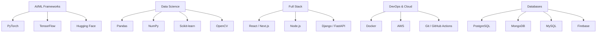

# Nitish R.G Profile Dashboard

<div align="center">
  
</div>

## ⚡ `SYSTEM_STATUS`: Online

<div align="center">
  <a href="https://github.com/NITISH-R-G/NITISH-R-G"></a>
  <a href="https://github.com/python/cpython"></a>
  
</div>

<br>

<div align="center">
  <a href="https://git.io/typing-svg"></a>
</div>

## 👨‍💻 `init_developer.py`

```python
class Developer:
    def __init__(self):
        self.name = "Nitish R.G"
        self.role = "Data Science & AI Practitioner"
        self.education = {
            "BS": "IIT Madras (Data Science)",
            "BE": "SIET (Computer Science Engineering)"
        }
        self.focus = [
            "Advanced LLMs",
            "Computer Vision",
            "Full-Stack ML Integration",
            "Scalable AI Architectures"
        ]

    def get_mission(self):
        return "Turning complex data into actionable intelligence 🚀"
```

---

## 🛠️ `NEURAL_ARCHITECTURE` & Tech Stack

<div align="center">



<br>

<a href="https://skillicons.dev">
  
</a>

</div>

---

## ⚔️ `PROJECT_WAR_ROOM`

<div align="center">
  <table width="100%" border="0" cellpadding="15">
    <tr>
      <td width="50%" align="center">
        <h3><a href="https://github.com/NITISH-R-G/PedagogyX" style="color:#00c3ff;">📚 PedagogyX</a></h3>
        <p><i>Advanced EdTech platform leveraging LLMs for personalized learning paths and automated assessment generation.</i></p>
        <p><b>Impact:</b> Scalable, customized education delivery.</p>
        <p> </p>
      </td>
      <td width="50%" align="center">
        <h3><a href="https://github.com/NITISH-R-G/PalmPlay" style="color:#00c3ff;">✋ PalmPlay</a></h3>
        <p><i>Computer Vision based real-time gesture recognition system for hands-free application control.</i></p>
        <p><b>Impact:</b> Enhanced accessibility and seamless UX.</p>
        <p> </p>
      </td>
    </tr>
    <tr>
      <td width="50%" align="center">
        <h3><a href="https://github.com/NITISH-R-G/Intelli-Credit-V2" style="color:#00c3ff;">💳 Intelli-Credit-V2</a></h3>
        <p><i>ML-driven credit scoring and risk assessment engine designed for scalable financial analysis.</i></p>
        <p><b>Impact:</b> Robust risk prediction pipelines.</p>
        <p> </p>
      </td>
      <td width="50%" align="center">
        <h3><a href="https://github.com/NITISH-R-G/CODESTREAK" style="color:#00c3ff;">🔥 CODESTREAK</a></h3>
        <p><i>Developer productivity dashboard and analytics tool for tracking coding habits and consistency.</i></p>
        <p><b>Impact:</b> Actionable developer metrics.</p>
        <p> </p>
      </td>
    </tr>
  </table>
</div>

---

## 📈 `FOUNDER_DASHBOARD`

<div align="center">
  <table width="100%" border="0" cellpadding="10" cellspacing="0">
    <tr>
      <td width="50%" valign="top">
        <h3>🌟 Building @ GDIN</h3>
        <p>Driving innovation and building scalable systems. Focused on rapid prototyping, MVP development, and scaling AI architectures.</p>
        <br/>
        <h3>🤝 Open to Collaboration</h3>
        <p>Actively looking to connect with YC founders, open-source maintainers, and innovators building the future of AI.</p>
      </td>
      <td width="50%" valign="top">
        <h3>🏢 Experience & Education</h3>
        <ul>
          <li><b>AI Intern</b> @ <a href="https://infyspringboard.onwingspan.com/web/en/login">Infosys Springboard</a></li>
          <li><b>Developer</b> @ <a href="https://www.amd.com/en/developer/resources/ai-developer-program.html">AMD AI Developer Program</a></li>
          <li><b>Alumni</b> @ <a href="https://www.mckinsey.com/careers/students/forward">McKinsey Forward</a></li>
          <li><b>BS in Data Science</b> @ IIT Madras</li>
          <li><b>BE in Computer Science Engineering</b> @ SIET</li>
        </ul>
      </td>
    </tr>
  </table>
</div>

<div align="center">
  <table width="100%" border="0" cellpadding="15">
    <tr>
      <td width="50%" align="center">
        <h3><a href="https://mac-os-portfolio-nine-beryl.vercel.app/" style="color:#00c3ff;">🖥️ Interactive Portfolio</a></h3>
        <p><i>Experience my work through an interactive, visually stunning Mac OS-themed web portfolio.</i></p>
        <a href="https://mac-os-portfolio-nine-beryl.vercel.app/">
            
        </a>
      </td>
      <td width="50%" align="center">
        <h3><a href="https://drive.google.com/file/d/1lm1TLC00ThShlEi80uRtkz4rppco1w8O/view?usp=sharing" style="color:#00c3ff;">📄 Comprehensive Resume</a></h3>
        <p><i>Dive deep into my technical background, academic achievements, and professional experience.</i></p>
        <a href="https://drive.google.com/file/d/1lm1TLC00ThShlEi80uRtkz4rppco1w8O/view?usp=sharing">
            
        </a>
      </td>
    </tr>
  </table>
</div>

---

## 📊 Analytics & Activity

<div align="center">
  <a href="https://github.com/NITISH-R-G"></a>
  <a href="https://github.com/NITISH-R-G"></a>
  <br>
  <a href="https://github.com/NITISH-R-G"></a>
</div>

<div align="center">
  <a href="https://github.com/ryo-ma/github-profile-trophy"></a>
</div>

<div align="center">
<!--START_SECTION:waka-->
<!--END_SECTION:waka-->
</div>

### 🐍 Contribution Graph

<div align="center">
  <picture>
    <source media="(prefers-color-scheme: dark)" srcset="https://raw.githubusercontent.com/NITISH-R-G/NITISH-R-G/output/github-contribution-grid-snake-dark.svg">
    <source media="(prefers-color-scheme: light)" srcset="https://raw.githubusercontent.com/NITISH-R-G/NITISH-R-G/output/github-contribution-grid-snake.svg">
    
  </picture>
</div>

### 3D Contribution Profile

<div align="center">
  
</div>

### Recent Activity

<!--START_SECTION:activity-->
<!--END_SECTION:activity-->

### Latest Blog Posts

<!-- BLOG-POST-LIST:START -->
<!-- BLOG-POST-LIST:END -->

---

## 📬 Contact Node

<div align="center">
  <a href="https://twitter.com/NITISH_R_G" target="_blank"></a>
  &nbsp;&nbsp;
  <a href="https://linkedin.com/in/nitish-r-g-15-10-2007-rgn/" target="_blank"></a>
  &nbsp;&nbsp;
  <a href="mailto:nitishrg.8220psgps2020@gmail.com" target="_blank"></a>
</div>

<div align="center">
  <br>
  
  <br>
  <a href="http://s01.flagcounter.com/more/ap7"></a>
</div>

<div align="center">
  <a href="https://star-history.com/#NITISH-R-G/NITISH-R-G&Date"></a>
</div>

<!--
    // Hey there, fellow developer!
    // Thanks for checking out the source code of my profile.
    // If you're a recruiter or founder looking to build the next big thing,
    // let's connect! I'm always open for interesting discussions.
    // printf("Hello, World!\n");
-->
