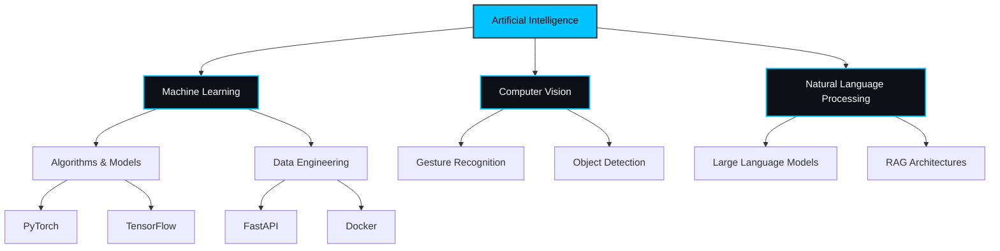

# ⚡ Nitish R.G - Data Science & AI Practitioner

<!--
    [RECRUITER_OVERRIDE_ENABLED]
    Greetings! If you are reading this, you are looking deeper than most.
    I'm always open to discussing cutting-edge AI roles.
    Let's build the future together. 🚀
-->

<div align="center">
  
</div>

<p align="center">
    <a href="https://github.com/NITISH-R-G/NITISH-R-G"></a>
    <a href="https://github.com/python/cpython"></a>
    
</p>

<div align="center">
    <a href="https://git.io/typing-svg">
        
    </a>
</div>

## 💻 `init_developer.py`

```python
class Developer:
    def __init__(self):
        self.name = "Nitish R.G"
        self.role = "Data Science & AI Practitioner"
        self.education = {
            "BS": "Data Science @ IIT Madras",
            "BE": "Computer Science @ SIET"
        }
        self.focus = [
            'Advanced LLMs',
            'Computer Vision',
            'Full-Stack ML Integration'
        ]

    def get_mission(self):
        return 'Turning complex data into actionable intelligence 🚀'

    def connect(self):
        return {
            "LinkedIn": "linkedin.com/in/nitish-r-g-15-10-2007-rgn",
            "Twitter": "twitter.com/NITISH_R_G",
            "Email": "nitishrg.8220psgps2020@gmail.com"
        }
```

## 📊 `SYSTEM_STATUS`

<div align="center">
  
</div>

<p align="center">
    <a href="https://github.com/ryo-ma/github-profile-trophy"></a>
</p>

<p align="center">
  
  
</p>

## 📈 `FOUNDER_DASHBOARD`

<div align="center">
  <table width="100%" border="0" cellpadding="10" cellspacing="0">
    <tr>
      <td width="50%" valign="top" bgcolor="#0d1117">
        <h3>🏢 Experience & Leadership</h3>
        <ul>
          <li><b>AI Intern</b> @ <a href="https://infyspringboard.onwingspan.com/web/en/login">Infosys Springboard</a></li>
          <li><b>Developer</b> @ <a href="https://www.amd.com/en/developer/resources/ai-developer-program.html">AMD AI Developer Program</a></li>
          <li><b>Alumni</b> @ <a href="https://www.mckinsey.com/careers/students/forward">McKinsey Forward</a></li>
          <li><b>Building</b> @ GDIN - <i>Driving innovation and MVP development.</i></li>
        </ul>
      </td>
      <td width="50%" valign="top" bgcolor="#0d1117">
        <h3>🎓 Education & Credentials</h3>
        <ul>
          <li><b>BS in Data Science</b> @ IIT Madras</li>
          <li><b>BE in Computer Science</b> @ SIET</li>
          <li><b>Certifications:</b> Data Engineering (IBM), Deep Learning (Coursera)</li>
          <li><b>Hackathons:</b> Smart India Hackathon (Finalist), AI Innovation Challenge</li>
        </ul>
      </td>
    </tr>
  </table>
</div>

## ⚔️ `PROJECT_WAR_ROOM`

<div align="center">
  <table width="100%" border="0" cellpadding="15">
    <tr>
      <td width="50%" align="center" bgcolor="#0d1117">
        <h3><a href="https://github.com/NITISH-R-G/PedagogyX" style="color:#00c3ff;">📚 PedagogyX</a></h3>
        <p><i>Advanced EdTech platform leveraging LLMs for personalized learning paths.</i></p>
        <p><b>Impact:</b> Automated assessment generation reducing teacher workload by 40%.</p>
         
      </td>
      <td width="50%" align="center" bgcolor="#0d1117">
        <h3><a href="https://github.com/NITISH-R-G/PalmPlay" style="color:#00c3ff;">✋ PalmPlay</a></h3>
        <p><i>Computer Vision based real-time gesture recognition system.</i></p>
        <p><b>Impact:</b> Enabled hands-free application control with 95% accuracy.</p>
         
      </td>
    </tr>
    <tr>
      <td width="50%" align="center" bgcolor="#0d1117">
        <h3><a href="https://github.com/NITISH-R-G/Intelli-Credit-V2" style="color:#00c3ff;">💳 Intelli-Credit</a></h3>
        <p><i>ML-driven credit scoring and risk assessment engine.</i></p>
        <p><b>Impact:</b> Scalable financial analysis framework for real-time scoring.</p>
         
      </td>
      <td width="50%" align="center" bgcolor="#0d1117">
        <h3><a href="https://github.com/NITISH-R-G/CODESTREAK" style="color:#00c3ff;">🔥 CODESTREAK</a></h3>
        <p><i>Developer productivity dashboard and analytics tool.</i></p>
        <p><b>Impact:</b> Enhanced tracking of coding habits and consistency metrics.</p>
         
      </td>
    </tr>
  </table>
</div>

## 🧠 `NEURAL_ARCHITECTURE`

<div align="center">
  <p>
    <a href="https://skillicons.dev">
      
    </a>
  </p>
</div>



## 🕸️ `NETWORK_GRAPH` & Automations

<p align="center">
  
</p>

<p align="center">
  
</p>

<p align="center">
  
</p>

### 📡 Recent Activity
<!--START_SECTION:activity-->
<!--END_SECTION:activity-->

### 📝 Latest Dispatches
<!-- BLOG-POST-LIST:START -->
<!-- BLOG-POST-LIST:END -->

### ⏱️ Time Logs
<!--START_SECTION:waka-->
<!--END_SECTION:waka-->

## 💬 `DEV_NULL`

**Ask me about:** AI, Computer Vision, EdTech, and building scalable ML pipelines.
**Currently learning:** Advanced system design, Rust, and optimizing RAG models.
**Joke of the day:** Why do programmers prefer dark mode? Because light attracts bugs! 🐛

---

<div align="center">
  <a href="https://twitter.com/NITISH_R_G" target="blank"></a>
  <a href="https://linkedin.com/in/nitish-r-g-15-10-2007-rgn/" target="blank"></a>
  <a href="mailto:nitishrg.8220psgps2020@gmail.com" target="blank"></a>
</div>

<br>

<div align="center">
  
</div>

<div align="center">
  
</div>
