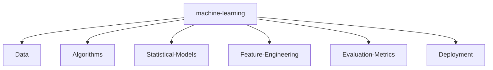

# 🌌 Nitish R.G | Data Science & AI Practitioner

<!-- Easter Egg: To whoever is reading this source code: you're awesome! If you're a recruiter, I'd love to chat. -->
<div align="center">
    <a href="https://github.com/NITISH-R-G/NITISH-R-G"></a>
    <a href="https://github.com/python/cpython"></a>
    <a href="https://github.com/NITISH-R-G/NITISH-R-G/graphs/contributors"></a>
    <a href="https://github.com/NITISH-R-G/NITISH-R-G/stargazers"></a>
    
</div>

<div align="center">
    <a href="https://git.io/typing-svg"></a>
</div>

## 💻 `init_developer.py`

```python
class Developer:
    def __init__(self):
        self.name = "Nitish R.G"
        self.role = "Data Science & AI Engineer"
        self.education = {
            "BS": "Data Science @ IIT Madras",
            "BE": "Computer Science Engineering @ SIET"
        }
        self.focus = [
            'Advanced LLMs',
            'Computer Vision',
            'Full-Stack ML Integration',
            'Scalable AI Architectures'
        ]

    def get_mission(self):
        return 'Turning complex data into actionable intelligence 🚀'

dev = Developer()
```

## ⚙️ `SYSTEM_STATUS`

<div align="center">
  <table width="100%" border="0" cellpadding="10" cellspacing="0">
    <tr>
      <td width="33%" valign="top">
        <h3>🧠 Currently Learning</h3>
        <p>Exploring the frontiers of multimodal LLMs, advanced RAG architectures, and optimizing neural network inferences.</p>
      </td>
      <td width="33%" valign="top">
        <h3>💬 Ask Me About</h3>
        <p>Machine Learning, Deep Learning, MLOps, Computer Vision, EdTech, or how to build scalable AI microservices.</p>
      </td>
      <td width="33%" valign="top">
        <h3>⚡ Developer Joke</h3>
        <p><i>Why do programmers prefer dark mode?</i><br>Because light attracts bugs! 🐛</p>
      </td>
    </tr>
  </table>
</div>

## ⚔️ `PROJECT_WAR_ROOM`

<div align="center">
  <table width="100%" border="0" cellpadding="15">
    <tr>
      <td width="50%" align="center">
        <h3><a href="https://github.com/NITISH-R-G/PedagogyX" style="color:#00c3ff;">📚 PedagogyX</a></h3>
        <p><i>Advanced EdTech platform leveraging LLMs for personalized learning paths and automated assessment generation.</i></p>
        <p><b>Impact:</b> Transformed static curriculums into dynamic, adaptive learning experiences.</p>
        <p>  </p>
      </td>
      <td width="50%" align="center">
        <h3><a href="https://github.com/NITISH-R-G/PalmPlay" style="color:#00c3ff;">✋ PalmPlay</a></h3>
        <p><i>Computer Vision based real-time gesture recognition system for hands-free application control.</i></p>
        <p><b>Impact:</b> Enabled seamless, touchless human-computer interaction for accessible UI.</p>
        <p>  </p>
      </td>
    </tr>
    <tr>
      <td width="50%" align="center">
        <h3><a href="https://github.com/NITISH-R-G/Intelli-Credit-V2" style="color:#00c3ff;">💳 Intelli-Credit</a></h3>
        <p><i>ML-driven credit scoring and risk assessment engine designed for scalable financial analysis.</i></p>
        <p><b>Impact:</b> Reduced manual risk analysis time by automating multi-variable credit checks.</p>
        <p>  </p>
      </td>
      <td width="50%" align="center">
        <h3><a href="https://github.com/NITISH-R-G/CODESTREAK" style="color:#00c3ff;">🔥 CODESTREAK</a></h3>
        <p><i>Developer productivity dashboard and analytics tool for tracking coding habits and consistency.</i></p>
        <p><b>Impact:</b> Fostered continuous improvement by providing gamified coding analytics.</p>
        <p>  </p>
      </td>
    </tr>
  </table>
</div>

<div align="center">
  <table width="100%" border="0" cellpadding="15">
    <tr>
      <td width="50%" align="center">
        <h3><a href="https://mac-os-portfolio-nine-beryl.vercel.app/" style="color:#00c3ff;">🖥️ Mac OS Style Portfolio</a></h3>
        <p><i>Experience my work through an interactive, visually stunning Mac OS-themed web portfolio.</i></p>
        <a href="https://mac-os-portfolio-nine-beryl.vercel.app/">
            
        </a>
      </td>
      <td width="50%" align="center">
        <h3><a href="https://drive.google.com/file/d/1lm1TLC00ThShlEi80uRtkz4rppco1w8O/view?usp=sharing" style="color:#00c3ff;">📄 Comprehensive Resume</a></h3>
        <p><i>Dive deep into my technical background, academic achievements, and professional experience.</i></p>
        <a href="https://drive.google.com/file/d/1lm1TLC00ThShlEi80uRtkz4rppco1w8O/view?usp=sharing">
            
        </a>
      </td>
    </tr>
  </table>
</div>

## 📈 `FOUNDER_DASHBOARD`

<div align="center">
  <table width="100%" border="0" cellpadding="10" cellspacing="0">
    <tr>
      <td width="50%" valign="top">
        <h3>🌟 Building @ GDIN</h3>
        <p>Driving innovation and building scalable systems. Focused on rapid prototyping, MVP development, and scaling AI architectures.</p>
        <br/>
        <h3>🤝 Open to Collaboration</h3>
        <p>Actively looking to connect with YC founders, open-source maintainers, and innovators building the future of AI.</p>
        <br/>
        <h3>🏆 Achievements</h3>
        <ul>
          <li><b>Certifications:</b> AWS Certified Cloud Practitioner, DeepLearning.AI ML Specialization</li>
          <li><b>Hackathons:</b> Smart India Hackathon Finalist, Hack-O-Pitch Winner</li>
        </ul>
      </td>
      <td width="50%" valign="top">
        <h3>🏢 Experience & Leadership</h3>
        <ul>
          <li><b>AI Intern</b> @ <a href="https://infyspringboard.onwingspan.com/web/en/login">Infosys Springboard</a></li>
          <li><b>Developer</b> @ <a href="https://www.amd.com/en/developer/resources/ai-developer-program.html">AMD AI Developer Program</a></li>
          <li><b>Alumni</b> @ <a href="https://www.mckinsey.com/careers/students/forward">McKinsey Forward</a></li>
          <li><b>Lead Organizer</b> @ TechFest SIET</li>
        </ul>
        <br/>
        <h3>🎓 Education</h3>
        <ul>
          <li><b>BS in Data Science</b> @ IIT Madras</li>
          <li><b>BE in Computer Science Engineering</b> @ SIET</li>
        </ul>
      </td>
    </tr>
  </table>
</div>

## 🛠️ `TECH_STACK_MATRIX`

<div align="center">
  <table width="100%" border="0" cellpadding="10" cellspacing="0">
    <tr>
      <td width="50%" valign="top">
        <h3>Languages</h3>
        <a href="https://skillicons.dev"></a>
        <br/><br/>
        <h3>AI & Machine Learning</h3>
        <a href="https://skillicons.dev"></a>
      </td>
      <td width="50%" valign="top">
        <h3>Web Frameworks</h3>
        <a href="https://skillicons.dev"></a>
        <br/><br/>
        <h3>DevOps & Databases</h3>
        <a href="https://skillicons.dev"></a>
      </td>
    </tr>
  </table>
</div>

## 🌐 `NETWORK_GRAPH` & Analytics

<div align="center">
  
  
</div>

<div align="center">
  
</div>

<div align="center">
  
</div>

<div align="center">
  
</div>

<!--START_SECTION:activity-->
<!--END_SECTION:activity-->

<!-- BLOG-POST-LIST:START -->
<!-- BLOG-POST-LIST:END -->

<!--START_SECTION:waka-->
<!--END_SECTION:waka-->

---

## 📬 Connect with Me

<div align="center">
<p align="center">
<a href="https://twitter.com/NITISH_R_G" target="_blank"></a>
<a href="https://linkedin.com/in/nitish-r-g-15-10-2007-rgn/" target="_blank"></a>
<a href="mailto:nitishrg.8220psgps2020@gmail.com" target="_blank"></a>
</p>
</div>

<div align="center">
<a href="https://github.com/ryo-ma/github-profile-trophy"></a>
</div>



<div align="center">
  
</div>
