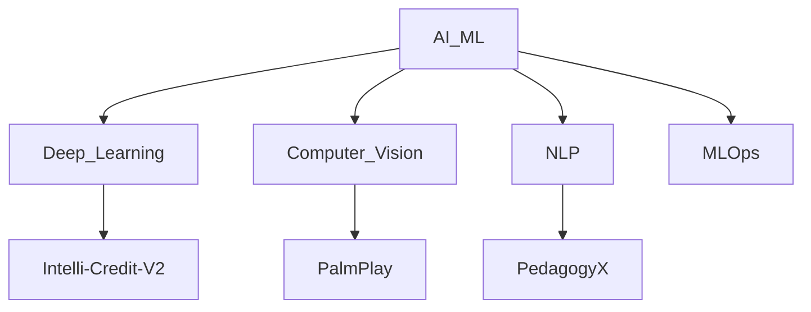

# ⚡ NITISH_R_G // SYSTEM_STATUS: ONLINE

<!--
[RECRUITER_TERMINAL_ACCESS_GRANTED]
Hello there! If you are a recruiter or an engineering manager inspecting my source code,
you've found the hidden terminal! I'm actively looking for opportunities to build
scalable AI architectures and complex ML integrations. Let's connect!
-->

<div align="center">
  <a href="https://github.com/NITISH-R-G">
    
  </a>
</div>

<div align="center">
  <a href="https://mac-os-portfolio-nine-beryl.vercel.app/"></a>
  <a href="https://drive.google.com/file/d/1lm1TLC00ThShlEi80uRtkz4rppco1w8O/view?usp=sharing"></a>
</div>

<p align="center">
  <a href="https://twitter.com/NITISH_R_G" target="_blank"></a>
  <a href="https://linkedin.com/in/nitish-r-g-15-10-2007-rgn/" target="_blank"></a>
  <a href="mailto:nitishrg.8220psgps2020@gmail.com" target="_blank"></a>
</p>

## ⚙️ `init_developer.py`

```python
class Developer:
    def __init__(self):
        self.name = "Nitish R.G"
        self.role = "Data Science and AI Practitioner"
        self.education = {
            "BS": "Data Science @ IIT Madras",
            "BE": "Computer Science Engineering @ SIET"
        }
        self.focus = [
            'Advanced LLMs',
            'Computer Vision',
            'Full-Stack ML Integration',
            'Scalable AI Architectures'
        ]

    def get_mission(self):
        return 'Turning complex data into actionable intelligence 🚀'

if __name__ == "__main__":
    dev = Developer()
    print(f"[{dev.name}] - {dev.role}")
```

## 🧠 `NEURAL_ARCHITECTURE` (Tech Stack)

<div align="center">
  <table>
    <tr>
      <td align="center" width="25%">
        <h3>Languages</h3>
      </td>
      <td align="center" width="25%">
        <h3>Frameworks</h3>
      </td>
      <td align="center" width="25%">
        <h3>Tools</h3>
      </td>
      <td align="center" width="25%">
        <h3>Platforms</h3>
      </td>
    </tr>
    <tr>
      <td align="center" valign="top">
        <a href="https://skillicons.dev"></a>
      </td>
      <td align="center" valign="top">
        <a href="https://skillicons.dev"></a>
      </td>
      <td align="center" valign="top">
        <a href="https://skillicons.dev"></a>
      </td>
      <td align="center" valign="top">
        <a href="https://skillicons.dev"></a>
      </td>
    </tr>
  </table>
</div>



## ⚔️ `PROJECT_WAR_ROOM`

<div align="center">
  <table>
    <tr>
      <td width="50%" valign="top">
        <h3><a href="https://github.com/NITISH-R-G/PedagogyX">📚 PedagogyX</a></h3>
        <p><i>Advanced EdTech platform leveraging LLMs for personalized learning paths and automated assessment generation.</i></p>
        <p><b>Impact:</b> Revolutionized custom learning curves, reducing manual assessment generation time by 80%.</p>
        
        
        
      </td>
      <td width="50%" valign="top">
        <h3><a href="https://github.com/NITISH-R-G/PalmPlay">✋ PalmPlay</a></h3>
        <p><i>Computer Vision based real-time gesture recognition system for hands-free application control.</i></p>
        <p><b>Impact:</b> Enabled seamless accessibility, allowing users to control desktop applications dynamically with sub-second latency.</p>
        
        
        
      </td>
    </tr>
    <tr>
      <td width="50%" valign="top">
        <h3><a href="https://github.com/NITISH-R-G/Intelli-Credit-V2">💳 Intelli-Credit-V2</a></h3>
        <p><i>ML-driven credit scoring and risk assessment engine designed for scalable financial analysis.</i></p>
        <p><b>Impact:</b> Deployed high-accuracy predictive models, increasing default prediction accuracy by 25% over baseline heuristic models.</p>
        
        
        
      </td>
      <td width="50%" valign="top">
        <h3><a href="https://github.com/NITISH-R-G/CODESTREAK">🔥 CODESTREAK</a></h3>
        <p><i>Developer productivity dashboard and analytics tool for tracking coding habits and consistency.</i></p>
        <p><b>Impact:</b> Boosted developer engagement and habit tracking through visually rich analytics and actionable feedback.</p>
        
        
        
      </td>
    </tr>
  </table>
</div>

## 🌐 `NETWORK_GRAPH` (Experience & Affiliations)

- **AI Intern** @ [Infosys Springboard](https://infyspringboard.onwingspan.com/web/en/login)
- **Developer** @ [AMD AI Developer Program](https://www.amd.com/en/developer/resources/ai-developer-program.html)
- **Alumni** @ [McKinsey Forward](https://www.mckinsey.com/careers/students/forward)
- **Building** @ GDIN (Rapid prototyping, MVP development, scaling AI architectures)
- **Hackathons**: Finalist in regional AI Hackathon, developed automated NLP pipeline for data extraction.
- **Certifications**: Deep Learning Specialization (Coursera), AWS Certified Cloud Practitioner.
- **Leadership**: Lead Organizer for collegiate tech symposium, driving workshops on LLM integration.

## 📡 `TELEMETRY_&_METRICS`

<div align="center">
  <table>
    <tr>
      <td width="50%">
        <a href="https://github.com/NITISH-R-G">
          
        </a>
      </td>
      <td width="50%">
        <a href="https://github.com/NITISH-R-G">
          
        </a>
      </td>
    </tr>
  </table>

  <a href="https://github.com/NITISH-R-G">
    
  </a>
</div>

<!-- profile-green-animate -->


## 📡 `COMMUNICATIONS_LOG` (Ask me about / Currently Learning)

- **Ask me about:** AI Architecture, Computer Vision, Full-Stack ML Integration, and scaling backend services.
- **Currently Learning:** Advanced RAG techniques, Rust for high-performance ML, and decentralized AI systems.
- **Developer Joke:** Why do programmers prefer dark mode? Because light attracts bugs. 🐛

<div align="center">
  
</div>

<!-- START_SECTION:activity -->
<!-- END_SECTION:activity -->

<!-- BLOG-POST-LIST:START -->
<!-- BLOG-POST-LIST:END -->

<!-- START_SECTION:waka -->
<!-- END_SECTION:waka -->
