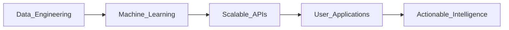

# ⚡ SYSTEM_INIT: Nitish R.G // Data Science & AI Engineer

<!--
  [INITIATING SECURE CONNECTION]
  Welcome, recruiter/developer! I see you exploring the source code.
  You found an easter egg! May your compile times be short and your ML models converge fast. 🚀
-->

<p align="center">
    <a href="https://github.com/NITISH-R-G/NITISH-R-G"></a>
    <a href="https://github.com/python/cpython"></a>
    <a href="https://github.com/NITISH-R-G/NITISH-R-G/graphs/contributors"></a>
    
</p>

<!-- Header Image, assuming it exists or replacing with aesthetic dynamic header -->
<div align="center">
  
</div>

<p align="center">
    <a href="https://git.io/typing-svg"></a>
</p>

---

## 🛠️ `init_developer.py`

```python
class Developer:
    def __init__(self):
        self.name = "Nitish R.G"
        self.role = "Data Science & AI Practitioner | Software Engineer"
        self.education = {
            "BS": "Data Science @ IIT Madras",
            "BE": "Computer Science Engineering @ SIET"
        }
        self.focus = [
            'Advanced LLMs',
            'Computer Vision',
            'Full-Stack ML Integration',
            'Scalable AI Architectures'
        ]

    def get_mission(self):
        return 'Turning complex data into actionable intelligence 🚀'

if __name__ == '__main__':
    dev = Developer()
```

---

## 🧠 `NEURAL_ARCHITECTURE` : Tech Stack

<div align="center">
  <table width="100%" border="0" cellpadding="10">
    <tr>
      <td width="50%" valign="top" bgcolor="#0d1117">
        <h3>💻 Languages & Core</h3>
        <p>
          
          
          
          
          
          
        </p>
      </td>
      <td width="50%" valign="top" bgcolor="#0d1117">
        <h3>🤖 AI / ML Frameworks</h3>
        <p>
          
          
          
          
          
          
        </p>
      </td>
    </tr>
    <tr>
      <td width="50%" valign="top" bgcolor="#0d1117">
        <h3>🌐 Web Frameworks</h3>
        <p>
          
          
          
          
          
          
          
        </p>
      </td>
      <td width="50%" valign="top" bgcolor="#0d1117">
        <h3>☁️ DevOps, Cloud & Databases</h3>
        <p>
          
          
          
          
          
          
          
          
        </p>
      </td>
    </tr>
  </table>
</div>



---

## ⚔️ `PROJECT_WAR_ROOM`

<div align="center">
  <table width="100%" border="0" cellpadding="15">
    <tr>
      <td width="50%" valign="top" bgcolor="#0d1117">
        <h3><a href="https://github.com/NITISH-R-G/PedagogyX" style="color:#00c3ff;">📚 PedagogyX</a></h3>
        <p><i>Advanced EdTech platform leveraging LLMs for personalized learning paths and automated assessment generation.</i></p>
        <p><b>Impact:</b> Scalable solution revolutionizing AI-driven personalized education.</p>
        <p>
          
          
          
        </p>
      </td>
      <td width="50%" valign="top" bgcolor="#0d1117">
        <h3><a href="https://github.com/NITISH-R-G/PalmPlay" style="color:#00c3ff;">✋ PalmPlay</a></h3>
        <p><i>Computer Vision based real-time gesture recognition system for hands-free application control.</i></p>
        <p><b>Impact:</b> Enhances accessibility by enabling seamless, touchless system navigation.</p>
        <p>
          
          
          
        </p>
      </td>
    </tr>
    <tr>
      <td width="50%" valign="top" bgcolor="#0d1117">
        <h3><a href="https://github.com/NITISH-R-G/Intelli-Credit-V2" style="color:#00c3ff;">💳 Intelli-Credit</a></h3>
        <p><i>ML-driven credit scoring and risk assessment engine designed for scalable financial analysis.</i></p>
        <p><b>Impact:</b> Automated, unbiased credit risk evaluation using robust statistical modeling.</p>
        <p>
          
          
          
        </p>
      </td>
      <td width="50%" valign="top" bgcolor="#0d1117">
        <h3><a href="https://github.com/NITISH-R-G/CODESTREAK" style="color:#00c3ff;">🔥 CODESTREAK</a></h3>
        <p><i>Developer productivity dashboard and analytics tool for tracking coding habits and consistency.</i></p>
        <p><b>Impact:</b> Visualizing developer metrics to foster consistent coding patterns.</p>
        <p>
          
          
          
        </p>
      </td>
    </tr>
  </table>
</div>

---

## 📈 `FOUNDER_DASHBOARD` & Experience

<div align="center">
  <table width="100%" border="0" cellpadding="10" cellspacing="0">
    <tr>
      <td width="50%" valign="top" bgcolor="#0d1117">
        <h3>🌟 Building @ GDIN</h3>
        <p>Driving innovation and building scalable systems. Focused on rapid prototyping, MVP development, and scaling AI architectures.</p>
        <br/>
        <h3>🎓 Education</h3>
        <ul>
          <li><b>BS in Data Science</b> @ IIT Madras</li>
          <li><b>BE in Computer Science Engineering</b> @ SIET</li>
        </ul>
        <br/>
        <h3>🤝 Open to Collaboration</h3>
        <p>Actively looking to connect with YC founders, open-source maintainers, and innovators building the future of AI.</p>
      </td>
      <td width="50%" valign="top" bgcolor="#0d1117">
        <h3>💼 Internships & Experience</h3>
        <ul>
          <li><b>AI Intern</b> @ <a href="https://infyspringboard.onwingspan.com/web/en/login">Infosys Springboard</a></li>
          <li><b>Developer</b> @ <a href="https://www.amd.com/en/developer/resources/ai-developer-program.html">AMD AI Developer Program</a></li>
          <li><b>Alumni</b> @ <a href="https://www.mckinsey.com/careers/students/forward">McKinsey Forward</a></li>
        </ul>
        <br/>
        <h3>🏆 Achievements & Leadership</h3>
        <ul>
          <li><b>Hackathons:</b> Multi-time participant building AI-driven MVPs.</li>
          <li><b>Certifications:</b> Advanced AI and Data Science milestones.</li>
          <li><b>Leadership:</b> Steering technical teams towards building robust systems.</li>
        </ul>
      </td>
    </tr>
  </table>
</div>

<div align="center">
  <table width="100%" border="0" cellpadding="15">
    <tr>
      <td width="50%" align="center" bgcolor="#0d1117">
        <h3>🖥️ Mac OS Style Portfolio</h3>
        <p><i>Experience my work through an interactive, visually stunning Mac OS-themed web portfolio.</i></p>
        <a href="https://mac-os-portfolio-nine-beryl.vercel.app/">
            
        </a>
      </td>
      <td width="50%" align="center" bgcolor="#0d1117">
        <h3>📄 Comprehensive Resume</h3>
        <p><i>Dive deep into my technical background, academic achievements, and professional experience.</i></p>
        <a href="https://drive.google.com/file/d/1lm1TLC00ThShlEi80uRtkz4rppco1w8O/view?usp=sharing">
            
        </a>
      </td>
    </tr>
  </table>
</div>

---

## 📊 `SYSTEM_METRICS` & Activity

<div align="center">
  
  
</div>

<div align="center">
  
</div>

<div align="center">
  <h3>Contributions Matrix</h3>
  <picture>
    <source media="(prefers-color-scheme: dark)" srcset="https://raw.githubusercontent.com/NITISH-R-G/NITISH-R-G/output/github-contribution-grid-snake-dark.svg">
    <source media="(prefers-color-scheme: light)" srcset="https://raw.githubusercontent.com/NITISH-R-G/NITISH-R-G/output/github-contribution-grid-snake.svg">
    
  </picture>
</div>

<!-- GitHub Actions Automations -->
<div align="center">
  <!--START_SECTION:waka-->
  <!--END_SECTION:waka-->
</div>

<div align="center">
  <!--START_SECTION:activity-->
  <!--END_SECTION:activity-->
</div>

<div align="center">
  <!-- BLOG-POST-LIST:START -->
  <!-- BLOG-POST-LIST:END -->
</div>

---

## 📡 `NETWORK_GRAPH` : Let's Connect

**Ask me about:** AI integration, Building scalable APIs, Computer Vision, EdTech innovation!
**Currently learning:** Advanced deployment strategies and Agentic RAG.
<br>
*“Why do programmers prefer dark mode? Because light attracts bugs.”* 🐛

<p align="center">
<a href="https://twitter.com/NITISH_R_G" target="blank"></a>
<a href="https://linkedin.com/in/nitish-r-g-15-10-2007-rgn/" target="blank"></a>
<a href="mailto:nitishrg.8220psgps2020@gmail.com" target="blank"></a>
</p>

<p align="center">
<a href="https://github.com/ryo-ma/github-profile-trophy"></a>
</p>

<p align="center">
  
</p>

<div align="center">
  
</div>

---
<div align="center">
  <i>If you find my work interesting, consider giving a ⭐!</i>
  <br><br>
  <a href="https://github.com/NITISH-R-G/NITISH-R-G/stargazers">
    
  </a>
</div>
