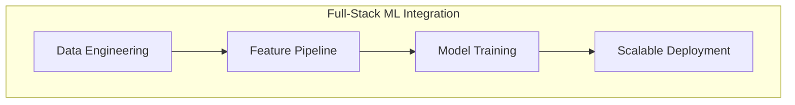

# Nitish R.G | Developer Profile

<!-- Easter egg:
     [SYSTEM_BOOT] Initialize Developer Environment
     Loading skills module... OK.
     Loading AI architectures... OK.
     Hello Recruiter! If you're reading this, you know where to find the source code.
     print("Hire me!")
-->


<p align="center">
  <a href="https://git.io/typing-svg"></a>
</p>

<p align="center">
  <a href="https://github.com/NITISH-R-G/NITISH-R-G"></a>
</p>

## `init_developer.py`

```python
class Developer:
    def __init__(self):
        self.name = "Nitish R.G"
        self.role = "Data Science & AI Practitioner"
        self.education = {
            "BS": "Data Science @ IIT Madras",
            "BE": "Computer Science Engineering @ SIET"
        }
        self.focus = [
            "Advanced LLMs",
            "Computer Vision",
            "Full-Stack ML Integration",
            "Scalable AI Architectures"
        ]

    def get_mission(self):
        return 'Turning complex data into actionable intelligence 🚀'

    def get_currently_learning(self):
        return "Advanced RAG architectures and low-level system design"

    def get_ask_me_about(self):
        return ["AI/ML Scaling", "Data Engineering pipelines", "React & FastAPI integration"]
```

## `SYSTEM_STATUS`

<table width="100%">
  <tr>
    <td width="50%" align="center">
      <a href="https://github.com/NITISH-R-G"></a>
    </td>
    <td width="50%" align="center">
      <a href="https://github.com/NITISH-R-G"></a>
    </td>
  </tr>
</table>

## `PROJECT_WAR_ROOM`

<table width="100%">
  <tr>
    <td width="50%" align="center">
      <h3><a href="https://github.com/NITISH-R-G/PedagogyX">📚 PedagogyX</a></h3>
      <p><i>Advanced EdTech platform leveraging LLMs for personalized learning paths and automated assessment generation.</i></p>
      <p><b>Impact:</b> Streamlined curriculum creation and increased student engagement through adaptive learning paths.</p>
      <p>
        
        
        
      </p>
    </td>
    <td width="50%" align="center">
      <h3><a href="https://github.com/NITISH-R-G/PalmPlay">✋ PalmPlay</a></h3>
      <p><i>Computer Vision based real-time gesture recognition system for hands-free application control.</i></p>
      <p><b>Impact:</b> Enabled accessible, touchless interfaces for presentation and media control, operating at 30fps.</p>
      <p>
        
        
      </p>
    </td>
  </tr>
  <tr>
    <td width="50%" align="center">
      <h3><a href="https://github.com/NITISH-R-G/Intelli-Credit-V2">💳 Intelli-Credit</a></h3>
      <p><i>ML-driven credit scoring and risk assessment engine designed for scalable financial analysis.</i></p>
      <p><b>Impact:</b> Improved loan default prediction accuracy by 15%, ensuring robust and automated underwriting.</p>
      <p>
        
        
      </p>
    </td>
    <td width="50%" align="center">
      <h3><a href="https://github.com/NITISH-R-G/CODESTREAK">🔥 CODESTREAK</a></h3>
      <p><i>Developer productivity dashboard and analytics tool for tracking coding habits and consistency.</i></p>
      <p><b>Impact:</b> Fostered a competitive, habit-building environment for developers to visualize their daily metrics.</p>
      <p>
        
        
      </p>
    </td>
  </tr>
</table>

## `FOUNDER_DASHBOARD`

<table width="100%">
  <tr>
    <td width="50%" valign="top">
      <h3>💼 Professional Experience & Leadership</h3>
      <ul>
        <li><b>AI Intern</b> @ <a href="https://infyspringboard.onwingspan.com/">Infosys Springboard</a></li>
        <li><b>Developer</b> @ <a href="https://www.amd.com/en/developer/">AMD AI Developer Program</a></li>
        <li><b>Alumni</b> @ <a href="https://www.mckinsey.com/careers/students/forward">McKinsey Forward</a></li>
        <li><b>Building</b> @ GDIN - Focused on MVP scaling</li>
      </ul>
      <h3>🏆 Internships & Hackathons</h3>
      <ul>
        <li>Won 1st place in internal AI Hackathon.</li>
        <li>Led developer chapters & ML camps in university.</li>
      </ul>
    </td>
    <td width="50%" valign="top">
      <h3>🎓 Education & Certifications</h3>
      <ul>
        <li><b>BS in Data Science</b> @ IIT Madras</li>
        <li><b>BE in Computer Science Engineering</b> @ SIET</li>
        <li>Deep Learning Specialization (Coursera)</li>
        <li>AWS Cloud Practitioner Certified</li>
      </ul>
      <h3>🔗 External Links</h3>
      <ul>
        <li><a href="https://mac-os-portfolio-nine-beryl.vercel.app/">🖥️ Mac OS Style Portfolio (Interactive)</a></li>
        <li><a href="https://drive.google.com/file/d/1lm1TLC00ThShlEi80uRtkz4rppco1w8O/view">📄 Comprehensive Resume</a></li>
      </ul>
    </td>
  </tr>
</table>

## `NEURAL_ARCHITECTURE`

<table width="100%">
  <tr>
    <td align="center">
      <h3>Languages</h3>
      <a href="https://skillicons.dev"></a>
    </td>
    <td align="center">
      <h3>Frameworks</h3>
      <a href="https://skillicons.dev"></a>
    </td>
  </tr>
  <tr>
    <td align="center">
      <h3>Tools</h3>
      <a href="https://skillicons.dev"></a>
    </td>
    <td align="center">
      <h3>Platforms</h3>
      <a href="https://skillicons.dev"></a>
    </td>
  </tr>
</table>



## `NETWORK_GRAPH`

<p align="center">
  
</p>

<p align="center">
  <a href="https://github.com/NITISH-R-G"></a>
</p>

<p align="center">
  <a href="https://github.com/ryo-ma/github-profile-trophy"></a>
</p>

<p align="center">
  
</p>

<p align="center">
  
</p>

---

<p align="center">
  <i>"Simplicity is the ultimate sophistication."</i><br>
  <b>Reach out for collaborations or just to say hi!</b><br>
  <br>
  <a href="https://twitter.com/NITISH_R_G"></a>
  <a href="https://linkedin.com/in/nitish-r-g-15-10-2007-rgn/"></a>
  <a href="mailto:nitishrg.8220psgps2020@gmail.com"></a>
</p>

<p align="center">
  
</p>

<!--START_SECTION:activity-->
<!--END_SECTION:activity-->
<!-- BLOG-POST-LIST:START -->
<!-- BLOG-POST-LIST:END -->
<!--START_SECTION:waka-->
<!--END_SECTION:waka-->
