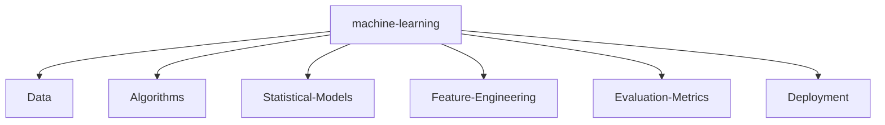

# 🌌 Nitish R.G | AI & Data Engineering Visionary

<div align="center">
  
  <a href="https://github.com/NITISH-R-G/NITISH-R-G/stargazers"></a>
  
</div>

<br/>

<div align="center">
  <a href="https://git.io/typing-svg">
    
  </a>
</div>

---

## ⚡ `SYSTEM_STATUS`

<div align="center">
  <table width="100%" border="0" cellpadding="10" cellspacing="0">
    <tr>
      <td width="50%" valign="top" bgcolor="transparent">
        <h3>🚀 Executive Summary</h3>
        <p>I thrive at the intersection of <strong>Artificial Intelligence, Data Engineering, and Software Development</strong>. My primary goal is to architect scalable, high-impact models that solve real-world problems and contribute meaningfully to the open-source ecosystem.</p>
        <p>Whether it's building robust RAG architectures, training complex computer vision models, or deploying full-stack web applications, I bring data to life.</p>
      </td>
      <td width="50%" valign="top" bgcolor="transparent">
        <h3>🔍 Quick Facts</h3>
        <ul>
          <li>🔭 <b>Currently focusing on:</b> Advanced LLMs & Computer Vision</li>
          <li>🌱 <b>Currently learning:</b> Scalable ML Deployment</li>
          <li>💬 <b>Ask me about:</b> Python, PyTorch, Data Structures</li>
          <li>⚡ <b>Fun fact:</b> I can debug code in my sleep (or so I think).</li>
        </ul>
      </td>
    </tr>
  </table>
</div>

---

## 💻 `init_developer.py`

```python
class Developer:
    def __init__(self):
        self.name = "Nitish R.G"
        self.role = "Data Science & AI Practitioner"
        self.education = {
            "BS": "IIT Madras",
            "BE": "SIET"
        }
        self.focus = [
            'Advanced LLMs',
            'Computer Vision',
            'Full-Stack ML Integration',
            'Scalable AI Architectures'
        ]

    def get_mission(self):
        return 'Turning complex data into actionable intelligence 🚀'

if __name__ == '__main__':
    me = Developer()
    print(me.get_mission())
```

---

## 🛠️ `NEURAL_ARCHITECTURE` (Tech Stack)

<div align="center">
  <p>
    <a href="https://skillicons.dev">
      
    </a>
  </p>
</div>

<br/>



---

## ⚔️ `PROJECT_WAR_ROOM`

<div align="center">
  <table width="100%" border="0" cellpadding="15">
    <tr>
      <td width="50%" align="center" bgcolor="transparent">
        <h3><a href="https://github.com/NITISH-R-G/PedagogyX" style="color:#00c3ff;">📚 PedagogyX</a></h3>
        <p><i>Advanced EdTech platform leveraging LLMs for personalized learning paths and automated assessment generation.</i></p>
        <p><b>Impact:</b> Revolutionizing personalized learning.</p>
        
      </td>
      <td width="50%" align="center" bgcolor="transparent">
        <h3><a href="https://github.com/NITISH-R-G/PalmPlay" style="color:#00c3ff;">✋ PalmPlay</a></h3>
        <p><i>Computer Vision based real-time gesture recognition system for hands-free application control.</i></p>
        <p><b>Impact:</b> Enabling touchless interfaces.</p>
        
      </td>
    </tr>
    <tr>
      <td width="50%" align="center" bgcolor="transparent">
        <h3><a href="https://github.com/NITISH-R-G/Intelli-Credit-V2" style="color:#00c3ff;">💳 Intelli-Credit-V2</a></h3>
        <p><i>ML-driven credit scoring and risk assessment engine designed for scalable financial analysis.</i></p>
        <p><b>Impact:</b> Scalable financial risk analysis.</p>
        
      </td>
      <td width="50%" align="center" bgcolor="transparent">
        <h3><a href="https://github.com/NITISH-R-G/CODESTREAK" style="color:#00c3ff;">🔥 CODESTREAK</a></h3>
        <p><i>Developer productivity dashboard and analytics tool for tracking coding habits and consistency.</i></p>
        <p><b>Impact:</b> Enhancing developer productivity tracking.</p>
        
      </td>
    </tr>
  </table>
</div>

<div align="center">
  <table width="100%" border="0" cellpadding="15">
    <tr>
      <td width="50%" align="center" bgcolor="transparent">
        <h3><a href="https://mac-os-portfolio-nine-beryl.vercel.app/" style="color:#00c3ff;">🖥️ Interactive Portfolio</a></h3>
        <p><i>Experience my work through a stunning Mac OS-themed web portfolio.</i></p>
        <a href="https://mac-os-portfolio-nine-beryl.vercel.app/">
            
        </a>
      </td>
      <td width="50%" align="center" bgcolor="transparent">
        <h3><a href="https://drive.google.com/file/d/1lm1TLC00ThShlEi80uRtkz4rppco1w8O/view?usp=sharing" style="color:#00c3ff;">📄 Comprehensive Resume</a></h3>
        <p><i>Dive deep into my technical background and professional experience.</i></p>
        <a href="https://drive.google.com/file/d/1lm1TLC00ThShlEi80uRtkz4rppco1w8O/view?usp=sharing">
            
        </a>
      </td>
    </tr>
  </table>
</div>

---

## 📈 `FOUNDER_DASHBOARD` (Experience & Achievements)

<div align="center">
  <table width="100%" border="0" cellpadding="10" cellspacing="0">
    <tr>
      <td width="50%" valign="top" bgcolor="transparent">
        <h3>🌟 Building @ GDIN</h3>
        <p>Driving innovation and building scalable systems. Focused on rapid prototyping, MVP development, and scaling AI architectures.</p>
        <h3>🏆 Achievements</h3>
        <ul>
          <li><b>Leadership:</b> Open-source contributor & tech leader</li>
          <li><b>Hackathons:</b> Participated in AI/ML hackathons</li>
          <li><b>Certifications:</b> Data Science & Machine Learning</li>
        </ul>
      </td>
      <td width="50%" valign="top" bgcolor="transparent">
        <h3>🏢 Experience & Education</h3>
        <ul>
          <li><b>AI Intern</b> @ <a href="https://infyspringboard.onwingspan.com/web/en/login">Infosys Springboard</a></li>
          <li><b>Developer</b> @ <a href="https://www.amd.com/en/developer/resources/ai-developer-program.html">AMD AI Developer Program</a></li>
          <li><b>Alumni</b> @ <a href="https://www.mckinsey.com/careers/students/forward">McKinsey Forward</a></li>
          <li><b>BS in Data Science</b> @ IIT Madras</li>
          <li><b>BE in Computer Science Engineering</b> @ SIET</li>
        </ul>
      </td>
    </tr>
  </table>
</div>

---

## 📊 `NETWORK_GRAPH` (Metrics & Activity)

<div align="center">
  
  
</div>
<br/>
<div align="center">
  
</div>
<br/>
<div align="center">
  <a href="https://github.com/ryo-ma/github-profile-trophy">
    
  </a>
</div>

### 📉 3D Contribution Graph

<div align="center">
  
</div>

<br/>

<!--START_SECTION:waka-->
<!--END_SECTION:waka-->

<br/>

<!-- BLOG-POST-LIST:START -->
<!-- BLOG-POST-LIST:END -->

<br/>

<!--START_SECTION:activity-->
<!--END_SECTION:activity-->

---

## 🌐 `CONNECT()`

<div align="center">
  <a href="https://twitter.com/NITISH_R_G" target="blank"></a>
  &nbsp;&nbsp;
  <a href="https://linkedin.com/in/nitish-r-g-15-10-2007-rgn/" target="blank"></a>
  &nbsp;&nbsp;
  <a href="mailto:nitishrg.8220psgps2020@gmail.com" target="blank"></a>
</div>

<br/>

<div align="center">
  
</div>

<br/>

<!-- India Map -->
```geojson
{
 "type": "FeatureCollection",
 "features": [
   {
     "type": "Feature",
     "id": 1,
     "properties": {
       "ID": 0
     },
     "geometry": {
       "type": "Polygon",
       "coordinates": [
         [
             [68.1, 7.9],
             [97.4, 35.5]
         ]
       ]
     }
   }
 ]
}
```

<!-- Hidden recruiter message -->
<!-- Hey there, Recruiter! If you're reading this HTML comment, you probably have a keen eye for detail. Let's chat! Email me at nitishrg.8220psgps2020@gmail.com -->
