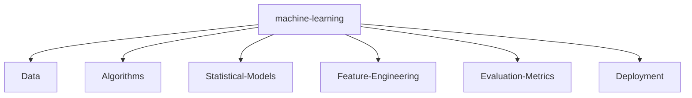

# 🚀 Nitish R.G | Architecting the Future with AI

<!-- my-header-img -->
<div align="center">
    
    
    
</div>

<br/>

<div align="center">
    [](https://git.io/typing-svg)
</div>

<br/>

<div align="center">
<p align="center">
<a href="https://twitter.com/NITISH_R_G" target="blank"></a>
<a href="https://linkedin.com/in/nitish-r-g-15-10-2007-rgn/" target="blank"></a>
<a href="mailto:nitishrg.8220psgps2020@gmail.com" target="blank"></a>
<a href="https://mac-os-portfolio-nine-beryl.vercel.app/"></a>
<a href="https://drive.google.com/file/d/1lm1TLC00ThShlEi80uRtkz4rppco1w8O/view?usp=sharing"></a>
</p>
</div>

---

## ⚡ `SYSTEM_STATUS`

I thrive at the intersection of **Artificial Intelligence, Data Engineering, and Software Development**. My mission is to architect scalable, high-impact models that solve real-world problems and contribute meaningfully to the open-source ecosystem.

```python
class Developer:
    def __init__(self):
        self.name = "Nitish R.G"
        self.role = "Data Science and AI Practitioner"
        self.education = {
            "BS": "IIT Madras (Data Science)",
            "BE": "SIET (Computer Science Engineering)"
        }
        self.focus = [
            'Advanced LLMs',
            'Computer Vision',
            'Full-Stack ML Integration',
            'Scalable AI Architectures'
        ]

    def get_mission(self):
        return 'Turning complex data into actionable intelligence 🚀'

dev = Developer()
```

---

## ⚔️ `PROJECT_WAR_ROOM`

<div align="center">
  <table width="100%" border="0" cellpadding="15">
    <tr>
      <td width="50%" align="center" bgcolor="#0d1117">
        <h3><a href="https://github.com/NITISH-R-G/PedagogyX" style="color:#00c3ff;">📚 PedagogyX</a></h3>
        <p><i>Advanced EdTech platform leveraging LLMs for personalized learning paths and automated assessment generation.</i></p>
        <p><b>Impact:</b> Revolutionizing personalized education.</p>
        <p></p>
      </td>
      <td width="50%" align="center" bgcolor="#0d1117">
        <h3><a href="https://github.com/NITISH-R-G/PalmPlay" style="color:#00c3ff;">✋ PalmPlay</a></h3>
        <p><i>Computer Vision based real-time gesture recognition system for hands-free application control.</i></p>
        <p><b>Impact:</b> Enhancing accessibility and UI interaction.</p>
        <p></p>
      </td>
    </tr>
    <tr>
      <td width="50%" align="center" bgcolor="#0d1117">
        <h3><a href="https://github.com/NITISH-R-G/Intelli-Credit-V2" style="color:#00c3ff;">💳 Intelli-Credit</a></h3>
        <p><i>ML-driven credit scoring and risk assessment engine designed for scalable financial analysis.</i></p>
        <p><b>Impact:</b> Optimizing financial risk management.</p>
        <p></p>
      </td>
      <td width="50%" align="center" bgcolor="#0d1117">
        <h3><a href="https://github.com/NITISH-R-G/CODESTREAK" style="color:#00c3ff;">🔥 CODESTREAK</a></h3>
        <p><i>Developer productivity dashboard and analytics tool for tracking coding habits and consistency.</i></p>
        <p><b>Impact:</b> Boosting developer productivity.</p>
        <p></p>
      </td>
    </tr>
  </table>
</div>

---

## 📈 `FOUNDER_DASHBOARD`

<div align="center">
  <table width="100%" border="0" cellpadding="10" cellspacing="0">
    <tr>
      <td width="50%" valign="top" bgcolor="#0d1117">
        <h3>🌟 Experience</h3>
        <ul>
          <li><b>AI Intern</b> @ <a href="https://infyspringboard.onwingspan.com/web/en/login">Infosys Springboard</a></li>
          <li><b>Developer</b> @ <a href="https://www.amd.com/en/developer/resources/ai-developer-program.html">AMD AI Developer Program</a></li>
          <li><b>Alumni</b> @ <a href="https://www.mckinsey.com/careers/students/forward">McKinsey Forward</a></li>
        </ul>
        <h3>🤝 Open to Collaboration</h3>
        <p>Looking to connect with YC founders, open-source maintainers, and AI innovators.</p>
      </td>
      <td width="50%" valign="top" bgcolor="#0d1117">
        <h3>🏆 Achievements</h3>
        <ul>
          <li><b>Certifications:</b> Various certifications in AI, ML, and Data Science.</li>
          <li><b>Hackathons:</b> Active participant in national and global tech hackathons.</li>
          <li><b>Internships:</b> Hands-on industry experience building scalable AI systems.</li>
          <li><b>Leadership:</b> Mentoring peers and contributing to developer communities.</li>
        </ul>
      </td>
    </tr>
  </table>
</div>

---

## 🧠 `NEURAL_ARCHITECTURE` (Skills)

<div align="center">
  <a href="https://skillicons.dev">
    
  </a>
</div>

<br/>



---

## 🌐 `NETWORK_GRAPH` (Metrics)

| .                                                                                                                                                      | .                                                                                                                                        |
|--------------------------------------------------------------------------------------------------------------------------------------------------------|------------------------------------------------------------------------------------------------------------------------------------------|
|  |  |

<div align="center">
    
</div>

<br/>

<div align="center">
    <a href="https://github.com/ryo-ma/github-profile-trophy"></a>
</div>

### 🟢 3D Contribution Graph

<div align="center">
    <!-- profile-green-animate -->
    
</div>

<!--START_SECTION:waka-->
<!--END_SECTION:waka-->

<!-- BLOG-POST-LIST:START -->
<!-- BLOG-POST-LIST:END -->

<!--START_SECTION:activity-->
<!--END_SECTION:activity-->

---

## 🎯 The Human Element

**Currently Learning:** Rust 🦀 and advanced distributed systems.
**Ask me about:** Why `vim` is better than your favorite IDE. (Just kidding... mostly)
**Joke of the day:** Why do programmers prefer dark mode? Because light attracts bugs! 🐞

<!--
Hey recruiter! If you're reading this HTML comment, you get bonus points.
I'm always looking for exciting opportunities. Drop me a line!
-->

<div align="center">
    <h3>Thanks for visiting! ❤️</h3>
    
</div>
