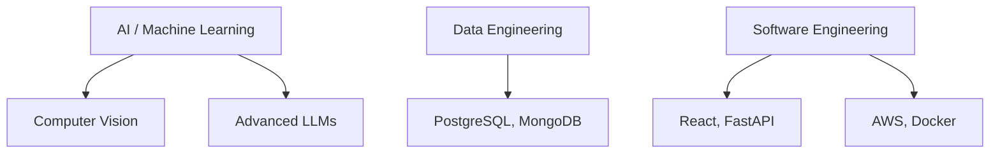

# ⚡ SYSTEM_BOOT: NITISH_OS // TERMINAL_ACTIVE

<div align="center">
  <a href="https://github.com/NITISH-R-G/NITISH-R-G"></a>
  <a href="https://github.com/python/cpython"></a>
  <a href="https://github.com/NITISH-R-G/NITISH-R-G/graphs/contributors"></a>
  <a href="https://github.com/NITISH-R-G/NITISH-R-G/stargazers"></a>
  
</div>

<div align="center">
  <a href="https://git.io/typing-svg">
    +Hello,+World!;>+I+am+Nitish+R.G;>+Data+Science+%26+AI+Practitioner;>+Building+Scalable+AI+Architectures" alt="Typing SVG" />
  </a>
</div>

## 👨‍💻 `init_developer.py`

```python
class Developer:
    def __init__(self):
        self.name = "Nitish R.G"
        self.role = "Data Science & AI Practitioner | Dual-Degree Engineer"
        self.education = {
            "BS Data Science": "IIT Madras",
            "BE CSE": "SIET"
        }
        self.focus = [
            'Advanced LLMs',
            'Computer Vision',
            'Full-Stack ML Integration',
            'Scalable AI Architectures'
        ]

    def get_mission(self):
        return 'Turning complex data into actionable intelligence 🚀'
```

## 🧠 `NEURAL_ARCHITECTURE` (Tech Stack)



<div align="center">
  <table>
    <tr>
      <td align="center"><b>Languages</b></td>
      <td align="center"></td>
    </tr>
    <tr>
      <td align="center"><b>AI/ML Frameworks</b></td>
      <td align="center"></td>
    </tr>
    <tr>
      <td align="center"><b>Web Frameworks</b></td>
      <td align="center"></td>
    </tr>
    <tr>
      <td align="center"><b>Tools & Platforms</b></td>
      <td align="center"></td>
    </tr>
    <tr>
      <td align="center"><b>Databases</b></td>
      <td align="center"></td>
    </tr>
  </table>
</div>

## ⚔️ `PROJECT_WAR_ROOM`

<div align="center">
  <table width="100%">
    <tr>
      <td width="50%" align="center">
        <h3><a href="https://github.com/NITISH-R-G/PedagogyX">📚 PedagogyX</a></h3>
        <p><i>Advanced EdTech platform leveraging LLMs for personalized learning paths and automated assessment generation.</i></p>
        <p><b>Impact:</b> Revolutionizing automated assessments.</p>
        <p></p>
      </td>
      <td width="50%" align="center">
        <h3><a href="https://github.com/NITISH-R-G/PalmPlay">✋ PalmPlay</a></h3>
        <p><i>Computer Vision based real-time gesture recognition system for hands-free application control.</i></p>
        <p><b>Impact:</b> Enhancing touchless human-computer interaction.</p>
        <p></p>
      </td>
    </tr>
    <tr>
      <td width="50%" align="center">
        <h3><a href="https://github.com/NITISH-R-G/Intelli-Credit-V2">💳 Intelli-Credit-V2</a></h3>
        <p><i>ML-driven credit scoring and risk assessment engine designed for scalable financial analysis.</i></p>
        <p><b>Impact:</b> Providing scalable risk assessment models.</p>
        <p></p>
      </td>
      <td width="50%" align="center">
        <h3><a href="https://github.com/NITISH-R-G/CODESTREAK">🔥 CODESTREAK</a></h3>
        <p><i>Developer productivity dashboard and analytics tool for tracking coding habits and consistency.</i></p>
        <p><b>Impact:</b> Boosting developer consistency and productivity.</p>
        <p></p>
      </td>
    </tr>
  </table>
</div>

<div align="center">
  <table width="100%">
    <tr>
      <td width="50%" align="center">
        <h3><a href="https://mac-os-portfolio-nine-beryl.vercel.app/">🖥️ Interactive Portfolio</a></h3>
        <p><i>Experience my work through a visually stunning Mac OS-themed web portfolio.</i></p>
      </td>
      <td width="50%" align="center">
        <h3><a href="https://drive.google.com/file/d/1lm1TLC00ThShlEi80uRtkz4rppco1w8O/view?usp=sharing">📄 Comprehensive Resume</a></h3>
        <p><i>Dive deep into my technical background, academic achievements, and professional experience.</i></p>
      </td>
    </tr>
  </table>
</div>

## 📈 `FOUNDER_DASHBOARD` & Experience

<div align="center">
  <table width="100%">
    <tr>
      <td width="50%" valign="top">
        <h3>Internships</h3>
        <ul>
          <li><b>AI Intern</b> @ <a href="https://infyspringboard.onwingspan.com/web/en/login">Infosys Springboard</a></li>
        </ul>
        <h3>Leadership</h3>
        <ul>
          <li><b>Developer</b> @ <a href="https://www.amd.com/en/developer/resources/ai-developer-program.html">AMD AI Developer Program</a></li>
          <li><b>Alumni</b> @ <a href="https://www.mckinsey.com/careers/students/forward">McKinsey Forward</a></li>
        </ul>
      </td>
      <td width="50%" valign="top">
        <h3>Certifications & Hackathons</h3>
        <ul>
          <li><b>Certifications:</b> McKinsey Forward Certification, AI Fundamentals via Infosys Springboard.</li>
          <li><b>Hackathons:</b> Regular participant in competitive ML problem-solving, building AI solutions for real-world impact.</li>
        </ul>
        <br>
        <h3>🎓 Education</h3>
        <ul>
          <li><b>BS in Data Science</b> @ IIT Madras</li>
          <li><b>BE in Computer Science Engineering</b> @ SIET</li>
        </ul>
      </td>
    </tr>
  </table>
</div>

## 💬 Let's Talk! (Ask me about)

* 🤖 **Currently learning:** Advanced RAG architectures, multi-agent LLM frameworks.
* 💡 **Ask me about:** Data Engineering, Computer Vision, and how to build scalable AI.
* ⚡ **Developer Joke:** Why do programmers prefer dark mode? Because light attracts bugs!

## 📊 `SYSTEM_TELEMETRY` (GitHub Stats)

<div align="center">
  
</div>

<div align="center">
  <table>
    <tr>
      <td>
        
      </td>
      <td>
        
      </td>
    </tr>
  </table>
</div>

<div align="center">
  
</div>

<div align="center">
  
</div>

<br>

<div align="center">
  <a href="https://github.com/ryo-ma/github-profile-trophy">
    
  </a>
</div>

## 📡 Action Center & Recent Activity

<div align="center">
  <p><b>Recent Activity</b></p>
  <!--START_SECTION:activity-->
  <!--END_SECTION:activity-->
</div>

<div align="center">
  <p><b>Latest Blog Posts</b></p>
  <!-- BLOG-POST-LIST:START -->
  <!-- BLOG-POST-LIST:END -->
</div>

<div align="center">
  <p><b>WakaTime Code Stats</b></p>
  <!--START_SECTION:waka-->
  <!--END_SECTION:waka-->
</div>

## 📫 Contact Network

<div align="center">
  <a href="https://twitter.com/NITISH_R_G"></a>
  <a href="https://linkedin.com/in/nitish-r-g-15-10-2007-rgn/"></a>
  <a href="mailto:nitishrg.8220psgps2020@gmail.com"></a>
</div>

<div align="center">
  <br>
  <p>Thanks for visiting! ❤️</p>
  
</div>

<!-- Easter Egg: HR Recruiter Secret Check! You found the hidden comment in the code! I'm always open to interesting AI opportunities. -->
