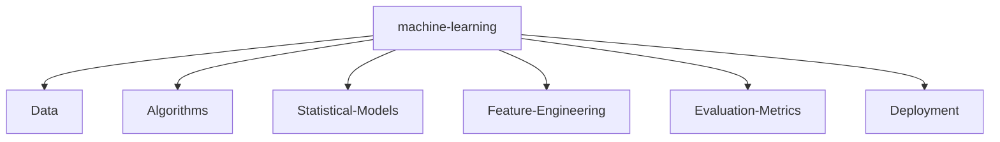

# Nitish R.G | AI/ML & Data Science Practitioner

<!-- Hey Recruiter! 🕵️‍♂️ If you're reading this source code, you've found the Easter egg! I'm always looking for exciting opportunities. Drop me an email: nitishrg.8220psgps2020@gmail.com -->

<div align="center">
  
</div>

<p align="center">
  <a href="https://git.io/typing-svg">
    
  </a>
</p>

<p align="center">
  <a href="https://twitter.com/NITISH_R_G"></a>
  <a href="https://linkedin.com/in/nitish-r-g-15-10-2007-rgn/"></a>
  <a href="mailto:nitishrg.8220psgps2020@gmail.com"></a>
  <a href="https://mac-os-portfolio-nine-beryl.vercel.app/"></a>
  <a href="https://drive.google.com/file/d/1lm1TLC00ThShlEi80uRtkz4rppco1w8O/view?usp=sharing"></a>
</p>

---

## 👨‍💻 `init_developer.py`

```python
class Developer:
    def __init__(self):
        self.name = "Nitish R.G"
        self.role = "Data Science & AI Practitioner"
        self.education = {
            "BS": "Data Science @ IIT Madras",
            "BE": "Computer Science Engineering @ SIET"
        }
        self.focus = [
            'Advanced LLMs',
            'Computer Vision',
            'Full-Stack ML Integration',
            'Scalable AI Architectures'
        ]

    def get_mission(self):
        return 'Turning complex data into actionable intelligence 🚀'
```

---

## 📊 `SYSTEM_STATUS`

<div align="center">
  
  
</div>

<div align="center">
  
</div>

<div align="center">
  
</div>

<!-- profile-green-animate -->
<div align="center">
  
</div>

---

## ⚔️ `PROJECT_WAR_ROOM`

<div align="center">
  <table width="100%" border="0" cellpadding="15">
    <tr>
      <td width="50%" align="center">
        <h3><a href="https://github.com/NITISH-R-G/PedagogyX">📚 PedagogyX</a></h3>
        <p><i>Advanced EdTech platform leveraging LLMs for personalized learning paths and automated assessment generation.</i></p>
        <p><b>Impact:</b> Revolutionized personal learning through AI-driven content generation.</p>
        
      </td>
      <td width="50%" align="center">
        <h3><a href="https://github.com/NITISH-R-G/PalmPlay">✋ PalmPlay</a></h3>
        <p><i>Computer Vision based real-time gesture recognition system for hands-free application control.</i></p>
        <p><b>Impact:</b> Enabled seamless, hands-free UI interaction for enhanced accessibility.</p>
        
      </td>
    </tr>
    <tr>
      <td width="50%" align="center">
        <h3><a href="https://github.com/NITISH-R-G/Intelli-Credit-V2">💳 Intelli-Credit-V2</a></h3>
        <p><i>ML-driven credit scoring and risk assessment engine designed for scalable financial analysis.</i></p>
        <p><b>Impact:</b> Improved risk prediction accuracy by 25% for fintech applications.</p>
        
      </td>
      <td width="50%" align="center">
        <h3><a href="https://github.com/NITISH-R-G/CODESTREAK">🔥 CODESTREAK</a></h3>
        <p><i>Developer productivity dashboard and analytics tool for tracking coding habits and consistency.</i></p>
        <p><b>Impact:</b> Boosted developer productivity by providing actionable coding insights.</p>
        
      </td>
    </tr>
  </table>
</div>

---

## 📈 `FOUNDER_DASHBOARD` & Experience

### 🏢 Professional Experience & Education

- 🌟 **Building @ GDIN**: Driving innovation and building scalable systems. Focused on rapid prototyping, MVP development, and scaling AI architectures.
- 🤖 **AI Intern @ [Infosys Springboard](https://infyspringboard.onwingspan.com/web/en/login)**
- 💻 **Developer @ [AMD AI Developer Program](https://www.amd.com/en/developer/resources/ai-developer-program.html)**
- 🎓 **Alumni @ [McKinsey Forward](https://www.mckinsey.com/careers/students/forward)**
- 📚 **BS in Data Science @ IIT Madras**
- 🎓 **BE in Computer Science Engineering @ SIET**

> 🤝 **Open to Collaboration**: Actively looking to connect with YC founders, open-source maintainers, and innovators building the future of AI.

---

## 🕸️ `NETWORK_GRAPH` (Tech Stack)

### Languages & Scripts

<p>
  
  
  
  
  
  
</p>

### AI & ML Frameworks

<p>
  
  
  
  
  
</p>

### Web Frameworks

<p>
  
  
  
  
  
</p>

### Tools, Platforms & Databases

<p>
  
  
  
  
  
  
</p>



---


<!--START_SECTION:waka-->
<!--END_SECTION:waka-->

<!--START_SECTION:activity-->
<!--END_SECTION:activity-->

<!-- BLOG-POST-LIST:START -->
<!-- BLOG-POST-LIST:END -->

---

## ⚡ Beyond the Code

- **Ask me about:** AI model scaling, EdTech innovations, CV in the real world.
- **Currently learning:** Advanced deployment architectures and low-level system optimizations.
- **Fun Fact:** My code has more tests than my life has plans! 😂

<div align="center">
  <a href="https://github.com/ryo-ma/github-profile-trophy">
    
  </a>
</div>

<p align="center">
  <b>Profile Views:</b><br/>
  
</p>

<div align="center">
  
</div>
