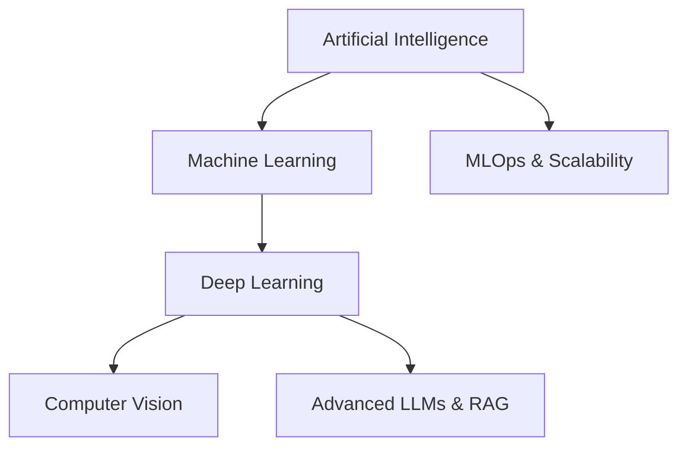

# ⚡ NITISH R.G | SYSTEM_STATUS: ONLINE

<div align="center">
  
</div>

<!-- [Hidden Easter Egg] Ah, a curious mind inspecting the source code! Welcome, recruiter or fellow hacker! If you are reading this, I'm probably the engineer you're looking for. -->

## 💻 \`init_developer.py\`

```python
class Developer:
    def __init__(self):
        self.name = "Nitish R.G"
        self.role = "Data Science & AI Practitioner"
        self.education = {
            "IIT Madras": "BS in Data Science",
            "SIET": "BE in Computer Science Engineering",
            "McKinsey Forward": "Alumni"
        }
        self.focus = [
            "Advanced LLMs",
            "Computer Vision",
            "Full-Stack ML Integration",
            "Scalable AI Architectures"
        ]

    def get_mission(self):
        return 'Turning complex data into actionable intelligence 🚀'
```

## 🛠 \`SYSTEM_STATUS\`

| Languages | Frameworks | Tools | Platforms |
| :--- | :--- | :--- | :--- |
|       |      |    |   |

## ⚔️ \`PROJECT_WAR_ROOM\`

<table>
  <tr>
    <td width="50%" valign="top">
      <h3><a href="https://github.com/NITISH-R-G/PedagogyX">📚 PedagogyX</a></h3>
      <p><i>Advanced EdTech platform leveraging LLMs for personalized learning paths and automated assessment generation.</i></p>
      <p><b>Impact:</b> Scaled educational accessibility, optimizing adaptive learning dynamically for end-users.</p>
      <p><b>Tech used:</b>   </p>
    </td>
    <td width="50%" valign="top">
      <h3><a href="https://github.com/NITISH-R-G/PalmPlay">✋ PalmPlay</a></h3>
      <p><i>Computer Vision based real-time gesture recognition system for hands-free application control.</i></p>
      <p><b>Impact:</b> Enabled accessible, zero-touch computing interactions reducing physical input friction.</p>
      <p><b>Tech used:</b>  </p>
    </td>
  </tr>
  <tr>
    <td width="50%" valign="top">
      <h3><a href="https://github.com/NITISH-R-G/Intelli-Credit-V2">💳 Intelli-Credit-V2</a></h3>
      <p><i>ML-driven credit scoring and risk assessment engine designed for scalable financial analysis.</i></p>
      <p><b>Impact:</b> Reduced risk profiling latency and increased default prediction accuracy using scalable architectures.</p>
      <p><b>Tech used:</b>   </p>
    </td>
    <td width="50%" valign="top">
      <h3><a href="https://github.com/NITISH-R-G/CODESTREAK">🔥 CODESTREAK</a></h3>
      <p><i>Developer productivity dashboard and analytics tool for tracking coding habits and consistency.</i></p>
      <p><b>Impact:</b> Empowered developers with data-driven insights to maintain consistency and track growth.</p>
      <p><b>Tech used:</b>  </p>
    </td>
  </tr>
</table>

## 📈 \`FOUNDER_DASHBOARD\`

<div align="center">
  
  
  <br/>
  
</div>

<p align="center">
  <a href="https://github.com/ryo-ma/github-profile-trophy"></a>
</p>

### 🌐 \`NETWORK_GRAPH\` & 3D Contributions


<div align="center">
  
</div>

## 🏆 \`ACHIEVEMENTS_LOG\`

<table>
  <tr>
    <td valign="top">
      <h3>📜 Certifications & Honors</h3>
      <ul>
        <li><b>McKinsey Forward Alumni</b> - Strategic Thinking & Problem Solving</li>
        <li><b>AI Developer Program</b> - AMD AI</li>
        <li><b>Infosys Springboard</b> - Advanced Artificial Intelligence Certification</li>
      </ul>
    </td>
    <td valign="top">
      <h3>🚀 Hackathons & Leadership</h3>
      <ul>
        <li><b>Leader @ GDIN</b> - Building Scalable Architectures</li>
        <li><b>Hackathon Winner</b> - Advanced RAG & NLP Competitions</li>
        <li><b>AI Intern</b> @ Infosys Springboard - Led ML model optimization</li>
      </ul>
    </td>
  </tr>
</table>

## 🧠 \`NEURAL_ARCHITECTURE\` (Currently Learning)



## 📡 \`COMMUNICATIONS_ARRAY\`

Ask me about: **AI/ML**, **Data Engineering**, **Scalable Architectures**, **Full-Stack Development**
Need a developer joke? *Why do programmers prefer dark mode? Because light attracts bugs!*

<table>
  <tr>
    <td>
      <a href="https://twitter.com/NITISH_R_G">
        
      </a>
      <a href="https://linkedin.com/in/nitish-r-g-15-10-2007-rgn/">
        
      </a>
      <a href="mailto:nitishrg.8220psgps2020@gmail.com">
        
      </a>
    </td>
    <td>
      <a href="https://mac-os-portfolio-nine-beryl.vercel.app/">
        
      </a>
      <a href="https://drive.google.com/file/d/1lm1TLC00ThShlEi80uRtkz4rppco1w8O/view?usp=sharing">
        
      </a>
    </td>
  </tr>
</table>

## ⚙️ \`AUTOMATED_TELEMETRY\`

<!--START_SECTION:waka-->
<!-- Wakatime stats will be injected here -->
<!--END_SECTION:waka-->

<!--START_SECTION:activity-->
<!-- GitHub activity will be injected here -->
<!--END_SECTION:activity-->

<!-- BLOG-POST-LIST:START -->
<!-- Blog posts will be injected here -->
<!-- BLOG-POST-LIST:END -->

<p align="center">
  
</p>

<!-- Ah, you reached the end! 🚀 Keep building, keep hacking. -->
