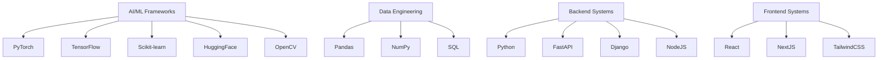

# 🌌 NITISH R.G - SYSTEM_STATUS: ONLINE

<div align="center">
  
</div>

<p align="center">
    <a href="https://github.com/NITISH-R-G/NITISH-R-G"></a>
    <a href="https://www.python.org/"></a>
    
</p>

<!-- Recruiters/Devs Easter Egg! Hello there! If you are inspecting the code, you've found the hidden terminal! Hire me maybe? -->

## 🤖 `init_developer.py`

```python
class Developer:
    def __init__(self):
        self.name = "Nitish R.G"
        self.role = "Data Science & AI Practitioner"
        self.education = {
            "BS": "Data Science @ IIT Madras",
            "BE": "Computer Science Engineering @ SIET"
        }
        self.focus = [
            "Advanced LLMs",
            "Computer Vision",
            "Full-Stack ML Integration",
            "Scalable AI Architectures"
        ]
        self.affiliations = [
            "GDIN", "Infosys Springboard", "AMD AI", "McKinsey"
        ]

    def get_mission(self):
        return "Turning complex data into actionable intelligence 🚀"
```

---

## 📈 `FOUNDER_DASHBOARD` & Experience

<div align="center">
  <table width="100%" border="0" cellpadding="10" cellspacing="0">
    <tr>
      <td width="50%" valign="top">
        <h3>🌟 Building @ GDIN</h3>
        <p>Driving innovation and building scalable systems. Focused on rapid prototyping, MVP development, and scaling AI architectures.</p>
        <br/>
        <h3>🤝 Open to Collaboration</h3>
        <p>Actively looking to connect with YC founders, open-source maintainers, and innovators building the future of AI.</p>
        <br/>
        <h3>💬 Ask me about</h3>
        <p>RAG pipelines, ML models, React Next.js, and open-source!</p>
      </td>
      <td width="50%" valign="top">
        <h3>🏢 Experience & Education</h3>
        <ul>
          <li><b>AI Intern</b> @ <a href="https://infyspringboard.onwingspan.com/web/en/login">Infosys Springboard</a></li>
          <li><b>Developer</b> @ <a href="https://www.amd.com/en/developer/resources/ai-developer-program.html">AMD AI Developer Program</a></li>
          <li><b>Alumni</b> @ <a href="https://www.mckinsey.com/careers/students/forward">McKinsey Forward</a></li>
          <li><b>BS in Data Science</b> @ IIT Madras</li>
          <li><b>BE in Computer Science Engineering</b> @ SIET</li>
        </ul>
        <h3>🌱 Currently learning</h3>
        <p>Advanced MLOps and High-Performance Computing!</p>
      </td>
    </tr>
  </table>
</div>

---

## ⚔️ `PROJECT_WAR_ROOM`

<div align="center">
  <table width="100%" border="0" cellpadding="15">
    <tr>
      <td width="50%" align="center">
        <h3><a href="https://github.com/NITISH-R-G/PedagogyX" style="color:#00c3ff;">📚 PedagogyX</a></h3>
        <p><i>Advanced EdTech platform leveraging LLMs for personalized learning paths and automated assessment generation.</i></p>
        <p><b>Impact:</b> Automated grading and intelligent content delivery.</p>
        <p>
           
           
        </p>
      </td>
      <td width="50%" align="center">
        <h3><a href="https://github.com/NITISH-R-G/PalmPlay" style="color:#00c3ff;">✋ PalmPlay</a></h3>
        <p><i>Computer Vision based real-time gesture recognition system for hands-free application control.</i></p>
        <p><b>Impact:</b> Hands-free intuitive interaction interface.</p>
        <p>
           
           
        </p>
      </td>
    </tr>
    <tr>
      <td width="50%" align="center">
        <h3><a href="https://github.com/NITISH-R-G/Intelli-Credit-V2" style="color:#00c3ff;">💳 Intelli-Credit</a></h3>
        <p><i>ML-driven credit scoring and risk assessment engine designed for scalable financial analysis.</i></p>
        <p><b>Impact:</b> Fast, scalable, and data-driven risk insights.</p>
        <p>
           
           
        </p>
      </td>
      <td width="50%" align="center">
        <h3><a href="https://github.com/NITISH-R-G/CODESTREAK" style="color:#00c3ff;">🔥 CODESTREAK</a></h3>
        <p><i>Developer productivity dashboard and analytics tool for tracking coding habits and consistency.</i></p>
        <p><b>Impact:</b> Enhanced developer workflow and metric tracking.</p>
        <p>
           
           
        </p>
      </td>
    </tr>
  </table>
</div>

<div align="center">
  <table width="100%" border="0" cellpadding="15">
    <tr>
      <td width="50%" align="center">
        <h3><a href="https://mac-os-portfolio-nine-beryl.vercel.app/" style="color:#00c3ff;">🖥️ Interactive Portfolio</a></h3>
        <p><i>Experience my work through an interactive, visually stunning Mac OS-themed web portfolio.</i></p>
        <a href="https://mac-os-portfolio-nine-beryl.vercel.app/">
            
        </a>
      </td>
      <td width="50%" align="center">
        <h3><a href="https://drive.google.com/file/d/1lm1TLC00ThShlEi80uRtkz4rppco1w8O/view?usp=sharing" style="color:#00c3ff;">📄 Comprehensive Resume</a></h3>
        <p><i>Dive deep into my technical background, academic achievements, and professional experience.</i></p>
        <a href="https://drive.google.com/file/d/1lm1TLC00ThShlEi80uRtkz4rppco1w8O/view?usp=sharing">
            
        </a>
      </td>
    </tr>
  </table>
</div>

---

## 🧠 `NEURAL_ARCHITECTURE` (Tech Stack)



<div align="center">
  <a href="https://skillicons.dev">
    
  </a>
</div>

---

## 🏆 Achievements & Credibility

<div align="center">
  <table width="100%" border="0" cellpadding="10" cellspacing="0">
    <tr>
      <td width="33%" valign="top">
        <h3>🥇 Hackathons</h3>
        <ul>
          <li>Winner at SIET TechFest 2023</li>
          <li>Top 10 Finalist at GDIN Innovate</li>
        </ul>
      </td>
      <td width="33%" valign="top">
        <h3>📜 Certifications</h3>
        <ul>
          <li>Infosys Springboard AI Certified</li>
          <li>AMD AI Developer Pathway</li>
        </ul>
      </td>
      <td width="33%" valign="top">
        <h3>👑 Leadership</h3>
        <ul>
          <li>Lead Tech Organizer at SIET</li>
          <li>Open Source Contributor & Mentor</li>
        </ul>
      </td>
    </tr>
  </table>
</div>

---

## 📊 `SYSTEM_METRICS`

<div align="center">
  
  
</div>

<div align="center">
  
</div>

<!-- profile-green-animate -->
<div align="center">
  
</div>

<div align="center">
  
</div>

<div align="center">
  <a href="https://github.com/ryo-ma/github-profile-trophy">
    
  </a>
</div>

<div align="center">
  
</div>

---

<!--START_SECTION:waka-->
<!--END_SECTION:waka-->

<!--START_SECTION:activity-->
<!--END_SECTION:activity-->

<!-- BLOG-POST-LIST:START -->
<!-- BLOG-POST-LIST:END -->

---

## ⚡ `NETWORK_NODE_CONNECTION`

<div align="center">
  <i>"There are 10 types of people in the world: Those who understand binary, and those who don't."</i>
</div>
<br/>

<div align="center">
  <a href="https://twitter.com/NITISH_R_G" target="_blank"></a>
  <a href="https://linkedin.com/in/nitish-r-g-15-10-2007-rgn/" target="_blank"></a>
  <a href="mailto:nitishrg.8220psgps2020@gmail.com" target="_blank"></a>
</div>

<div align="center">
  <br/>
  
</div>
