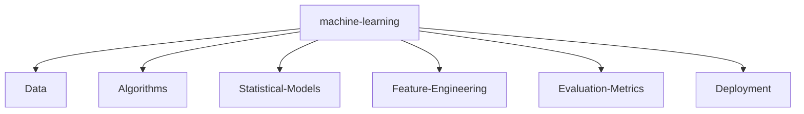

# ⚡ NITISH R.G // SYSTEM_INITIALIZATION

<div align="center">
  
</div>

<div align="center">
  <!-- Recruiter Easter Egg -->
  <!-- 🕵️‍♂️ Hey Recruiter! If you are reading this source code, you clearly have an eye for detail. Let's connect and build something scalable! -->

  <p align="center">
    <a href="https://github.com/NITISH-R-G/NITISH-R-G"></a>
    
  </p>

  <a href="https://git.io/typing-svg"></a>
</div>

---

## 💻 `init_developer.py`

```python
class Developer:
    def __init__(self):
        self.name = "Nitish R.G"
        self.role = "Data Science & AI Engineer"
        self.education = {
            "BS": "Data Science @ IIT Madras",
            "BE": "Computer Science @ SIET"
        }
        self.focus = [
            'Advanced LLMs',
            'Computer Vision',
            'Full-Stack ML Integration',
            'Scalable AI Architectures'
        ]

    def get_mission(self):
        return 'Turning complex data into actionable intelligence 🚀'

if __name__ == "__main__":
    dev = Developer()
    print(f"[{dev.name}] SYSTEM ONLINE.")
```

---

## 📈 `FOUNDER_DASHBOARD`

<div align="center">
  <table>
    <tr>
      <td width="50%" valign="top">
        <h3>🚀 Operations</h3>
        <p>Driving innovation and building scalable systems. Focused on rapid prototyping, MVP development, and scaling AI architectures.</p>
        <p><strong>Building @ GDIN</strong></p>
      </td>
      <td width="50%" valign="top">
        <h3>🏢 Network & History</h3>
        <ul>
          <li><b>AI Intern</b> @ Infosys Springboard</li>
          <li><b>Developer</b> @ AMD AI Developer Program</li>
          <li><b>Alumni</b> @ McKinsey Forward</li>
          <li><b>Academic</b> @ IIT Madras & SIET</li>
        </ul>
      </td>
    </tr>
  </table>
</div>

---

## ⚔️ `PROJECT_WAR_ROOM`

<div align="center">
  <table>
    <tr>
      <td width="50%" align="center">
        <h3><a href="https://github.com/NITISH-R-G/PedagogyX">📚 PedagogyX</a></h3>
        <p><i>Advanced EdTech platform leveraging LLMs for personalized learning paths and automated assessment generation.</i></p>
        
      </td>
      <td width="50%" align="center">
        <h3><a href="https://github.com/NITISH-R-G/PalmPlay">✋ PalmPlay</a></h3>
        <p><i>Computer Vision based real-time gesture recognition system for hands-free application control.</i></p>
        
      </td>
    </tr>
    <tr>
      <td width="50%" align="center">
        <h3><a href="https://github.com/NITISH-R-G/Intelli-Credit-V2">💳 Intelli-Credit</a></h3>
        <p><i>ML-driven credit scoring and risk assessment engine designed for scalable financial analysis.</i></p>
        
      </td>
      <td width="50%" align="center">
        <h3><a href="https://github.com/NITISH-R-G/CODESTREAK">🔥 CODESTREAK</a></h3>
        <p><i>Developer productivity dashboard and analytics tool for tracking coding habits and consistency.</i></p>
        
      </td>
    </tr>
  </table>
</div>

<div align="center">
  <table>
    <tr>
      <td width="50%" align="center">
        <h3><a href="https://mac-os-portfolio-nine-beryl.vercel.app/">🖥️ Interactive Portfolio</a></h3>
        <p><i>Experience my work through an interactive, visually stunning Mac OS-themed web portfolio.</i></p>
        <a href="https://mac-os-portfolio-nine-beryl.vercel.app/">
            
        </a>
      </td>
      <td width="50%" align="center">
        <h3><a href="https://drive.google.com/file/d/1lm1TLC00ThShlEi80uRtkz4rppco1w8O/view?usp=sharing">📄 Comprehensive Resume</a></h3>
        <p><i>Dive deep into my technical background, academic achievements, and professional experience.</i></p>
        <a href="https://drive.google.com/file/d/1lm1TLC00ThShlEi80uRtkz4rppco1w8O/view?usp=sharing">
            
        </a>
      </td>
    </tr>
  </table>
</div>

---

## 🧠 `NEURAL_ARCHITECTURE` (Tech Stack)

| Category | Technologies |
| --- | --- |
| **Language / IDE** |         |
| **Domain Knowledge** | [](https://github.com/NITISH-R-G) [](https://github.com/NITISH-R-G) [](https://github.com/NITISH-R-G) [](https://github.com/NITISH-R-G) |
| **CI / CD & DevOps** |        |
| **Databases** |     |
| **AI / ML Frameworks** |       |
| **Web Frameworks** |        |



---

## 📊 `SYSTEM_STATUS`

<div align="center">
  
  
</div>

<div align="center">
  <table>
    <tr>
      <td valign="top">
        
      </td>
      <td valign="top">
        
      </td>
    </tr>
  </table>
</div>

<div align="center">
  
</div>

<br>

<div align="center">
  
</div>

---

<!--START_SECTION:activity-->
<!--END_SECTION:activity-->

<!-- BLOG-POST-LIST:START -->
<!-- BLOG-POST-LIST:END -->

<!--START_SECTION:waka-->
<!--END_SECTION:waka-->

---

## 🌐 `ESTABLISH_CONNECTION`

<div align="center">
  <a href="https://twitter.com/NITISH_R_G">
    
  </a>
  <a href="https://linkedin.com/in/nitish-r-g-15-10-2007-rgn/">
    
  </a>
  <a href="mailto:nitishrg.8220psgps2020@gmail.com">
    
  </a>
</div>

<br>
<div align="center">
  <i>"I don't need a joke, my code is funny enough."</i><br>
  <b>Thanks for dropping by!</b>
</div>
